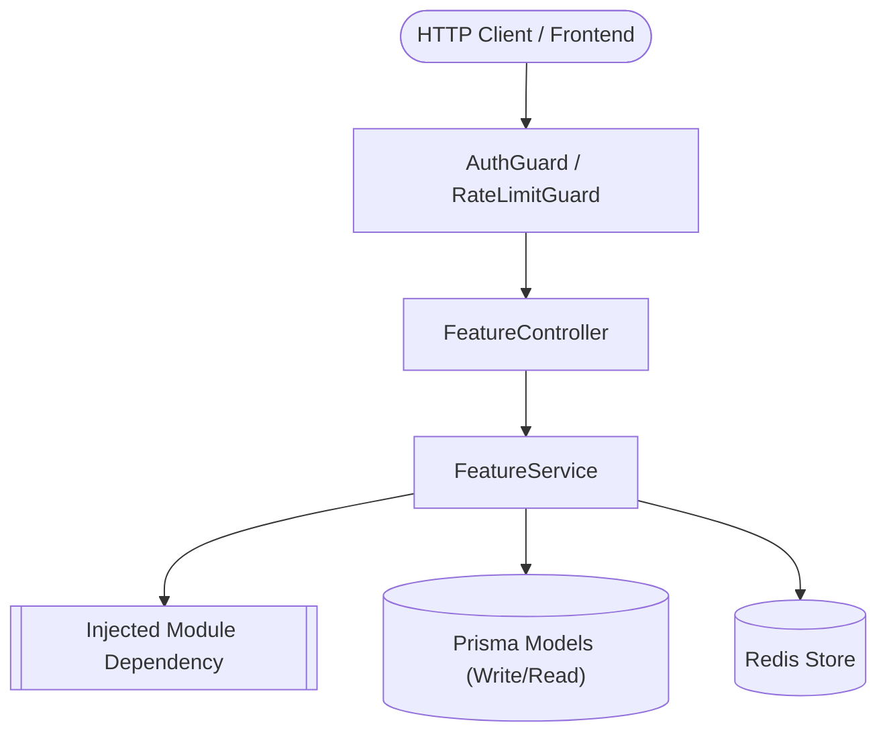
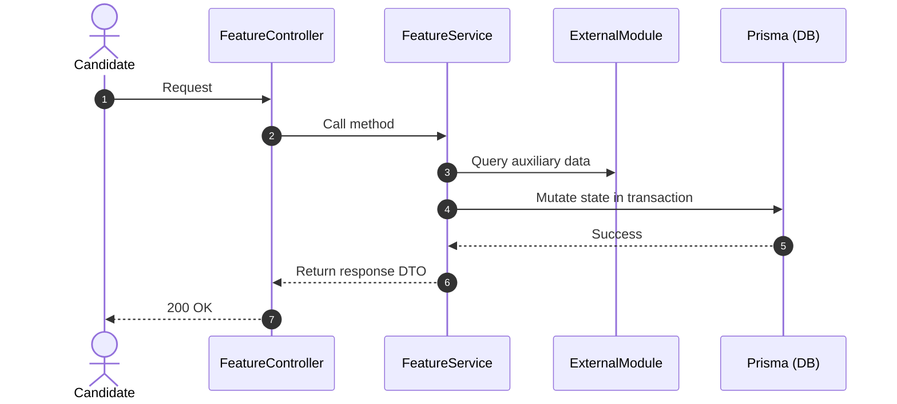
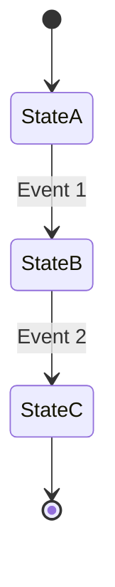

# Backend Feature README Generator

Creates and maintains high-value, architectural, super accurate, brutal honest  `README.md` documents for bounded backend modules in `backend/src/features/`.

## Core Philosophy

A feature README must **never simply repeat what the code syntax already says** (e.g., *"This controller has a GET method that calls service.findAll"*). Code already documents its own syntax.

Instead, a feature README must answer questions that code and Git diffs cannot answer quickly:
1. **Domain Boundary**: What does this module own, and what is explicitly out of scope?
2. **Visual Architecture**: How do controllers, services, guards, and databases connect?
3. **Invariants**: What business rules must *never* be broken by any developer or AI agent?
4. **Database Ownership**: Which tables does this feature mutate versus read?
5. **Flows & State Machines**: How do data and state transition through the feature?
6. **Identify and confirm the brutal honest vulnerability** : So that we can think about zero day fixing  **(super important)**
---

## Visual Architecture & Flow Diagrams (Mermaid)

Every feature `README.md` **should or can contain multiple Mermaid diagrams** to make architectural and procedural boundaries immediately understandable:

### 1. Component & Dependency Architecture (`flowchart TD` / `flowchart LR`)
Visualizes:
- Client / Consumer entry points
- Authentication guards and rate limiters
- Feature controllers and service layers
- Injected cross-module dependencies
- Database tables (Prisma) and caches (Redis)

### 2. Request & Execution Sequences (`sequenceDiagram`)
Visualizes important flows across actors (e.g. Client -> Controller -> Guard -> Service -> Injected Module -> DB).

### 3. State Machines & Entity Lifecycles (`stateDiagram-v2`)
Visualizes status transitions (e.g. pipeline stages, approval queues, enrichment states).

> [!TIP]
> **Mermaid Formatting Rules**:
> - Always quote node labels containing special characters: `node["Label (Details)"]`.
> - Avoid raw HTML tags inside node text.
> - Use appropriate shapes: `([Endpoints])`, `[[Services]]`, `[(Databases)]`.

---

## Standard Feature README Structure

Every `README.md` in `backend/src/features/<feature>/` should follow this standardized schema:

```markdown
# <Feature Name>

## Purpose
<One to two concise sentences defining the bounded context and domain purpose.>

## Component Architecture


## Responsibilities
- <Core domain responsibility 1>
- <Core domain responsibility 2>
- <Core domain responsibility 3>

## Does Not Own
- <Adjacent concern handled by Module A (e.g., authentication tokens)>
- <Adjacent concern handled by Module B (e.g., raw scraping transport)>
- <Administrative counterpart handled by Module C>

## Dependencies
- **Core / Platform**: `PrismaService`, Redis, Config
- **Internal Modules**: `<ImportedModuleA>`, `<ImportedModuleB>`
- **External Libraries / APIs**: `<ExternalService or Library>`

## Database Ownership
- **Writes / Mutates**:
  - `table_name`: <How and when it is mutated>
- **Reads / References**:
  - `other_table`: <Context for why it is read>

## Important Invariants
- <Invariant 1: Unbreakable domain rule>
- <Invariant 2: Security or privacy guarantee>
- <Invariant 3: Consistency or transaction boundary>

## Public API & Entry Points
- **HTTP Endpoints**:
  - `METHOD /api/v1/<path>` - <Intent & Guard applied>
- **Exported Services**:
  - `ServiceName.methodName()` - <Who calls this and why>
- **Background Tasks / Commands** (if any):
  - `<Scheduler or CLI command>`

## Important Flows

### 1. <Flow Name (Sequence)>


### 2. <State Lifecycle (if applicable)>

```

---

## Step-by-Step Generation Workflow

When instructed to create or update a feature's `README.md`:

### 1. Inspect the Module Boundaries
1. Read the feature's NestJS module definition (`*.module.ts`):
   - Check `controllers`: What is exposed to clients?
   - Check `providers` & `exports`: What is shared with other modules?
   - Check `imports`: What other feature modules does this feature depend on?
2. Inspect directory layout:
   - `controllers/`: HTTP boundary
   - `services/`: Orchestration and transactions
   - `domain/`: Pure domain algorithms, parsers, and invariant rules
   - `dto/`: Input validation and payload shapes

### 2. Trace Database Ownership
1. Check Prisma schema (`backend/prisma/schema.prisma` or module `.prisma` file).
2. Look at write operations in `services/`:
   - Search for `prisma.<model>.create`, `update`, `upsert`, `delete`, or `$transaction`.
   - Identify tables this module has **write authority** over.
   - Identify tables this module only queries with `findMany` or `findUnique` (Read-only reference).

### 3. Extract Business Invariants & Rules
Look for invariants in:
- Domain specs (`*.spec.ts` files inside the feature): Unit tests test invariants!
- Validation logic in DTOs and service guards.
- Filtering conditions in queries (e.g., `.filter(company => !excludedIds.has(company.id))`).
- Security rules (e.g., read-only fields, user isolation where `candidate_id` must match authenticated session).

### 4. Explicitly Define Negative Scope ("Does Not Own")
State what this module explicitly avoids doing to keep boundaries clean:
- Does it authenticate users, or just consume authenticated session guards?
- Does it perform live web scraping, or just consume pre-crawled jobs?
- Does it send actual outbound emails, or just emit notifications / render templates?

### 5. Build Mermaid Visualizations
Construct high-signal diagrams:
- **Architecture diagram**: Clarifying dependencies and data stores.
- **Sequence diagram**: Tracing the most critical business flow.
- **State diagram**: If the module manages multi-step status lifecycles.

---

## Example Reference

See the full [Candidate Portal Feature README Example](./examples/candidate-portal-readme.md) as the canonical golden reference.
