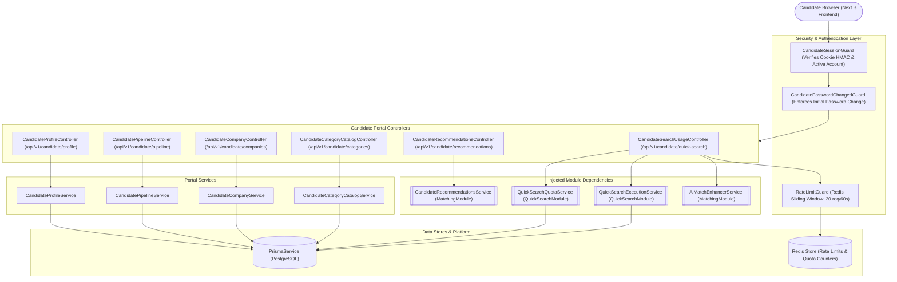
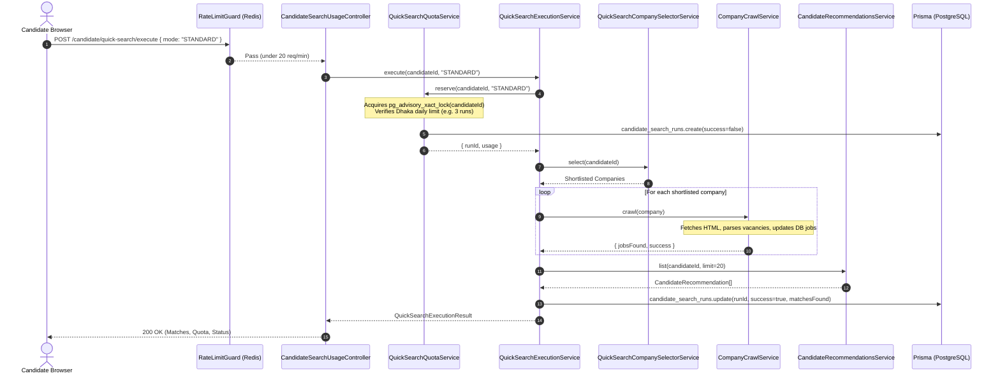
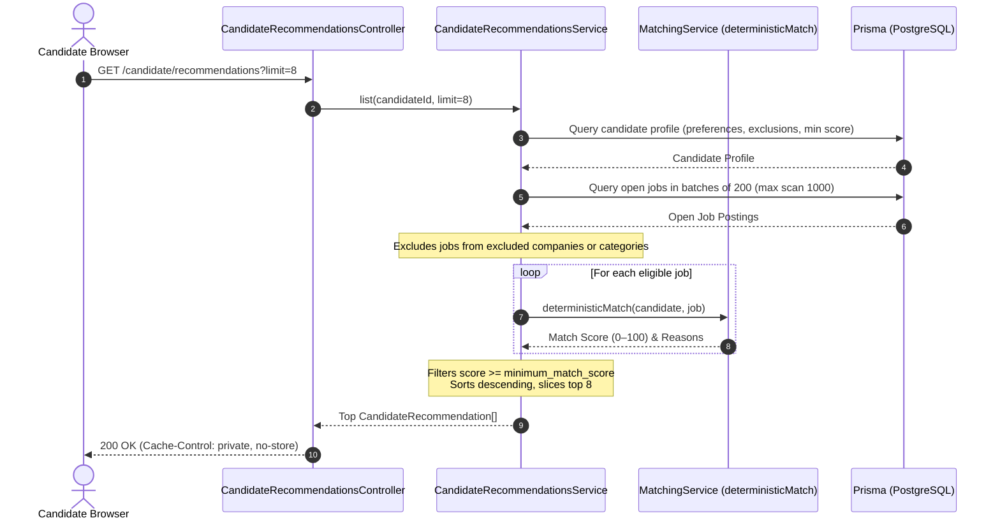
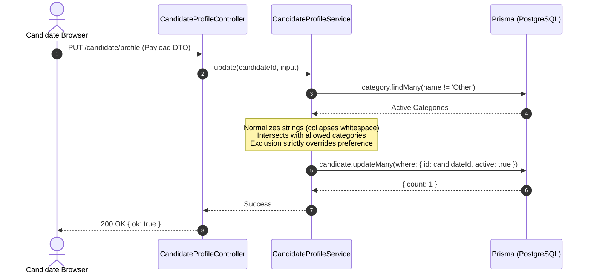
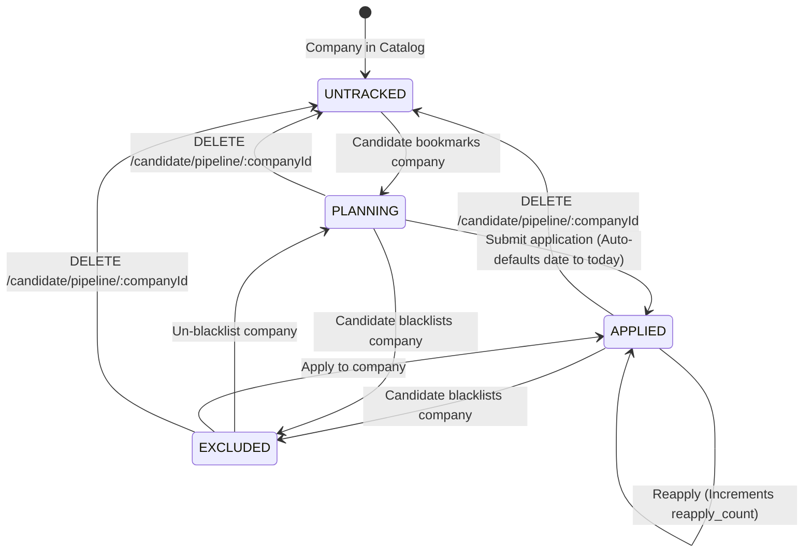

# Candidate Portal Feature

## Purpose
Owns candidate self-service functionality, personalized job recommendations, company interest tracking, on-demand quick search telemetry, and career application pipeline state.

---

## Component Architecture



---

## Responsibilities
- **Profile Self-Service**: Viewing and updating candidate bio, skills, experience level, years of experience, locations, work modes, and category preferences.
- **Preference Normalization**: Validating preferred categories against the live category catalog, discarding unknown categories, and guaranteeing that excluded categories strictly override preferred categories.
- **Personal Company Pipeline**: Tracking company application states across three discrete stages: `PLANNING` (1), `APPLIED` (2), and `EXCLUDED` (3), with personal notes, reapply counters, and application dates.
- **Company Catalog Browsing**: Searching active companies with candidate-specific tracking states, text search (`q`), location filtering, category filtering, pipeline status filtering, and dual-mode response formatting (paginated object vs flat legacy array).
- **Personalized Recommendations**: Fetching scored job recommendations tailored to the candidate's preferred tech stacks, experience level, and work modes, with blacklisted companies and excluded categories filtered out.
- **Quick Search Quota & On-Demand Execution**: Checking remaining daily search quotas (standard vs. AI-assisted) and triggering live company crawls with AI match enhancements.
- **Category Discovery**: Exposing selectable taxonomy categories (excluding placeholder 'Other') without leaking internal database identifiers.

---

## Does Not Own
- **Candidate Authentication & Credentials**: Owned by `AuthenticationModule` (passwords, HMAC session tokens, forced initial password changes, Google OAuth).
- **Candidate Account Provisioning & Deactivation**: Owned by `AdminOperationsModule` (`AdminCandidatesService`).
- **Global Company Entity Mutation**: Candidates **cannot** create, edit, or delete global company records. Shared company records are read-only and managed exclusively by `CompanyIntelligenceModule`.
- **Job Ingestion & Web Scraping Infrastructure**: Web crawling transport, HTML parsing, and vacancy hashing are owned by `JobCrawlingModule`.
- **Match Scoring Engine**: Algorithmic match math is owned by `MatchingModule` (`deterministicMatch`).
- **System Operational Configuration**: Quota defaults and scheduler rules are owned by `SettingsModule`.

---

## Dependencies
- **Internal Modules**:
  - `AuthenticationModule`: Provides `CandidateSessionGuard` and `CandidatePasswordChangedGuard`.
  - `MatchingModule`: Provides `CandidateRecommendationsService` and `AiMatchEnhancerService`.
  - `QuickSearchModule`: Provides `QuickSearchQuotaService` and `QuickSearchExecutionService`.
- **Core / Platform**:
  - `PrismaService` (`@app/database`): PostgreSQL persistence and atomic queries.
  - `@app/common`: `@RateLimit` decorator for Redis sliding-window throttling.

---

## Database Ownership

### Writes / Mutates
- `candidates`: Mutates self-service profile fields (`name`, `expertise`, `skills`, `experience_level`, `experience_years`, `preferred_locations`, `excluded_locations`, `preferred_work_modes`, `preferred_categories`, `excluded_categories`, `minimum_match_score`). Candidate `email`, `active`, and `created_at` are **strictly read-only / immutable**.
- `candidate_company_state`: Upserts and deletes candidate-specific company tracking records (`status`, `last_applied_at`, `reapply_count`, `notes`, `updated_at`).
- `candidate_search_runs`: Indirectly mutated via `QuickSearchQuotaService` and `QuickSearchExecutionService` (creates and updates audit runs for on-demand search runs).

### Reads / References
- `companies`: Reads active companies, website URLs, career URLs, locations, and categories.
- `categories`: Reads active category taxonomy to whitelist candidate preferences.
- `jobs`: Queried indirectly via `MatchingModule` to generate recommendations.
- `candidate_auth`: Checked by `CandidateSessionGuard` and `CandidatePasswordChangedGuard` to verify session versioning and forced password changes.

---

## Important Invariants

1. **Strict Session Principal Isolation**:
   Every database query and mutation is scoped strictly to `request.candidate.id` resolved from the cryptographically verified session cookie. Path parameters and request bodies cannot specify another candidate's ID.
2. **Double Guard Perimeter**:
   All endpoints in this module are guarded by both `CandidateSessionGuard` and `CandidatePasswordChangedGuard`. If a candidate has `mustChangePassword === true`, requests fail immediately with HTTP 403 `PASSWORD_CHANGE_REQUIRED`.
3. **Category Exclusion Dominance**:
   If a category is present in both `preferredCategories` and `excludedCategories`, it is unconditionally stripped from `preferredCategories`.
4. **Taxonomy Whitelisting**:
   Only known, valid categories in the database (excluding placeholder 'Other') are accepted into preferences. Unrecognized strings are silently pruned.
5. **Read-Only Login Email**:
   Candidates cannot alter their login email address via profile updates. Email modifications require administrative action in `AdminOperationsModule`.
6. **Global Company Record Protection**:
   Saving or deleting candidate pipeline entries mutates only the candidate's personal join row (`candidate_company_state`). The shared `Company` record is never modified or deleted.
7. **Application Date Defaulting Rules**:
   Saving status as `APPLIED` without an explicit `lastAppliedAt` date defaults to the current UTC date (`YYYY-MM-DD`). Saving non-applied states without a date preserves any prior application date.
8. **Private Response Caching**:
   Endpoints returning sensitive personal data (`/usage`, `/recommendations`) transmit `@Header('Cache-Control', 'private, no-store')` to prevent intermediary proxy or browser disk caching.
9. **Dual-Mode Company Catalog Response Contract**:
   When `page` is provided, `GET /candidate/companies` returns a paginated structure (`{ total, page, pageSize, totalPages, rows }`). When `page` is omitted, it returns a flat array (`rows`) for backward compatibility.

---

## Public API & Entry Points

| Method | Endpoint | Guards | Rate Limit | Purpose |
| :--- | :--- | :--- | :--- | :--- |
| `GET` | `/api/v1/candidate/profile` | Session + Password | None | Reads editable profile fields for authenticated candidate |
| `PUT` | `/api/v1/candidate/profile` | Session + Password | None | Updates candidate profile, skills, and category preferences |
| `GET` | `/api/v1/candidate/pipeline` | Session + Password | None | Lists candidate's tracked companies (ordered by stage, then name) |
| `POST` | `/api/v1/candidate/pipeline/company-state` | Session + Password | None | Upserts tracking state, application date, notes, and reapply count |
| `DELETE`| `/api/v1/candidate/pipeline/:companyId` | Session + Password | None | Removes personal tracking row for a company (idempotent) |
| `GET` | `/api/v1/candidate/companies` | Session + Password | None | Browses active company catalog with personal tracking states |
| `GET` | `/api/v1/candidate/categories` | Session + Password | None | Lists selectable taxonomy categories (excluding 'Other') |
| `GET` | `/api/v1/candidate/recommendations` | Session + Password | None | Fetches personalized job recommendations ranked by match score |
| `GET` | `/api/v1/candidate/quick-search/usage` | Session + Password | None | Returns remaining daily search allowance and AI availability |
| `POST` | `/api/v1/candidate/quick-search/execute` | Session + Password | 20 req / 60s | Executes live on-demand company crawl sweep (Standard or AI) |

---

## Important Flows

### 1. On-Demand Quick Search Execution Flow



### 2. Candidate Job Recommendation Flow



### 3. Profile Update & Sanitization Flow



### 4. Application Pipeline Workflow State Transitions



---

## Brutally Honest Vulnerability & Architectural Risk Assessment

> [!WARNING]
> This section highlights critical architectural bottlenecks, design weaknesses, and operational risks identified in the `candidate-portal` module.

### 1. Synchronous HTTP Crawl Loop in Quick Search (Critical Gateway Timeout Risk)
- **Vulnerability**: In `QuickSearchExecutionService.execute()`, calling `POST /api/v1/candidate/quick-search/execute` initiates a synchronous `for (const company of companies)` loop that performs live network requests to external company websites with rate delays (`delayMs`).
- **Threat Vector**:
  - If a candidate shortlists 5–10 companies and any target website is slow, unresponsive, or tarpitting requests, the HTTP connection remains open for **20–45+ seconds**.
  - Edge reverse proxies (Cloudflare, Nginx, AWS ALB) enforce strict HTTP connection timeouts (typically 30–60 seconds). When Cloudflare times out, it aborts the connection with `504 Gateway Timeout` or `524 A timeout occurred`.
  - Because quota reservation happens *before* crawling, the candidate loses their daily search quota, but their browser sees a network failure error and receives no job matches.
- **Remediation**:
  Decouple Quick Search execution from the HTTP request cycle using an asynchronous job queue (e.g. BullMQ / Redis):
  1. `POST /candidate/quick-search/execute` reserves quota, enqueues the job, and immediately returns HTTP 202 Accepted with a `jobId`.
  2. The browser polls or listens via Server-Sent Events (SSE) / WebSockets for progress updates.

### 2. Full Pipeline Memory Bloat & In-Memory Sorting (High Scalability Risk)
- **Vulnerability**: In `CandidatePipelineService.list()`:
  ```ts
  const rows = await this.prisma.candidate_company_state.findMany({
    where: { candidate_id: candidateId, ...(status ? { status } : {}) },
    include: {
      companies: {
        include: { categories: { include: { category: { select: { name: true } } } } },
      },
    },
    orderBy: [{ updated_at: 'desc' }],
  });
  ```
  This query has **no pagination (`take`/`skip`)**. It loads every single tracked company with three levels of nested relational joins into V8 memory and performs an in-memory JavaScript sort:
  ```ts
  rows.sort((a, b) => rank[...] || a.companies.name.localeCompare(b.companies.name));
  ```
- **Threat Vector**: An active job seeker tracking hundreds or thousands of companies will trigger multi-megabyte allocations, high garbage collection pressure, and slow query execution, causing Node.js event loop latency for other users.
- **Remediation**: Add cursor- or offset-based pagination (`page`, `pageSize`) to `CandidatePipelineQueryDto` and move the workflow stage ranking into an SQL `CASE` expression in PostgreSQL.

### 3. Missing Rate Limiting on Recommendation Scoring (CPU Exhaustion DoS)
- **Vulnerability**: `CandidateRecommendationsController.list()` has **no rate limiting decorator** (`@RateLimit`).
- **Threat Vector**: Generating recommendations runs `deterministicMatch()` across all active open jobs in the platform. An authenticated candidate (or compromised session token) can fire hundreds of concurrent requests to `GET /api/v1/candidate/recommendations`. This forces continuous CPU-intensive string searching, regex matching, and score normalization, choking CPU cores and degrading response times across the entire API server.
- **Remediation**: Apply `@RateLimit({ windowMs: 60_000, max: 30, keyPrefix: 'candidate_recs' })` and cache candidate recommendations in Redis with a 5-minute TTL.

### 4. Redundant Full Table Scans on Category Catalog
- **Vulnerability**: In `CandidateProfileService.update()`:
  ```ts
  const allowedCategories = new Set(
    (
      await this.prisma.category.findMany({
        where: { name: { not: 'Other' } },
        select: { name: true },
      })
    ).map((category) => category.name),
  );
  ```
  Every time a candidate clicks "Save profile", the server executes a full table scan on `categories` to construct an in-memory set.
- **Threat Vector**: Categories are virtually static. Querying PostgreSQL on every profile submission creates needless pooler connection churn and query latency on Neon serverless databases.
- **Remediation**: Cache the valid category names in-memory or in Redis with a 1-hour TTL.

### 5. PostgreSQL Advisory Lock Global Namespace Collisions
- **Vulnerability**: `QuickSearchQuotaService` acquires an advisory transaction lock using the raw candidate ID:
  ```ts
  await transaction.$executeRaw`SELECT pg_advisory_xact_lock(${candidateId})`;
  ```
- **Architectural Risk**: PostgreSQL advisory locks use a single flat 64-bit integer namespace per database. If any other service (or future feature) locks a company ID, job ID, or crawler run ID with `pg_advisory_xact_lock(id)`, an unrelated candidate transaction with matching integer ID will block waiting on that lock, causing unpredictable lock contention and transaction timeouts (`5000ms maxWait`).
- **Remediation**: Use two-key advisory locks with a 32-bit namespace discriminator:
  ```sql
  SELECT pg_advisory_xact_lock(hashtext('quick_search_quota'), ${Number(candidateId)});
  ```

### 6. Denormalized Comma-Separated String Storage vs Structured Array / JSON
- **Vulnerability**: `preferred_categories`, `excluded_categories`, and `preferred_work_modes` are persisted in the `candidates` table as comma-delimited strings:
  ```ts
  preferred_work_modes: [...new Set(input.preferredWorkModes ?? [])].join(', ') || null,
  preferred_categories: preferred.join(', ') || null,
  excluded_categories: excluded.join(', ') || null,
  ```
- **Architectural Risk**: Storing lists as raw comma-separated strings inside `VARCHAR`/`TEXT` columns breaks 1NF (First Normal Form). If a category name contains a comma (e.g., `"Hardware, Embedded & Firmware"`), naive string splitting (`split(', ')`) corrupts category boundaries. Furthermore, PostgreSQL cannot create GIN or B-tree indexes over elements within the string, preventing fast database-level matching.
- **Remediation**: Migrate `preferred_categories`, `excluded_categories`, and `preferred_work_modes` to native PostgreSQL array types (`TEXT[]`) or a relational join table (`candidate_preferred_categories`).

### 7. Polymorphic API Response Shape on Company Catalog Browse
- **Vulnerability**: In `CandidateCompanyService.list()`:
  ```ts
  if (!isPaginated) {
    return mappedRows; // Flat array: CandidateCompanyDto[]
  }
  return {
    total,
    page: query.page!,
    pageSize,
    totalPages: Math.ceil(total / pageSize) || 1,
    rows: mappedRows, // Object wrapper: PaginatedResult<CandidateCompanyDto>
  };
  ```
- **Architectural Risk**: The endpoint returns two completely different top-level JSON data types depending on whether the optional `page` query parameter was passed: an `Array` versus an `Object`. This polymorphic response structure violates strict API contract conventions and causes runtime errors in typed API consumers or SDKs that expect a consistent response signature.
- **Remediation**: Deprecate the flat array return mode and always return the standard pagination envelope `{ total, page, pageSize, totalPages, rows }`.
