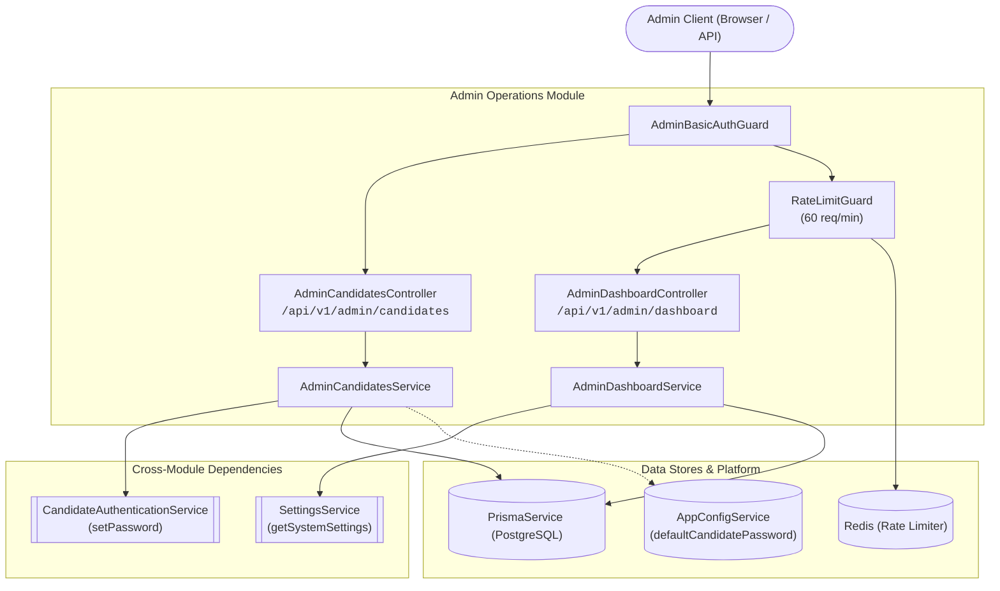
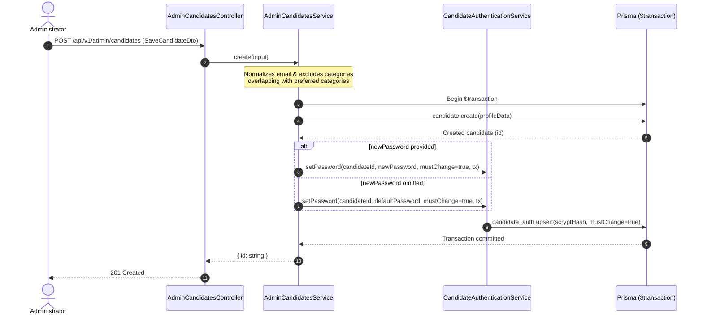
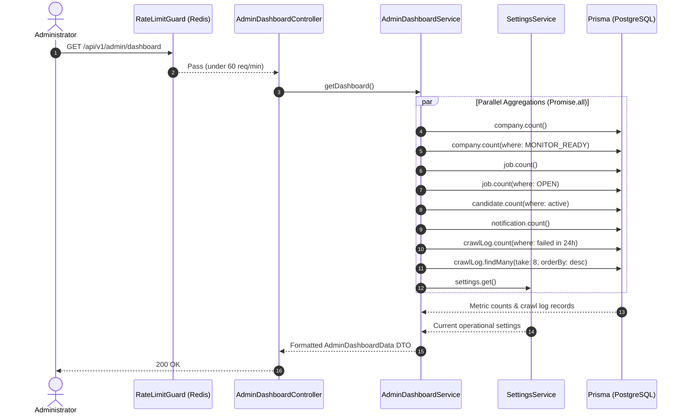
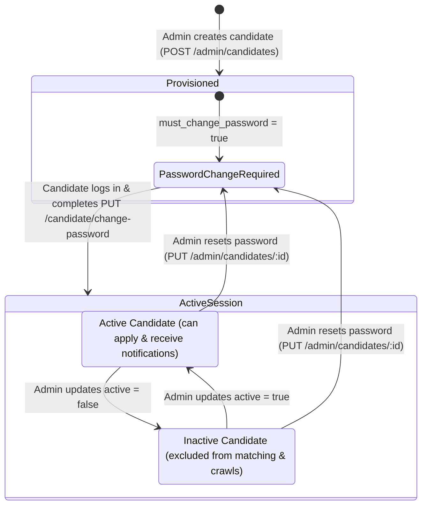

# Admin Operations Feature

## Purpose
Owns administrative candidate account management, credential provisioning, and system-wide operational telemetry aggregation.

---

## Component Architecture



---

## Responsibilities
- **Candidate Account Lifecycle**: Creating candidate profiles, updating profile attributes, and resetting candidate passwords.
- **Credential Initialization & Reset**: Enforcing atomic password assignment with forced change flag (`must_change_password: true`) upon initial creation or administrative reset.
- **Preference & Exclusion Sanitization**: Normalizing category preferences and guaranteeing that excluded categories strictly override preferred categories.
- **Administrator-Safe Projections**: Providing sanitized candidate records to the admin UI, exposing authentication presence (`hasPassword`, `hasGoogle`) while redacting password hashes and OAuth identifiers.
- **Operational Dashboard Aggregation**: Querying real-time system metrics (companies, monitor-ready crawler targets, open jobs, active candidates, 24-hour crawl failures, and recent crawl activity logs).

---

## Does Not Own
- **Candidate Self-Service**: Handled by `CandidatePortalModule` (`/api/v1/candidate/*`).
- **Candidate Authentication Flow**: Handled by `AuthenticationModule` (candidate login, cookie session issuance, Google OAuth exchange).
- **Company & Category Catalog Management**: Handled by `CompanyIntelligenceModule` (`/api/v1/admin/companies`, `/api/v1/admin/categories`).
- **Job Ingestion & Crawler Automation**: Handled by `JobCrawlingModule` (`/api/v1/admin/jobs`, `/api/v1/admin/crawl-logs`, crawler commands).
- **Settings Mutation**: Handled by `SettingsModule` (`PUT /api/v1/admin/settings`). Note: `AdminDashboardService` reads settings, but mutation is owned strictly by `SettingsModule`.

---

## Dependencies
- **Core / Platform**:
  - `PrismaService`: Database queries and atomic multi-table transactions.
  - `AppConfigService`: Retrieves configured credentials (`adminUsername`, `adminPassword`, `defaultCandidatePassword`).
  - `@app/common`: `@RateLimit` decorator for Redis sliding-window throttling.
- **Internal Modules**:
  - `AuthenticationModule`: Supplies `AdminBasicAuthGuard` and `CandidateAuthenticationService`.
  - `SettingsModule`: Supplies `SettingsService` for reading crawler/notification thresholds.

---

## Database Ownership

### Writes / Mutates
- `candidates`: Writes name, email, expertise, skills, experience level/years, locations, work modes, category preferences/exclusions, minimum match score, and active flag.
- `candidate_auth`: Mutates `password_hash`, `password_updated_at`, and `must_change_password` atomically via `CandidateAuthenticationService.setPassword` in the same `$transaction`.

### Reads / References
- `companies`: Counts total companies and `MONITOR_READY` targets.
- `jobs`: Counts total jobs and `OPEN` jobs.
- `candidate`: Reads all candidate records for administrator tables.
- `candidate_auth`: Checks existence of `passwordHash` and `google_sub` for account summaries.
- `crawl_logs`: Counts failures within the last 24 hours; fetches latest 8 crawl entries with company relations.
- `notifications`: Counts total notifications generated.
- `settings`: Reads crawler and notification interval configs.

---

## Important Invariants

1. **Exclusion Overrides Preference**:
   If a category exists in both `preferredCategories` and `excludedCategories`, the exclusion strictly wins. The category is stripped from preferred categories before persistence.
2. **Atomic Credential & Profile Creation**:
   Candidate creation and initial password hashing/storing must occur within a single database `$transaction`. If password assignment fails, candidate creation is automatically rolled back.
3. **Forced Password Change on Provisioning/Reset**:
   Any password initialized by an administrator (whether explicit or default) sets `must_change_password = true`. Candidates are blocked from portal access until they complete the password change flow.
4. **Credential Preservation on Profile Update**:
   Calling `PUT /admin/candidates/:id` without `newPassword` preserves existing password hashes and Google OAuth links.
5. **Zero Credential Leakage**:
   Administrator responses must **never** expose password hashes, salts, or Google `sub` identifiers. Responses only contain `hasPassword: boolean` and `hasGoogle: boolean`.
6. **BigInt ID Validation**:
   All `:id` parameters must match `/^[1-9]\d{0,18}$/` and remain `<= 9223372036854775807n` to avoid PostgreSQL bigint out-of-range database panics.
7. **Email Uniqueness Constraint**:
   Duplicate email conflicts during create or update are caught and translated into HTTP 409 Conflict (`CANDIDATE_EMAIL_EXISTS`).

---

## Public API & Entry Points

| Method | Endpoint | Auth Guard | Rate Limit | Purpose |
| :--- | :--- | :--- | :--- | :--- |
| `GET` | `/api/v1/admin/candidates` | `AdminBasicAuthGuard` | None | Lists all candidates with authentication presence flags |
| `GET` | `/api/v1/admin/candidates/:id` | `AdminBasicAuthGuard` | None | Returns full profile details for one candidate |
| `POST` | `/api/v1/admin/candidates` | `AdminBasicAuthGuard` | None | Creates a candidate profile and initializes password |
| `PUT` | `/api/v1/admin/candidates/:id` | `AdminBasicAuthGuard` | None | Updates candidate profile; resets password if provided |
| `GET` | `/api/v1/admin/dashboard` | `AdminBasicAuthGuard` | 60 req / 60s | Returns aggregated counts, system settings, and recent crawl logs |

---

## Important Flows

### 1. Candidate Account Creation & Credential Provisioning



### 2. Operational Dashboard Aggregation Flow



### 3. Candidate Account Security & Status Lifecycle



---

## Brutally Honest Vulnerability & Architectural Risk Assessment

> [!WARNING]
> This section documents critical architectural vulnerabilities, design flaws, and threat vectors identified in `admin-operations` so engineering can prioritize zero-day hardening.

### 1. Predictable Default Password Account Takeover (High Severity)
- **Vulnerability**: In `AdminCandidatesService.ensurePassword()`, if `input.newPassword` is omitted, the service silently provisions the account with `this.config.app.defaultCandidatePassword` (configured as a static string like `asdfasdf` in `.env`).
- **Threat Vector**: An attacker who knows an employee or candidate's email can watch for account creation. Because the default password is known and identical for all uninitialized accounts, the attacker can log in as the candidate before they do and hijack the forced-password-change flow (`PUT /api/v1/candidate/change-password`), locking out the legitimate candidate.
- **Remediation**:
  1. Remove static fallback default passwords entirely.
  2. Require an explicit password upon creation, OR generate a cryptographically secure, random, high-entropy one-time token (`crypto.randomBytes(16).toString('hex')`) and dispatch it via an invitation email.

### 2. Missing Rate Limiting on Candidate Admin Endpoints (High Severity)
- **Vulnerability**: While `AdminDashboardController` is protected with `@RateLimit`, `AdminCandidatesController` (`GET`, `POST`, `PUT`) has **no rate limit guard**.
- **Threat Vector**:
  1. **Credential Brute-Force**: Attackers can hammer `GET /api/v1/admin/candidates` with basic auth brute-force attempts without experiencing IP rate limiting or progressive backoff at the application layer.
  2. **Candidate Creation Flood / Scrypt DoS**: `POST /api/v1/admin/candidates` computes `hashLegacyScrypt` (CPU/memory intensive with `N=16384, r=8, p=1`). A burst of candidate creation requests will tie up Node.js thread pool workers (`libuv`), causing high event-loop lag.
- **Remediation**:
  Apply `@RateLimit({ windowMs: 60_000, max: 30, keyPrefix: 'admin_candidates' })` across `AdminCandidatesController`.

### 3. Lack of Pagination on Candidate Listing (Medium Severity - DoS)
- **Vulnerability**: `AdminCandidatesService.list()` executes:
  ```ts
  this.prisma.candidate.findMany({
    include: { auth: { select: { passwordHash: true, google_sub: true } } },
    orderBy: [{ active: 'desc' }, { name: 'asc' }],
  });
  ```
  with zero pagination (`skip` / `take`).
- **Threat Vector**: As the platform grows to thousands of candidates, calling `GET /api/v1/admin/candidates` will fetch the entire candidate database table into V8 memory, serialize thousands of nested objects, and transfer multi-megabyte JSON payloads. This causes memory bloat, high GC pauses, and eventual container OOM crashes.
- **Remediation**: Introduce cursor- or offset-based pagination (`page`, `pageSize`, `search`) matching the pagination architecture used in `AdminCompaniesController`.

### 4. Basic Auth Inherent Limitations & Missing Audit Trails (Medium Severity)
- **Vulnerability**:
  1. Administrative authentication uses HTTP Basic Auth (`Authorization: Basic base64(admin:pass)`), which re-transmits raw credentials on every single request.
  2. There is a single global admin credential shared among all operators.
- **Threat Vector**: There is zero attribution: if a candidate's profile is altered, deactivated, or compromised, logs cannot determine which administrator executed the mutation. Furthermore, credentials cannot be individually revoked without rotating the shared environment variable and restarting containers.
- **Remediation**: Transition administrative authentication to short-lived signed JWT session cookies, multi-user admin accounts with RBAC, and append audit log records for administrative mutations (`admin_audit_logs`).

### 5. High-Concurrency Neon Connection Exhaustion on Dashboard Metrics (Medium Severity)
- **Vulnerability**: `AdminDashboardService.getDashboard()` runs 8 simultaneous database queries in `Promise.all`:
  - 7 `COUNT(*)` operations on separate tables.
  - 1 `findMany` query with relational joins.
- **Threat Vector**: On serverless PostgreSQL instances (like Neon) or connection-pooler setups (`PgBouncer`), every concurrent dashboard load instantly demands up to 8 connections from the pool. Multiple operators refreshing the dashboard can saturate the pooler and cause connection timeout errors (`P2024: Timed out fetching a new connection from the connection pool`).
- **Remediation**:
  1. Cache dashboard metrics in Redis with a short TTL (e.g., 30–60 seconds).
  2. Replace individual table counts with a single consolidated SQL query:
     ```sql
     SELECT 
       (SELECT COUNT(*) FROM companies) AS companies,
       (SELECT COUNT(*) FROM jobs) AS jobs,
       (SELECT COUNT(*) FROM candidates WHERE active = true) AS candidates;
     ```

### 6. Missing Candidate Deletion (Compliance & Data Integrity)
- **Vulnerability**: There is no candidate deletion endpoint (`DELETE /admin/candidates/:id`).
- **Threat Vector**:
  1. Non-compliance with data privacy regulations (GDPR/CCPA "Right to be Forgotten").
  2. Inability to purge test accounts, corrupted profiles, or fraudulent entries without direct database access.
- **Remediation**: Add `DELETE /api/v1/admin/candidates/:id` that cascades cleanly through `candidate_auth`, `candidate_company_state`, `candidate_search_runs`, and `notifications` within an atomic transaction.
