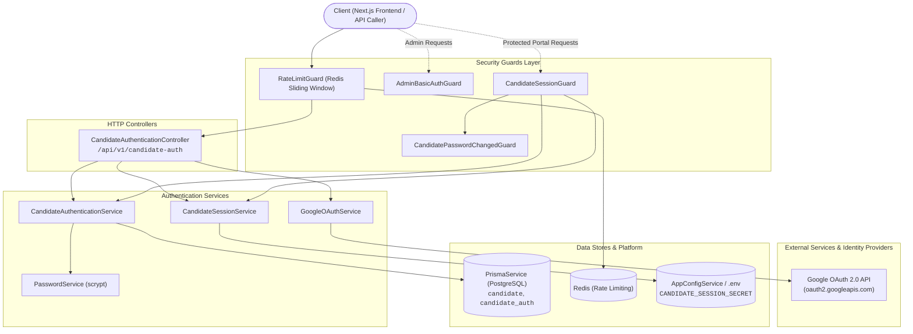
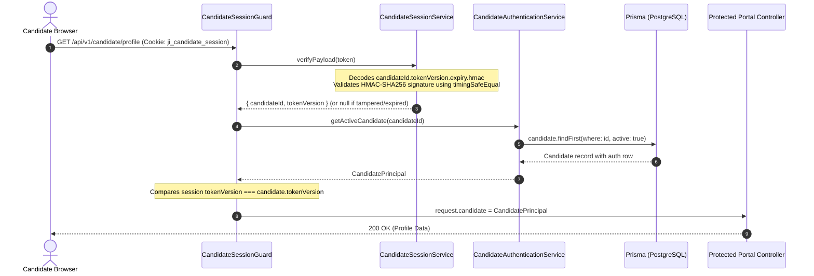
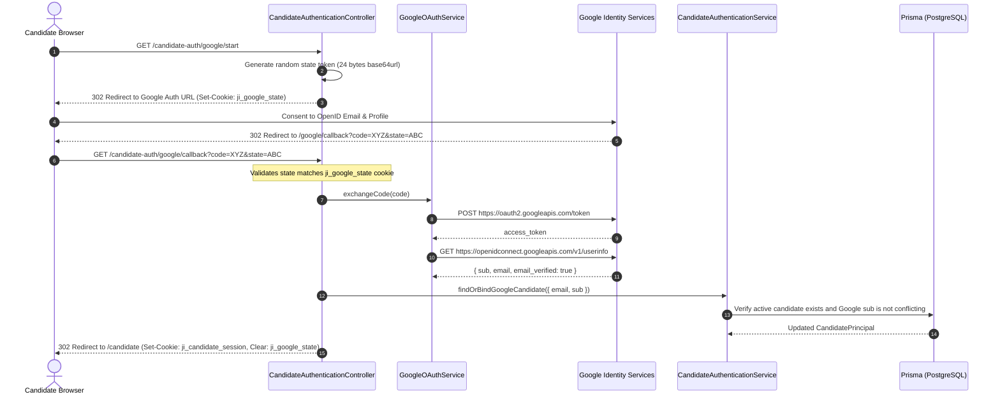
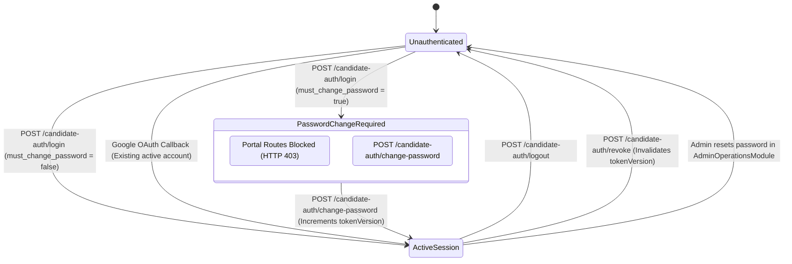

# Authentication Feature

## Purpose
Owns candidate credential verification, stateless HMAC-signed session lifecycle management, session revocation via token versioning, mandatory password-change policy enforcement, and Google OAuth 2.0 identity federation. Also houses the administrative basic authentication guard (`AdminBasicAuthGuard`).

---

## Component Architecture



---

## Responsibilities
- **Credential Verification**: Verifying passwords using legacy-compatible, salted scrypt hashes (`scrypt$N$r$p$salt$hash`).
- **Stateless Session Management**: Creating and verifying tamper-proof HMAC-SHA256 session tokens formatted as `candidateId.tokenVersion.expiresAt.signature`.
- **Global Session Revocation**: Invalidation of all outstanding session tokens across all devices by incrementing `token_version` in the database.
- **Mandatory Password Change Policy**: Enforcing that provisioned or reset candidate accounts cannot access portal features until they explicitly change their temporary password.
- **Google OAuth 2.0 Integration**: Managing OAuth authorization URLs, state cookies for anti-forgery protection, authorization code exchange, and linking Google IDs (`sub`) to pre-existing active candidates.
- **Administrative Perimeter Defense**: Validating HTTP Basic Authentication headers for all operator endpoints via `AdminBasicAuthGuard`.

---

## Does Not Own
- **Candidate Registration / Self-Signup**: There is **no public registration**. Accounts can only be created by an administrator in `AdminOperationsModule`.
- **Candidate Profile & Preferences**: Owned by `CandidatePortalModule` (`/api/v1/candidate/profile`).
- **Administrative Account Provisioning**: Handled by `AdminOperationsModule` (`AdminCandidatesService.create()`).

---

## Dependencies
- **Core / Platform**:
  - `PrismaService`: Persists authentication records and verifies real-time account status.
  - `AppConfigService`: Supplies session signing secrets, OAuth client credentials, and admin credentials.
  - `@app/common`: `@RateLimit` decorator for Redis sliding-window throttling.
  - `node:crypto`: Native implementations of `scrypt`, `createHmac`, `randomBytes`, and `timingSafeEqual`.
- **Internal Modules**:
  - Exported to `CandidatePortalModule`, `AdminOperationsModule`, `CompanyIntelligenceModule`, and `JobCrawlingModule` to enforce session and basic auth guards.

---

## Database Ownership

### Writes / Mutates
- `candidate_auth`:
  - `passwordHash`: Stores scrypt-derived password hash string.
  - `mustChangePassword`: Sets/clears the mandatory password-change requirement.
  - `token_version`: Atomically increments to invalidate all active session tokens.
  - `google_sub`, `google_email`: Binds a verified Google account to the candidate.
  - `password_updated_at`, `updated_at`: Timestamps password modifications.

### Reads / References
- `candidates`: Queries `id`, `email`, and `active` status to ensure inactive accounts cannot log in or use existing sessions.

---

## Important Invariants

1. **Active Account Check on Every Request**:
   Deactivated candidates (`active = false`) are rejected at login and during every subsequent request in `CandidateSessionGuard.canActivate()`.
2. **Session Token Versioning Guarantee**:
   If the token's embedded `tokenVersion` does not match the database's `candidate_auth.token_version`, the session is immediately rejected (`CANDIDATE_SESSION_INVALID`).
3. **Password Change Gating**:
   Candidates with `mustChangePassword: true` are restricted exclusively to `/candidate-auth/change-password` and `/candidate-auth/me`. All other candidate routes block access with HTTP 403 `PASSWORD_CHANGE_REQUIRED`.
4. **Password Change Revokes Prior Sessions**:
   Calling `changePassword()` sets the new password, clears `mustChangePassword`, and atomically increments `token_version`, terminating sessions on all other devices.
5. **No Auto-Registration via Google OAuth**:
   Google login ONLY succeeds if an active candidate account with that verified email already exists. Google OAuth cannot be used to self-register new accounts.
6. **Immutable Google Account Linkage**:
   A candidate account can only be bound to a single Google `sub`. Attempts to log in with a different Google account for that candidate's email are strictly rejected.
7. **Timing-Safe Equality Checks**:
   All HMAC signature comparisons and scrypt password hash checks use `crypto.timingSafeEqual` to eliminate timing side-channel leaks.
8. **Secure Cookie Hardening**:
   Session cookies (`ji_candidate_session`) and OAuth state cookies (`ji_google_state`) use `httpOnly: true`, `path: '/'`, `sameSite: 'lax'`, and conditional `secure: true` when running in production.

---

## Public API & Entry Points

| Method | Endpoint | Guards | Rate Limit | Purpose |
| :--- | :--- | :--- | :--- | :--- |
| `POST` | `/api/v1/candidate-auth/login` | None | 10 req / 60s | Authenticates email/password, issues session cookie |
| `GET` | `/api/v1/candidate-auth/me` | `CandidateSessionGuard` | None | Returns active candidate principal and password change status |
| `POST` | `/api/v1/candidate-auth/change-password` | `CandidateSessionGuard` | 10 req / 60s | Updates password, clears change requirement, revokes other sessions |
| `POST` | `/api/v1/candidate-auth/logout` | None | None | Clears browser cookie; supports optional `?revoke=true` |
| `POST` | `/api/v1/candidate-auth/revoke` | `CandidateSessionGuard` | 10 req / 60s | Revokes all active session tokens on the server |
| `GET` | `/api/v1/candidate-auth/google/status` | None | None | Checks if Google OAuth is configured and enabled |
| `GET` | `/api/v1/candidate-auth/google/start` | None | 20 req / 60s | Sets anti-forgery state cookie and redirects to Google |
| `GET` | `/api/v1/candidate-auth/google/callback` | None | 20 req / 60s | Validates state, exchanges OAuth code, binds user, issues session |

---

## Important Flows

### 1. Candidate Session Verification Flow (Every Portal Request)



### 2. Google OAuth 2.0 Authorization Flow



### 3. Candidate Authentication & Password State Machine



---

## Brutally Honest Vulnerability & Architectural Risk Assessment

> [!WARNING]
> This section identifies critical security risks, architectural bottlenecks, and zero-day vulnerabilities in the `authentication` module.

### 1. Database Query on Every HTTP Request (Severe Database Bottleneck)
- **Vulnerability**: In `CandidateSessionGuard.canActivate()`:
  ```ts
  const candidate = await this.authentication.getActiveCandidate(sessionPayload.candidateId);
  ```
  Every single authenticated API request to any candidate portal route performs a real-time database query to `candidate` and `candidate_auth`.
- **Architectural Risk**: While intended to immediately reflect account deactivation and token revocation, this completely defeats the performance advantage of stateless HMAC cookies. On serverless connection poolers (Neon), when a dashboard loads multiple concurrent widgets, a single page view spawns 4–6 parallel connection requests just for session validation.
- **Remediation**:
  Cache `token_version` and `active` status in Redis with a short TTL (e.g. 60–120 seconds):
  `GET candidate:session:<id>` -> returns `{ tokenVersion: 1, active: true }`. Check DB only on Redis cache miss or when invalidation events occur.

### 2. Predictable Default Password on Provisioned Accounts (Critical Auth Bypass Risk)
- **Vulnerability**: Candidate accounts provisioned without an explicit password use the static `defaultCandidatePassword` from config (defaults to `asdfasdf`).
- **Threat Vector**: If an administrator adds a candidate, an attacker who monitors the portal or knows the candidate's email can authenticate using the known default password before the real candidate ever logs in. The attacker can then immediately call `POST /candidate-auth/change-password` with their own secret password, locking out the legitimate candidate permanently.
- **Remediation**:
  1. Never allow static default passwords for candidate accounts.
  2. Implement an email-based account activation flow with a single-use, high-entropy cryptographic token (`crypto.randomBytes(32).toString('hex')`) with a 24-hour expiration.

### 3. Missing Cryptographic Signature on OAuth State Cookie (CSRF Risk)
- **Vulnerability**: In `googleStart`, the state cookie `ji_google_state` contains raw base64url random bytes without an HMAC signature:
  ```ts
  const state = randomBytes(24).toString('base64url');
  response.cookie('ji_google_state', state, ...);
  ```
- **Threat Vector**: In complex deployment topologies or shared subdomain environments (e.g. `*.sheakh.qzz.io`), an attacker with cookie-setting capabilities on a sibling subdomain or through an unencrypted HTTP MITM can set or fixate the `ji_google_state` cookie, facilitating OAuth login CSRF attacks.
- **Remediation**: Sign the OAuth state with HMAC (`state = id + '.' + hmac(id, secret)`) or bind the state parameter cryptographically to the browser's TLS session.

### 4. Basic Auth Credential Exposure & Missing Endpoint-Level Rate Limiting
- **Vulnerability**: `AdminBasicAuthGuard` protects all administrative endpoints, transmitting static administrator credentials (`Authorization: Basic base64(admin:pass)`) with every HTTP request. Furthermore, while the dashboard controller has `@RateLimit`, other admin controllers (`AdminCandidatesController`, `AdminCompaniesController`) lack application-level rate limiting.
- **Threat Vector**: High-speed brute-force attacks against admin endpoints are only stopped if an external WAF (like Cloudflare) is configured. If internal or tunnel access bypasses the WAF, attackers can brute-force the single static admin credential without restriction.
- **Remediation**:
  1. Add rate limiting across all administrative controllers.
  2. Transition admin operations from HTTP Basic Auth to short-lived signed JWT session cookies.

### 5. Absence of Sliding Session Expiration
- **Vulnerability**: Session tokens are issued with a hardcoded 30-day fixed expiry (`Date.now() + 30 * 24 * 60 * 60 * 1000`).
- **Threat Vector**:
  1. An active user who interacts with the system every day will experience an abrupt session termination on day 30 with no warning.
  2. A candidate who logs in once and never returns retains a valid session token for an entire month, widening the window of opportunity for session hijacking via compromised local storage/cookies.
- **Remediation**: Implement sliding expiration: if a valid session token is verified with less than 7 days of remaining validity, the server should issue an updated session cookie with a fresh 30-day expiry.
