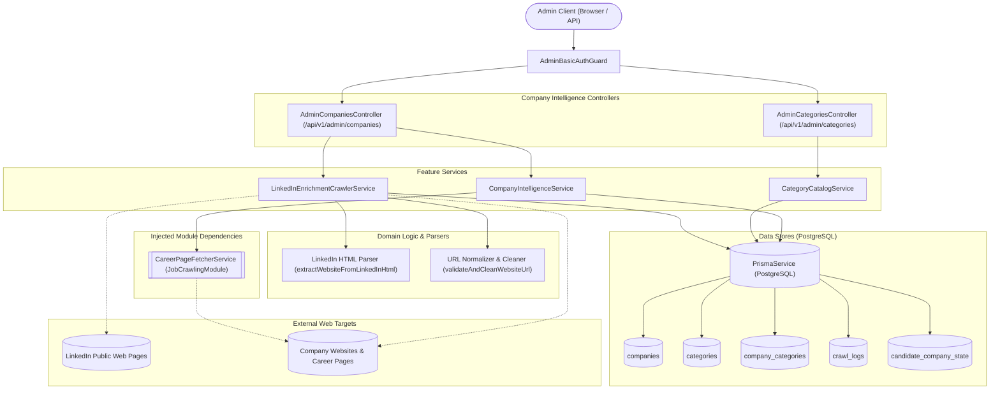
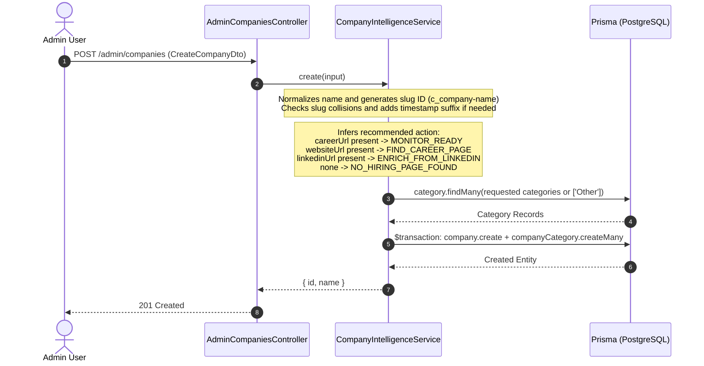
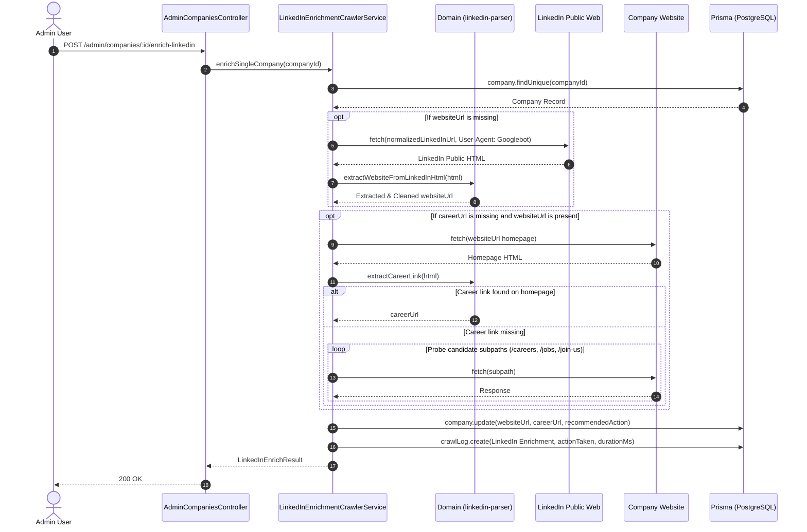
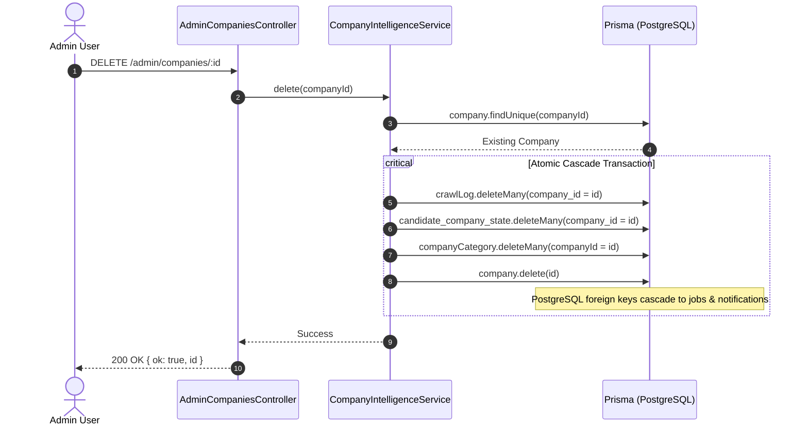
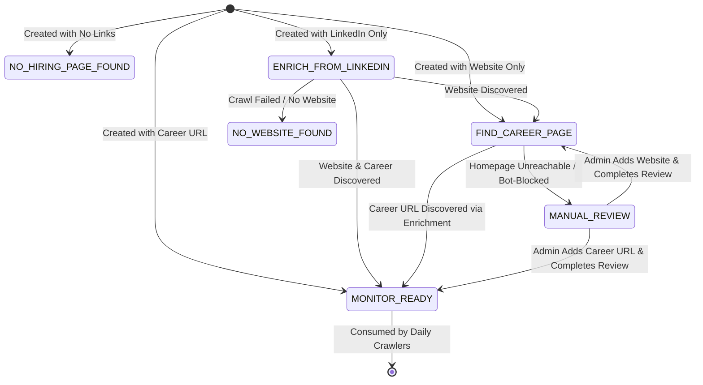

# Company Intelligence Feature

## Purpose
Owns global company directory intelligence, taxonomy categorization, automated website career discovery, LinkedIn profile enrichment crawling, administrative review lifecycles, and atomic entity cascade deletion.

---

## Component Architecture



---

## Responsibilities
- **Company Profile Lifecycle**: Creating, updating, querying, filtering, and deleting shared enterprise company intelligence records.
- **Slugified Identity Generation**: Deriving clean, deterministic primary key slugs (e.g., `c_tech-innovations-ltd`) with timestamp-based salt collision protection (`_${Date.now().toString(36)}`).
- **Atomic Category Taxonomy Management**: Maintaining shared taxonomy types (`technology`, `domain`, `sector`, `other`) and atomically replacing company-category associations (`company_categories`) in a single database transaction.
- **Automated Research Action Inference**: Automatically classifying newly created or updated companies into workflow actions (`MONITOR_READY`, `FIND_CAREER_PAGE`, `ENRICH_FROM_LINKEDIN`, `NO_HIRING_PAGE_FOUND`).
- **Controlled Website Career Discovery**: Fetching company homepages, scanning anchors (`/careers`, `/jobs`, `/join-us`), resolving relative URLs, and transitioning verified targets to `MONITOR_READY`.
- **LinkedIn Profile Enrichment**: Crawling public LinkedIn company profile HTML using crawler user-agents, parsing `data-test-id="about-us__website"` redirect parameters, extracting JSON-LD schema metadata, cleaning domains, and discovering career URLs.
- **Batch & Single Enrichment**: Ingesting companies in `ENRICH_FROM_LINKEDIN` status either individually or in batches with bounded limits, polite rate delays (`delayMs`), and execution audit logging.
- **Manual Review Workflow**: Clearing `needs_manual_review` flags and recalculating action targets (`MONITOR_READY` vs `FIND_CAREER_PAGE`) when administrative inspection completes.
- **Atomic Cascade Entity Deletion**: Completely purging a company along with its dependent crawl logs, candidate bookmarks, category joins, and cascaded job postings in an atomic transaction.

---

## Does Not Own
- **Candidate-Specific Tracking & Notes**: Personal application pipeline states (`PLANNING`, `APPLIED`, `EXCLUDED`) and candidate notes are owned by `CandidatePortalModule` (`CandidatePipelineService`).
- **Job Ingestion & Parsing Infrastructure**: Full-page career scraping, vacancy extraction, text cleaning, and job hash deduplication are owned by `JobCrawlingModule` (`CompanyCrawlService`).
- **Job Matching & Scored Recommendations**: Algorithmic scoring of candidate profiles against open company jobs is owned by `MatchingModule` (`deterministicMatch`).
- **Candidate Account Management**: Candidate profile provisioning and credential resets are owned by `AdminOperationsModule`.
- **Authentication Credentials**: Verification of basic auth credentials (`adminUsername`, `adminPassword`) is owned by `AuthenticationModule` (`AdminBasicAuthGuard`).

---

## Dependencies
- **Internal Modules**:
  - `AuthenticationModule`: Provides `AdminBasicAuthGuard`.
  - `CrawlExecutionModule` (`JobCrawlingModule`): Provides `CareerPageFetcherService`.
- **Core / Platform**:
  - `PrismaService` (`@app/database`): PostgreSQL persistence, relations, and atomic transactions.
  - Native `fetch` & `AbortController`: HTTP transport with timeout controls.
- **Standard Library / Validation**:
  - `node:url`: Canonical URL parsing, normalization, and path resolution.
  - `class-validator`, `class-transformer`: Input validation and query parameter transformation.

---

## Database Ownership

### Writes / Mutates
- `companies`: Creates companies, updates profile attributes, website/career URLs, research status, review flags, and deletes companies.
- `categories`: Upserts category definitions (`name`, `type`).
- `company_categories`: Deletes and creates join assignments atomically in `$transaction`.
- `crawl_logs`: Creates enrichment activity audit logs (`LinkedIn Enrichment`) and purges logs when a company is deleted.
- `candidate_company_state`: Purges candidate bookmarks/notes when a company is deleted.

### Reads / References
- `companies`: Reads companies for listing, search (`q`), category filtering, action filtering, review auditing, and enrichment.
- `categories`: Reads active category taxonomy and aggregates usage counts.
- `jobs`: Read and cascaded at the database level when a company is removed.

---

## Important Invariants

1. **Admin Perimeter Isolation**:
   All endpoints in this feature are strictly guarded by `AdminBasicAuthGuard`. Candidates and unauthenticated clients cannot view or mutate company intelligence records or trigger enrichment crawls.
2. **Category Replacement Atomicity**:
   Updating company categories atomically deletes all existing join records (`companyCategory.deleteMany`) and creates new ones (`companyCategory.createMany`) within a single database transaction. If any requested category does not exist, the entire transaction aborts with HTTP 404 `CATEGORY_NOT_FOUND`.
3. **Fallback to 'Other' Category**:
   If an update or create request specifies an empty category list, the system automatically assigns the fallback `'Other'` category.
4. **Deterministic Unique Slug Identity**:
   Company primary keys are formatted as `c_<slug>` (up to 30 characters). If a company with that slug already exists, a base-36 timestamp suffix is appended (`c_<slug>_<timestamp36>`), guaranteeing uniqueness without relying on random UUIDs.
5. **Polite Crawler Delay & Rate Management**:
   Batch LinkedIn enrichment enforces a sequential loop with configurable polite delay (`delayMs >= 1200ms`) between requests to avoid IP bans and anti-bot blocks.
6. **Domain Whitelisting & Non-Company Exclusion**:
   Website URL extraction rigorously filters out major non-company domains (LinkedIn, Google, Facebook, Twitter, Instagram, YouTube, Schema.org, Bing, Microsoft, Apple) and strips tracking query parameters (`utm_*`, `gclid`, `fbclid`).
7. **Clean Cascade Deletion Boundary**:
   Deleting a company removes its `crawl_logs`, `candidate_company_state`, `company_categories`, and cascades to `jobs` and `notifications` in PostgreSQL, preventing orphaned foreign key violations.

---

## Public API & Entry Points

| Method | Endpoint | Guards | Payload / Query | Purpose |
| :--- | :--- | :--- | :--- | :--- |
| `GET` | `/api/v1/admin/companies/enrich-linkedin/status` | Admin Basic Auth | None | Returns count of active companies pending LinkedIn enrichment |
| `POST` | `/api/v1/admin/companies/enrich-linkedin` | Admin Basic Auth | `BatchEnrichLinkedInDto` (`limit`, `delayMs`) | Runs batch LinkedIn enrichment crawler on pending companies |
| `GET` | `/api/v1/admin/companies` | Admin Basic Auth | `CompanyListQueryDto` (`search`, `action`, `category`, `needsManualReview`, `page`, `pageSize`) | Lists companies with multi-column text search, filters, and pagination |
| `POST` | `/api/v1/admin/companies` | Admin Basic Auth | `CreateCompanyDto` | Creates a new company profile, generates slug ID, and assigns categories |
| `GET` | `/api/v1/admin/companies/:id` | Admin Basic Auth | None | Retrieves detailed company record including research hints and source rows |
| `PUT` | `/api/v1/admin/companies/:id` | Admin Basic Auth | `UpdateCompanyDto` | Updates company profile attributes and atomically replaces categories |
| `POST` | `/api/v1/admin/companies/:id/complete-review` | Admin Basic Auth | None | Clears manual review flags and recalculates recommended research action |
| `POST` | `/api/v1/admin/companies/:id/enrich` | Admin Basic Auth | `EnrichCompanyDto` (`websiteUrl`, `careerUrl`) | Inspects website homepage HTML to discover career URL |
| `POST` | `/api/v1/admin/companies/:id/enrich-linkedin` | Admin Basic Auth | None | Crawls LinkedIn profile for a single company and discovers career page |
| `DELETE`| `/api/v1/admin/companies/:id` | Admin Basic Auth | None | Atomically deletes company, crawl logs, bookmarks, and cascaded jobs |
| `GET` | `/api/v1/admin/categories` | Admin Basic Auth | None | Lists categories ordered by type with usage counts (counting 'Other' cleanly) |
| `POST` | `/api/v1/admin/categories` | Admin Basic Auth | `CreateCategoryDto` (`name`, `type`) | Upserts category definition by name, preserving existing company links |

### Exported Services
- `CompanyIntelligenceService`: Exported to `AdminOperationsModule` for dashboard metrics, and accessible across features.
- `CategoryCatalogService`: Exported for category taxonomy inspection and administration.
- `LinkedInEnrichmentCrawlerService`: Exported for scheduled or CLI-driven enrichment workflows.

---

## Important Flows

### 1. Company Creation & Research Action Inference Flow



### 2. LinkedIn Enrichment & Career Discovery Flow



### 3. Atomic Cascade Deletion Flow



### 4. Company Research Recommended Action Lifecycle



---

## Brutally Honest Vulnerability & Architectural Risk Assessment

> [!WARNING]
> This section details critical architectural bottlenecks, zero-day threat exposures, and operational risks identified in the `company-intelligence` module.

### 1. Synchronous Batch HTTP Crawling in Main API Thread (Cloudflare 524/504 Gateway Timeout)
- **Vulnerability**: Calling `POST /api/v1/admin/companies/enrich-linkedin` executes a synchronous loop in the Node.js HTTP request-response cycle over up to 500 companies (`limit?: number`, maximum 500):
  ```ts
  for (let i = 0; i < companies.length; i++) {
    // 1. Fetch LinkedIn HTML (timeout: 15s)
    // 2. Fetch Website homepage (timeout: 10s)
    // 3. Probe 4 candidate subpaths (4 x 6s = 24s)
    // 4. Polite delay (delayMs >= 1200ms)
  }
  ```
- **Threat Vector**:
  - A batch of 50 companies with moderate network latency or hung external servers will block the HTTP connection for **10 to 30 minutes**.
  - Edge reverse proxies (Cloudflare, Nginx, AWS ALB) enforce strict gateway timeouts (typically 30–100 seconds). Cloudflare will abort the client connection with `524 A timeout occurred` or `504 Gateway Timeout`.
  - While the client sees an HTTP failure, the Node.js process continues executing the batch loop blindly in the background, consuming socket descriptors and event loop ticks without notifying the client.
- **Remediation**:
  Offload batch enrichment to an asynchronous BullMQ queue worker:
  1. `POST /admin/companies/enrich-linkedin` enqueues a background job and immediately returns HTTP 202 Accepted with a `jobId`.
  2. The admin UI listens for progress over Server-Sent Events (SSE) or WebSockets.

### 2. Missing Rate Limiting on External Scraping Endpoints (IP Blacklisting & Anti-Bot Bans)
- **Vulnerability**: `AdminCompaniesController` has **zero rate limiting decorators** (`@RateLimit` is missing on `batchEnrichLinkedIn`, `enrichLinkedIn`, and `enrich`).
- **Threat Vector**:
  - An administrator or an automated script can issue rapid concurrent requests to `POST /admin/companies/:id/enrich-linkedin`.
  - Scraping LinkedIn repeatedly from a single static datacenter IP address triggers LinkedIn's anti-bot detection systems (`HTTP 429 Too Many Requests`, `HTTP 999 Request Denied`, or CAPTCHA challenges), permanently blacklisting the server's public IP from accessing LinkedIn.
- **Remediation**: Apply `@RateLimit({ windowMs: 60_000, max: 10, keyPrefix: 'admin_enrich_linkedin' })` and integrate a rotating residential proxy service for outbound LinkedIn requests.

### 3. Hardcoded Googlebot User-Agent Spoofing without Reverse DNS Validation
- **Vulnerability**: In `LinkedInEnrichmentCrawlerService`:
  ```ts
  const CRAWLER_USER_AGENT =
    'Mozilla/5.0 (compatible; Googlebot/2.1; +http://www.google.com/bot.html)';
  ```
- **Threat Vector**:
  - Modern anti-bot perimeters (Cloudflare, Akamai, PerimeterX) and LinkedIn actively detect Googlebot impersonation by performing reverse DNS verification (`rDNS`).
  - If the incoming IP does not resolve to `*.googlebot.com` or `*.google.com`, the request is immediately flagged as a malicious scraper, resulting in instant HTTP 403 Forbidden or silent bot tarpitting.
- **Remediation**: Use a realistic modern browser user-agent header set with matching Client Hints (`sec-ch-ua`, `sec-fetch-site`, `accept-language`) and randomized viewport profiles, or route through a headless browser instance (Playwright/Puppeteer).

### 4. Race Condition in Slug Generation Under Concurrent Creation
- **Vulnerability**: In `CompanyIntelligenceService.create()`:
  ```ts
  const prefix = baseSlug ? `c_${baseSlug}` : 'c_company';
  let id = prefix;
  const existing = await this.prisma.company.findUnique({
    where: { id },
    select: { id: true },
  });
  if (existing) {
    id = `${prefix}_${Date.now().toString(36)}`;
  }
  ```
- **Threat Vector**: This check-then-insert pattern is **not wrapped in a serializable lock or database transaction before slug selection**. If two concurrent requests attempt to create a company with the exact same name at the same millisecond (e.g. during CSV bulk imports or automated seed scripts), both see `existing === null`, use the exact same primary key `c_<slug>`, and one crashes with a PostgreSQL unique constraint violation error (`P2002`).
- **Remediation**: Use database-level generation or catch `PrismaClientKnownRequestError` with code `P2002` to retry with a cryptographic random suffix (`crypto.randomUUID().slice(0, 8)`).

### 5. Irreversible Cascade Deletion Without Soft-Delete or Trash Retention
- **Vulnerability**: `DELETE /api/v1/admin/companies/:id` executes a hard deletion:
  ```ts
  await transaction.crawlLog.deleteMany({ where: { company_id: id } });
  await transaction.candidate_company_state.deleteMany({ where: { company_id: id } });
  await transaction.companyCategory.deleteMany({ where: { companyId: id } });
  await transaction.company.delete({ where: { id } });
  ```
- **Threat Vector**:
  - The deletion cascades directly to `jobs` and `notifications` in PostgreSQL.
  - If an administrator accidentally deletes a company, all historical crawl metrics, candidate tracking bookmarks, personal notes, and published vacancies are permanently and irreversibly destroyed from the database.
- **Remediation**: Implement a soft-delete mechanism (`deleted_at TIMESTAMP NULL`, `active = false`) and an administrative "Trash / Restore" lifecycle. Hard deletions should require an explicit confirmation token (`confirmName === company.name`).

### 6. Sequential Subpath Probing Latency Multiplier
- **Vulnerability**: In `discoverCareerUrlFromWebsite()`:
  ```ts
  const candidates = ['/career', '/careers', '/jobs', '/join-us'];
  for (const candidate of candidates) {
    // Sequential fetch with 6,000ms timeout
  }
  ```
- **Threat Vector**: If a company's web server drops packets or tarpits non-existent paths, probing 4 subpaths sequentially stalls the Node.js request handler for up to **24 seconds** per company.
- **Remediation**: Execute candidate probes concurrently using `Promise.any()` or `Promise.allSettled()` with a unified 5-second timeout budget:
  ```ts
  const candidateUrls = candidates.map(c => new URL(c, websiteUrl).toString());
  // Probe concurrently and resolve on first valid 200 HTML response
  ```

### 7. Uncached Category Catalog with In-Memory JavaScript Sorting
- **Vulnerability**: In `CategoryCatalogService.list()`:
  The service queries all categories and company counts from PostgreSQL and performs an in-memory array sort in JavaScript:
  ```ts
  const order = { technology: 1, domain: 2, sector: 3, other: 4 } as const;
  return categories.sort((left, right) =>
    order[left.type] - order[right.type] || left.name.localeCompare(right.name)
  );
  ```
- **Threat Vector**: Because category taxonomy rarely changes, querying PostgreSQL and sorting in V8 on every admin page load wastes connection pool resources on Neon serverless databases.
- **Remediation**: Cache the catalog in Redis with a 1-hour TTL and move the type ordering into an SQL `ORDER BY CASE type WHEN 'technology' THEN 1 ... END` clause.
