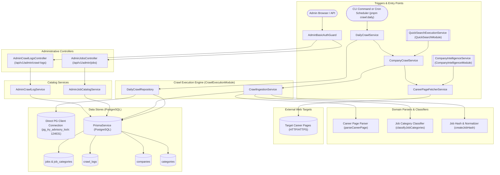
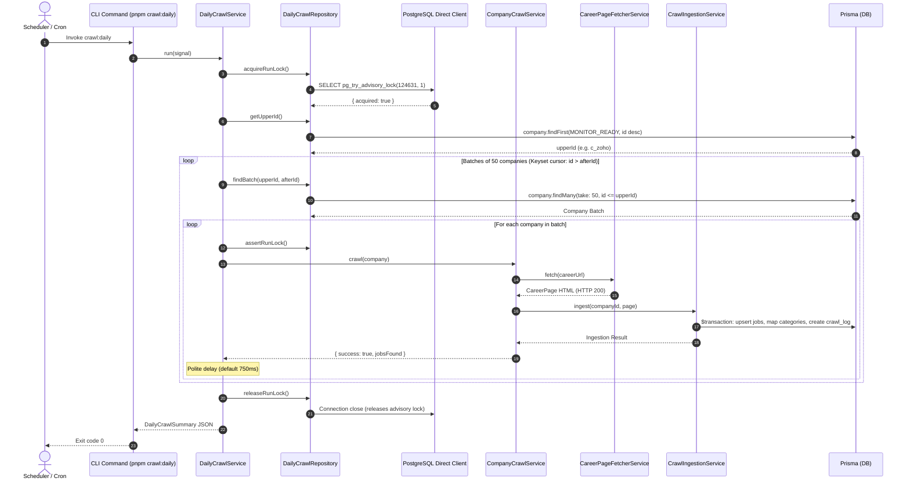
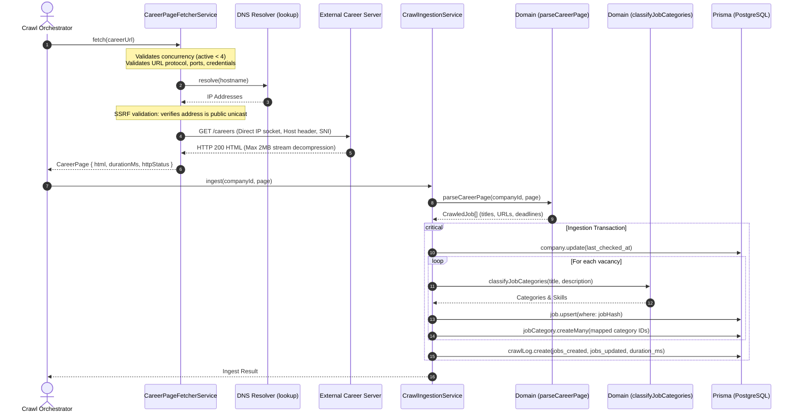
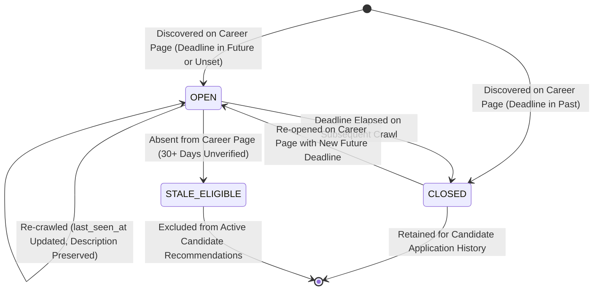

# Job Crawling Feature

## Purpose
Owns web crawling transport, strict SSRF-protected HTTP fetching, Cheerio-based career page parsing, deterministic vacancy deduplication, category taxonomy classification, atomic database ingestion, and scheduled daily crawl orchestration.

---

## Component Architecture



---

## Responsibilities
- **SSRF-Protected HTTP Fetching**: Crawling public career pages with strict IP validation (`ipaddr.js`), private/loopback/multicast filtering, DNS pinning to eliminate DNS rebinding, manual redirect controls (max 3), HTTPS downgrade prevention, and 20-second hard deadlines.
- **Vacancy Discovery & DOM Analysis**: Parsing arbitrary HTML structures using Cheerio, detecting role titles, application links, locations, work modes, and natural-language application deadlines ("15th October 2026", "Apply by November 20, 2026", ISO dates).
- **Deterministic Vacancy Deduplication**: Generating SHA-256 hashes from normalized entity properties (`companyId|title|location|applicationUrl`) to idempotently upsert vacancies rather than creating duplicate entries.
- **Taxonomy & Skill Classification**: Mapping job titles and descriptions against regular expression rules across 30+ technologies and domains, linking vacancies to normalized categories with attribution sources (`title`, `skills`, `description`).
- **Atomic Ingestion & Freshness Guarantees**: Upserting up to 150 vacancies per page, updating `last_checked_at` and `last_seen_at` timestamps, marking expired deadlines as `CLOSED`, and preserving existing descriptions and deadlines when incoming crawls lack them.
- **Scheduled Batch Crawl Orchestration**: Executing keyset-paginated sweeps (50 companies per batch) over active `MONITOR_READY` targets with fixed upper-ID boundaries and configurable polite delays (`CRAWL_DELAY_MS`).
- **Distributed Concurrency & Advisory Locking**: Preventing concurrent daily crawler runs using a dedicated direct PostgreSQL session advisory lock (`pg_try_advisory_lock(124631, 1)`), independent of transactional connection poolers.
- **Administrative Job & Crawl Audit Telemetry**: Exposing paginated, filtered endpoints for administrators to review discovered jobs and historical crawl logs with execution metrics and diagnostic error codes.

---

## Does Not Own
- **Job Matching & Scored Candidate Recommendations**: Algorithmic scoring of candidate profiles against open jobs is owned by `MatchingModule` (`CandidateRecommendationsService`, `deterministicMatch`).
- **Candidate-Specific Pipeline Tracking**: Personal bookmarks, applied dates, and candidate notes are owned by `CandidatePortalModule` (`candidate_company_state`).
- **Global Company Directory Management**: Company entity CRUD, taxonomy editing, and LinkedIn enrichment are owned by `CompanyIntelligenceModule`.
- **Match Notification Dispatch**: Composing candidate digests and sending outbound emails are owned by `NotificationsModule`.
- **Operating System Scheduling**: The daily 06:15 Asia/Dhaka schedule trigger is owned by an external scheduler (system cron, Docker container, or cloud scheduler); this module owns the execution context.

---

## Dependencies
- **Core / Platform**:
  - `PrismaService` (`@app/database`): PostgreSQL persistence for jobs, logs, categories, and companies.
  - Native `node:http`, `node:https`, `node:tls`, `node:dns/promises`, `node:zlib`: Network transport and decompression.
  - `pg`: Dedicated standalone PostgreSQL client for session advisory lock management.
- **Internal Modules**:
  - `AuthenticationModule`: Provides `AdminBasicAuthGuard`.
- **Third-Party Libraries**:
  - `cheerio`: High-performance HTML parsing and DOM traversal.
  - `ipaddr.js`: Rigorous IP address parsing and CIDR range classification.
  - `domhandler`: Low-level DOM element type definitions.
  - `class-validator`, `class-transformer`: Query parameter validation and transformation.

---

## Database Ownership

### Writes / Mutates
- `jobs`: Upserts vacancies using `jobHash`, mutates `status` (`OPEN` vs `CLOSED`), `last_seen_at`, `application_deadline`, `description`, and `skills`.
- `job_categories`: Replaces category associations for each processed vacancy in `IngestionService`.
- `crawl_logs`: Creates execution audit records recording `duration_ms`, `http_status`, `jobs_found`, `jobs_created`, `jobs_updated`, `action_taken`, and sanitized error codes.
- `companies`: Updates `last_checked_at` timestamp upon crawl attempt.

### Reads / References
- `companies`: Queries active `MONITOR_READY` companies with non-null `careerUrl`.
- `categories`: Reads taxonomy to map classified category names to primary keys (`categoryId`).
- `jobs` & `crawl_logs`: Queried for administrative catalog listings and diagnostics.

---

## Important Invariants

1. **Strict SSRF Defense & IP Pinning**:
   Before initiating an HTTP request, the target hostname is resolved via OS DNS. Every resolved IP is evaluated against `ipaddr.js`. If any IP belongs to a private range (`10.0.0.0/8`, `172.16.0.0/12`, `192.168.0.0/16`), carrier-grade NAT (`100.64.0.0/10`), loopback (`127.0.0.0/8`), link-local, multicast, or IPv4-mapped IPv6, the request is aborted immediately with `BLOCKED_ADDRESS`. Sockets connect directly to the verified IP, eliminating DNS rebinding.
2. **Direct Connection for Advisory Session Lock**:
   Daily crawl concurrency locking uses `pg_try_advisory_lock(124631, 1)` on a dedicated, non-pooled connection (`CRAWLER_LOCK_DATABASE_URL`). Connection strings containing `-pooler.` (such as Neon or PgBouncer transaction poolers) are rejected immediately at startup to prevent session lock bleeding or silent lock loss.
3. **Stable Keyset Pagination Boundary**:
   The crawler captures the current maximum company ID (`getUpperId()`) before beginning a run. New companies created while crawling is underway cannot extend the run indefinitely.
4. **Deterministic Job Hash Identity**:
   A job's identity is defined strictly as `SHA-256(companyId | title | location | applicationUrl)`. Subsequent crawls that detect the same role update `last_seen_at` without duplicating the row.
5. **Non-Destructive Content Preservation**:
   If a re-crawled job page omits the description or application deadline, the previously stored values in PostgreSQL are preserved (using Prisma `undefined` semantics).
6. **No-Openings Safety Invariant**:
   If a career page returns 0 jobs or displays a "no openings" notice, existing jobs for that company are **never** closed or deleted after a single crawl, preventing accidental bulk closure due to temporary website glitches or anti-bot interstitials.
7. **Deadline-Driven Status Transition**:
   If a parsed job has an application deadline earlier than the current crawl timestamp, its status is set to `CLOSED`. Vacancies with future or absent deadlines are set to `OPEN`.
8. **In-Process Concurrency Ceiling**:
   `CareerPageFetcherService` enforces a strict ceiling of at most 4 concurrent active HTTP requests per Node.js process (`active >= 4` immediately throws `CAPACITY`).

---

## Public API & Entry Points

### HTTP Endpoints (Admin Guarded)

| Method | Endpoint | Guards | Query Parameters | Purpose |
| :--- | :--- | :--- | :--- | :--- |
| `GET` | `/api/v1/admin/jobs` | Admin Basic Auth | `JobListQueryDto` (`search`, `status`, `category`, `technology`, `domain`, `sector`, `categoryScope`, `page`, `pageSize`) | Paginated jobs catalog with multi-field search and category scope filtering |
| `GET` | `/api/v1/admin/crawl-logs` | Admin Basic Auth | `CrawlLogListQueryDto` (`search`, `success`, `page`, `pageSize`) | Paginated crawl execution audit logs with company details |

### CLI & Worker Commands

| Command | File Entry Point | Options / Env | Purpose |
| :--- | :--- | :--- | :--- |
| `pnpm crawl:daily` | `backend/src/commands/crawl-daily.ts` | `CRAWL_DELAY_MS` (default 750)<br/>`CRAWL_LIMIT` (optional count)<br/>`CRAWLER_LOCK_DATABASE_URL` | Runs a bounded, advisory-locked daily crawl sweep across all active `MONITOR_READY` companies |

### Exported Module Services (`CrawlExecutionModule`)
- `CompanyCrawlService`: Single-company crawl orchestrator, consumed by `QuickSearchExecutionService`.
- `CareerPageFetcherService`: Public HTTP transport, consumed by `CompanyIntelligenceService` for website career discovery.
- `CrawlIngestionService`: Ingests and persists parsed career pages and logs failures.
- `DailyCrawlService`: Manages daily sweep lifecycles and concurrency locks.

---

## Important Flows

### 1. Scheduled Daily Crawl Batch Execution Flow



### 2. Career Page Fetching & Ingestion Flow



### 3. Job Vacancy Status Lifecycle



---

## Brutally Honest Vulnerability & Architectural Risk Assessment

> [!WARNING]
> This section details critical architectural bottlenecks, zero-day threat exposures, and operational risks identified in the `job-crawling` module.

### 1. Direct Session Advisory Lock Fragility on Serverless PostgreSQL (Neon)
- **Vulnerability**: In `DailyCrawlRepository`:
  ```ts
  const connectionString = process.env.CRAWLER_LOCK_DATABASE_URL ?? process.env.DATABASE_URL;
  if (!connectionString || new URL(connectionString).hostname.includes('-pooler.'))
    throw new Error('Daily crawl locking requires a direct database connection.');
  ```
  The crawler maintains an active TCP connection to PostgreSQL throughout the entire duration of the crawl (which can last 30–90+ minutes).
- **Threat Vector**:
  - Serverless cloud databases (like Neon) aggressively terminate idle TCP sessions and drop direct compute endpoints when scaling or migrating replicas.
  - If Neon triggers a connection restart or TCP keep-alive drop, `client.on('error')` trips `lockHealthy = false`.
  - On the very next company, `assertRunLock()` throws `Daily crawl lock was lost.`, abruptly aborting the entire daily crawl midway through execution.
- **Remediation**:
  Migrate distributed crawl coordination from a single long-lived PostgreSQL session advisory lock to a Redis-based Redlock (`SET crawler:daily:lock <uuid> NX PX 30000` with periodic heartbeat renewal) or a persisted database lease table (`crawler_leases` with heartbeats).

### 2. Single-Threaded Sequential Crawl Bottleneck (Scaling Ceiling)
- **Vulnerability**: `DailyCrawlService.run()` executes sequentially:
  ```ts
  for (const company of batch) {
    await this.companies.crawl(company);
    await delay(config.delayMs);
  }
  ```
- **Threat Vector**:
  - With 500 active companies, an average 4-second HTTP roundtrip per company, plus a 750ms polite delay, a single run requires:
    $$500 \times (4.0\text{s} + 0.75\text{s}) = 2,375\text{ seconds} \approx 40\text{ minutes}$$
  - As the company directory expands to 2,000+ companies, the daily crawl will exceed **2.5 to 3 hours**, colliding with work hours and exhausting serverless compute credits.
- **Remediation**:
  Implement worker concurrency pools (e.g. 5 concurrent worker threads or BullMQ parallel jobs), with per-domain rate limiting to ensure polite pacing while processing disparate companies concurrently.

### 3. Inability to Crawl Client-Side Rendered (SPA) Career Portals
- **Vulnerability**: `CareerPageFetcherService` uses plain Node.js `https.request` and parses static HTML using Cheerio.
- **Threat Vector**:
  - An increasing number of modern enterprise career pages (Workday, Greenhouse React boards, Lever SPAs, Taleo) render vacancy listings client-side via JavaScript.
  - The static fetcher receives an empty `<div id="root"></div>` or `<app-root></app-root>`, resulting in 0 jobs found and recording false `noOpeningsSignal` states.
- **Remediation**:
  Deploy a headless browser rendering microservice (e.g. Playwright / Puppeteer with Chromium) invoked conditionally when `CareerPageFetcherService` detects an empty SPA shell or when an administrative flag `requires_js_render: true` is configured.

### 4. Ghost Vacancy Accumulation (Absence of Automated Job Pruning)
- **Vulnerability**: In `CrawlIngestionService`:
  When a vacancy is removed from an external company career page, the database **never** marks that job `CLOSED` or `REMOVED`. Only explicit deadline expiry marks a job `CLOSED`.
- **Threat Vector**:
  - If a company removes a job posting that had no explicit deadline, that vacancy remains `status: 'OPEN'` indefinitely.
  - Over months of operation, thousands of "ghost jobs" accumulate in the database. Candidates continue receiving recommendations for positions that were closed months ago, severely degrading platform credibility.
  - (Note: `CandidateRecommendationsService` mitigates this partially at query time by ignoring jobs unverified in the last 30 days, but the database itself never reconciles or purges the stale records).
- **Remediation**:
  Implement a reconciliation pass in `CrawlIngestionService`: if a company was successfully crawled and returned $\ge 1$ jobs, mark any previously `OPEN` jobs for that company not present in the current crawl as `CLOSED` or `STALE` after 3 consecutive crawl absences.

### 5. Regex ReDoS Vulnerability in Career Page Text Parser
- **Vulnerability**: In `career-page.parser.ts`:
  Regex patterns such as `ROLE_TEXT`, `JOB_CONTEXT`, and nested DOM element traversal (`nearestJobContainer`, scanning up to 6 parent levels) operate on raw HTML text extracted from untrusted third-party servers.
- **Threat Vector**:
  A malicious target server (or an infected target website) can return an adversarial 2MB HTML payload containing heavily repeated whitespace or pathological character sequences designed to trigger catastrophic backtracking in V8's regex engine, freezing the Node.js event loop.
- **Remediation**:
  Ensure all regexes are linear-time (`O(N)`) and wrap HTML parsing passes in `safe-regex` checks or run DOM parsing inside worker threads with execution timeouts.

### 6. In-Process Semaphore Concurrency Ceiling
- **Vulnerability**: In `CareerPageFetcherService`:
  ```ts
  if (this.active >= 4) throw new CrawlTransportError('CAPACITY', 'Crawler transport is busy.');
  this.active += 1;
  ```
- **Threat Vector**:
  This in-memory counter is local to a single Node.js process. When running multiple API replicas or cluster mode instances behind a load balancer, each instance can fire 4 concurrent requests, bypassing the intended concurrency bounds and multiplying outbound network strain.
- **Remediation**:
  Manage outbound crawler concurrency across processes using a shared Redis semaphore or token bucket.
