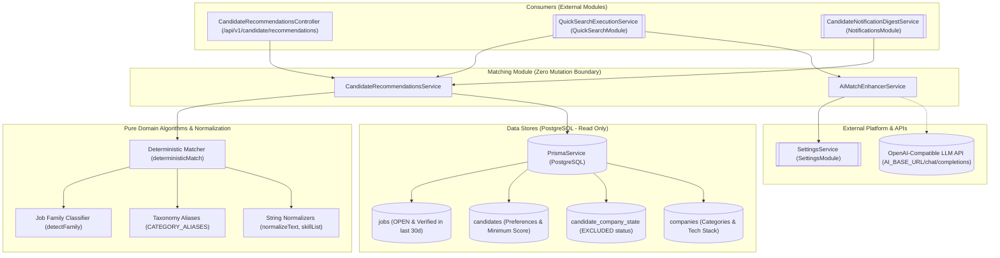
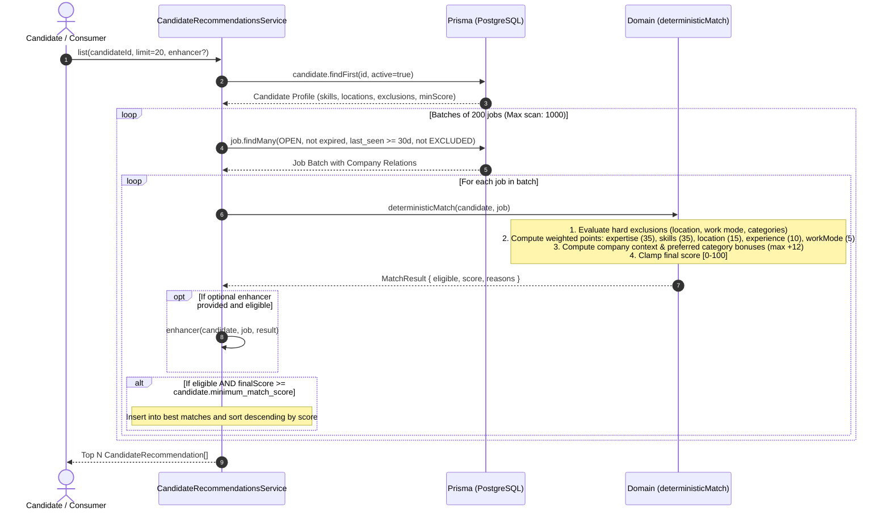
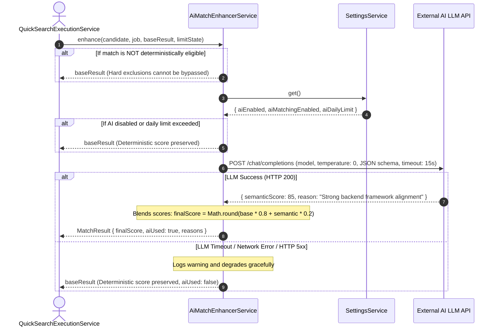
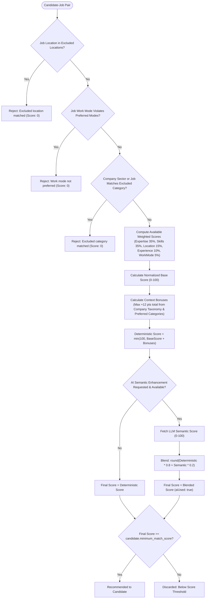

# Matching Feature

## Purpose
Owns candidate-to-job match scoring, deterministic career fit algorithms, hard exclusion enforcement (location, work mode, categories), company context weighting, bounded catalog candidate recommendation scans, and optional LLM-assisted semantic score enhancement.

---

## Component Architecture



---

## Responsibilities
- **Multi-Factor Weighted Deterministic Matching**: Computing career alignment scores based on five core criteria:
  - **Expertise Alignment (35%)**: Classifies roles into 13 job families (`backend`, `frontend`, `fullstack`, `mobile`, `qa`, `devops`, `data`, `ml`, `security`, `design`, `product`, `business-analysis`, `support`) or falls back to word-stem overlap.
  - **Skills Overlap (35%)**: Evaluates candidate skill lists against compact alphanumeric job and company tech stack tokens.
  - **Location Preference (15%)**: Awards 100 points for preferred location matches, 35 points for unlisted non-excluded locations.
  - **Experience Level & Years (10%)**: Compares seniority ranks (intern through director, diff 0: 100pts, diff 1: 65pts, diff $\ge 2$: 20pts) and parses required experience years.
  - **Work Mode Preference (5%)**: Evaluates Remote, Hybrid, or On-site alignment.
- **Company Context & Preferred Category Bonuses**: Awarding up to 12 total bonus points for related company taxonomy categories (2–8 pts) and candidate preferred category overlaps (2–8 pts).
- **Absolute Hard Exclusion Enforcement**:
  - Rejects jobs located in `excludedLocations`.
  - Rejects jobs whose work mode conflicts with candidate preferences.
  - Rejects jobs whose company sector or vacancy text matches `excludedCategories`.
- **Bounded Batch Database Recommendation Scans**: Scanning active `OPEN` vacancies in batches of 200 by descending BigInt ID, bounded by `MAX_MATCH_SCAN_JOBS` (default 1000), ignoring expired vacancies and unverified listings older than 30 days.
- **Candidate Blacklist Filtration**: Excluding companies bookmarked as `EXCLUDED` by the candidate at both the PostgreSQL relational query level and double-checked in-memory.
- **AI-Assisted Semantic Enhancement**: Optionally invoking an external OpenAI-compatible LLM endpoint to compute semantic fit (0–100), blending scores ($80\%$ deterministic, $20\%$ semantic), while ensuring hard exclusions can never be overridden by AI.
- **Graceful Fault Tolerance**: Automatically falling back to deterministic scores when the AI provider times out, encounters HTTP errors, or exceeds the daily quota.

---

## Does Not Own
- **HTTP Routing & API Guarding**: `MatchingModule` does not declare any HTTP controllers. Controller endpoints (`/candidate/recommendations`) and session/password guards are owned by `CandidatePortalModule`.
- **Candidate Profile & Preference Persistence**: Updating candidate skills, locations, and category preferences is owned by `CandidatePortalModule` (`CandidateProfileService`).
- **Job Ingestion & Parsing**: Web crawling, vacancy extraction, and job record creation are owned by `JobCrawlingModule`.
- **System Quota Configuration**: Managing AI daily limits and system-wide toggles is owned by `SettingsModule`.
- **Candidate Notification Dispatch**: Email templating and SMTP delivery are owned by `NotificationsModule`.

---

## Dependencies
- **Core / Platform**:
  - `PrismaService` (`@app/database`): Read-only querying of jobs, candidates, categories, and company states.
  - Native `fetch` & `AbortSignal.timeout(15_000)`: Outbound HTTP transport for LLM completion calls.
- **Internal Modules**:
  - `SettingsModule`: Provides `SettingsService` for reading dynamic AI operational settings (`aiEnabled`, `aiMatchingEnabled`, `aiDailyLimit`).
- **Standard Library / Pure Math**:
  - Pure TypeScript regex parsing, string distance, and weighted arithmetic without external machine learning dependencies.

---

## Database Ownership

### Writes / Mutates
- **NONE**: `MatchingModule` is a **zero-mutation, strictly read-only** bounded context. It never creates, updates, or deletes database records.

### Reads / References
- `jobs`: Reads `OPEN` jobs with non-expired application deadlines and `last_seen_at` within the last 30 days.
- `candidates`: Reads profile criteria (`expertise`, `skills`, `experience_level`, `experience_years`, `preferred_locations`, `excluded_locations`, `preferred_work_modes`, `preferred_categories`, `excluded_categories`, `minimum_match_score`).
- `candidate_company_state`: Filters out companies with `status: 'EXCLUDED'`.
- `companies`: Reads `name`, `website_url`, `careerUrl`, `location`, `tech_stack`, and associated taxonomy categories.
- `categories`: Reads category names and types (`sector`, etc.).
- `settings`: Reads dynamic AI toggles and daily allowance limits.

---

## Important Invariants

1. **Absolute Primacy of Hard Exclusions**:
   If an excluded location, work mode, or category matches, the job is immediately marked `eligible: false` with score 0. AI enhancement is **never** invoked on ineligible jobs and can never resurrect an excluded job.
2. **Deterministic Score Ceiling**:
   Deterministic base score is calculated only from non-empty candidate fields (weights are re-normalized to 100% of available fields). Total bonuses (company context + preferred categories) are strictly capped at +12 points, and the final score is clamped to $[0, 100]$.
3. **Graceful AI Degradation**:
   If the AI provider times out (15s), returns HTTP 5xx/4xx, or runs out of daily quota, the system silently logs a warning and returns the deterministic score (`finalScore = base.deterministicScore, aiUsed: false`). Recommendation listing never crashes due to LLM provider downtime.
4. **Stale Job Exclusion (30-Day Freshness Window)**:
   Jobs whose `last_seen_at` is older than 30 days are automatically excluded from recommendation scans, shielding candidates from abandoned job listings.
5. **Candidate Blacklist Filtration**:
   Companies blacklisted by the candidate (`candidate_company_state.status === 'EXCLUDED'`) are excluded both in the Prisma relational query (`none: { status: 'EXCLUDED' }`) and double-checked in-memory before scoring.
6. **Zero Write Authority**:
   This module must remain completely side-effect free. It never inserts, updates, or deletes database records.
7. **Score Threshold Cutoff**:
   Only jobs with `finalScore >= candidate.minimum_match_score` are returned in recommendations.

---

## Public API & Entry Points

### Exported Services

| Service | Method | Consumers | Purpose |
| :--- | :--- | :--- | :--- |
| `CandidateRecommendationsService` | `list(candidateId, limit, enhancer?)` | `CandidateRecommendationsController`<br/>`QuickSearchExecutionService`<br/>`CandidateNotificationDigestService` | Scans catalog and returns top ranked recommendations (limit $\le 20$) |
| `AiMatchEnhancerService` | `isAvailable()` | `CandidateSearchUsageController`<br/>`QuickSearchExecutionService` | Checks whether AI is enabled, configured, and has remaining daily quota |
| `AiMatchEnhancerService` | `enhance(candidate, job, baseResult, limitState)` | `QuickSearchExecutionService` | Blends deterministic score with LLM semantic evaluation ($80/20$ split) |

### Pure Domain Functions (`domain/matcher.ts`)
- `deterministicMatch(candidate: CandidateForMatch, job: JobForMatch): MatchResult`: Pure, synchronous, zero-dependency scoring engine available for offline batch evaluation and unit tests.

---

## Important Flows

### 1. Candidate Recommendation Generation Flow



### 2. AI-Assisted Semantic Enhancement Flow



### 3. Recommendation Eligibility & Scoring Decision Tree



---

## Brutally Honest Vulnerability & Architectural Risk Assessment

> [!WARNING]
> This section details critical architectural bottlenecks, zero-day threat exposures, and operational risks identified in the `matching` module.

### 1. Unbounded Event Loop CPU Starvation During Matching Scans (DoS Risk)
- **Vulnerability**: In `CandidateRecommendationsService.list()`:
  The service queries up to `MAX_MATCH_SCAN_JOBS` (default 1000) and executes `deterministicMatch()` synchronously in a tight JavaScript loop.
- **Threat Vector**:
  - Each match invocation executes multiple regex patterns (`detectFamily`, `NON_CONTEXT_TITLE_RE`, `CATEGORY_ALIASES`, `categoryMatchesSignal`, `skillList`).
  - Processing 1,000 jobs requires **200–500ms of uninterrupted synchronous CPU time** per candidate.
  - If 15–20 candidates concurrently load their dashboard or invoke recommendations, the single Node.js event loop blocks for **4 to 10 seconds**. During this freeze, all other HTTP requests (health checks, logins, API calls) stall, causing reverse proxies (Cloudflare) to throw `502 Bad Gateway` or `504 Gateway Timeout`.
- **Remediation**:
  1. Offload heavy matching iterations to Node.js worker threads (`piscina` / `worker_threads`).
  2. Implement cooperative multitasking by yielding to the event loop (`await new Promise(setImmediate)`) every 100 jobs.
  3. Pre-calculate and cache candidate recommendations in Redis with a 5-minute TTL.

### 2. Full In-Memory Job Ingestion Without Database-Level Pre-Filtering
- **Vulnerability**: The Prisma query in `CandidateRecommendationsService` only filters by:
  ```ts
  where: {
    status: 'OPEN',
    OR: [{ application_deadline: null }, { application_deadline: { gte: now } }],
    last_seen_at: { gte: thirtyDaysAgo },
  }
  ```
- **Threat Vector**:
  - The query fetches all active jobs across all tech stacks, locations, and industries into Node.js memory.
  - If the database contains 10,000 active jobs, Node.js transfers 1,000 full records with company categories and descriptions over the network wire, only to immediately discard 90%+ in JavaScript (e.g. discarding Frontend/Design jobs when scoring a Backend Java developer).
  - This generates excessive network bandwidth, database buffer churn, and V8 garbage collection pressure.
- **Remediation**:
  Add PostgreSQL full-text search (`tsvector` / `tsquery`) or relational pre-filtering in Prisma using candidate preferred categories and expertise keywords before fetching candidate jobs into memory.

### 3. Compact Substring Matching False Positives in Skills Scoring
- **Vulnerability**: In `skillsScore()`:
  ```ts
  const compactJobSignal = normalizeText(jobSignal).replace(/[^a-z0-9+#]+/g, '');
  const matched = candidateSkills.filter((skill) =>
    compactJobSignal.includes(skill.replace(/[^a-z0-9+#]+/g, '')),
  );
  ```
- **Threat Vector**:
  - Alphanumeric compact substring matching produces severe false positives for short skills.
  - A candidate listing `"C"` matches any word with the letter 'c'.
  - A candidate listing `"Go"` matches `"Good communication"`, `"Ongoing maintenance"`, or `"Django"`.
  - A candidate listing `"R"` matches virtually every English word.
  - Candidates receive 100% skill scores on completely unrelated job postings due to substring collisions.
- **Remediation**:
  Use word-boundary regexes (`\b(c|go|r)\b/i`) or strict tokenized sets rather than raw substring inclusion (`.includes()`).

### 4. Sequential AI HTTP Calls Creating Request Timeouts
- **Vulnerability**: In `QuickSearchExecutionService`:
  When running with AI mode enabled, semantic enhancements are executed sequentially per match:
  ```ts
  for (const match of eligibleMatches) {
    await aiEnhancer.enhance(candidate, job, match, limitState);
  }
  ```
- **Threat Vector**:
  - If 15 matches qualify for AI enhancement and each external LLM API request takes 1.2–2.0 seconds, total execution time balloons by **18–30 seconds**.
  - Combined with the crawl delays, the HTTP request exceeds edge timeouts, resulting in Cloudflare `524 A timeout occurred`.
- **Remediation**:
  1. Batch all candidate-job pairs into a single multi-job prompt to the LLM.
  2. Or evaluate candidates concurrently with `Promise.all()` bounded by `p-limit(3)`.

### 5. Absence of Result Caching in Redis
- **Vulnerability**: Every invocation of `CandidateRecommendationsController.list()` re-executes full database queries and CPU matching routines.
- **Threat Vector**:
  Candidate profiles and platform jobs change slowly over hours. Repeated dashboard navigation or page refreshes cause identical compute passes, wasting database connections and CPU cycles.
- **Remediation**: Cache candidate recommendation results in Redis with a 5-minute TTL keyed by candidate ID and profile update timestamp.
