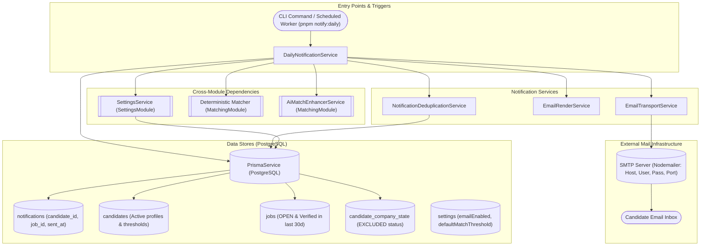
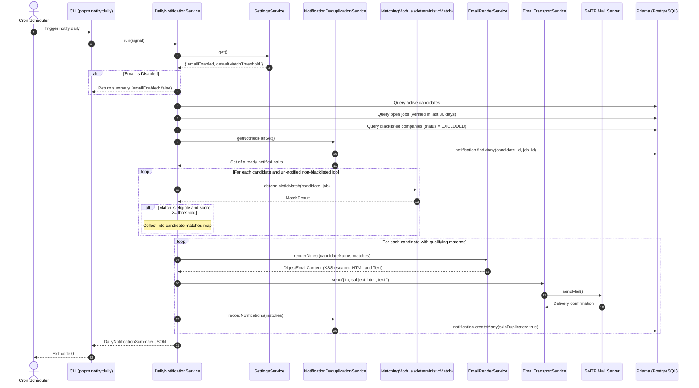
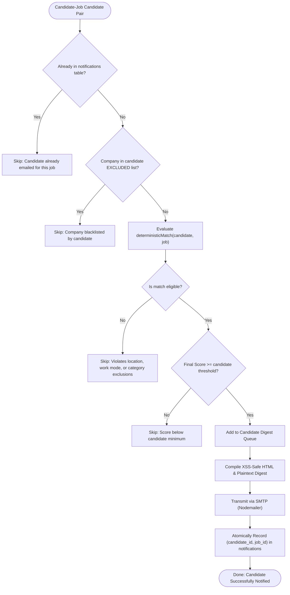

# Notifications Feature

## Purpose
Owns candidate email digest rendering, SMTP transport delivery, notification delivery history tracking, cross-run deduplication, and scheduled daily match notification distribution.

---

## Component Architecture



---

## Responsibilities
- **Periodic Daily Digest Sweeps**: Orchestrating candidate digest runs:
  - Checking global email master switch (`settings.emailEnabled`).
  - Loading active candidates and fresh `OPEN` vacancies (verified within 30 days).
  - Cross-referencing delivery history to ignore already-notified candidate-job pairs.
  - Filtering candidate company blacklists (`EXCLUDED` status).
  - Evaluating deterministic matches and optional AI enhancements against candidate thresholds.
- **XSS-Safe Responsive Email Rendering**:
  - Compiling plain text and responsive HTML candidate digests.
  - Escaping HTML characters (`&`, `<`, `>`, `"`, `'`) in job titles, company names, and descriptions.
  - Sanitizing URLs (`safeUrl` verifying `http:`/`https:`) to prevent `javascript:` or `data:` XSS vectors in email clients.
  - Dynamic subject pluralization (`1 new job match for you` vs `N new job matches for you`).
- **SMTP Transport & Credential Validation**:
  - Transmitting digests via Nodemailer with strict validation of `SMTP_HOST`, `SMTP_USER`, `SMTP_PASS`, `EMAIL_FROM`, `SMTP_PORT`, and TLS settings.
  - Supporting test suite overrides via `setTransporterOverride()`.
- **Database Deduplication & Audit Persistence**:
  - Tracking notified pairs in `notifications` (`candidate_id`, `job_id`, `match_score`, `sent_at`).
  - Leveraging composite unique constraint `@@unique([candidate_id, job_id])` with `skipDuplicates: true` to guarantee candidates never receive repeated emails for the same vacancy.

---

## Does Not Own
- **HTTP Routing & API Guarding**: Has no HTTP controllers. Triggered via CLI command `pnpm notify:daily` or scheduled background workers.
- **Matching & Scoring Math**: Algorithmic scoring and AI enhancement are owned by `MatchingModule` (`deterministicMatch`, `AiMatchEnhancerService`).
- **Candidate Account & Profile Management**: Candidate credentials and profile updates are owned by `AuthenticationModule` and `CandidatePortalModule`.
- **Company Blacklist State**: The `candidate_company_state` table is owned by `CandidatePortalModule`.
- **Operating System Scheduling**: External schedulers (cron, Docker Compose, Kubernetes CronJob) trigger `pnpm notify:daily`.

---

## Dependencies
- **Core / Platform**:
  - `PrismaService` (`@app/database`): PostgreSQL persistence.
  - `nodemailer`: SMTP client transport.
- **Internal Modules**:
  - `SettingsModule`: Provides `SettingsService` for dynamic settings (`emailEnabled`, `defaultMatchThreshold`).
  - `MatchingModule`: Provides `deterministicMatch` and `AiMatchEnhancerService`.
- **Standard Library / Pure Math**:
  - Native `URL` parsing, string escaping, and set lookups.

---

## Database Ownership

### Writes / Mutates
- `notifications`: Inserts delivery records (`candidate_id`, `job_id`, `match_score`, `sent_at`) with `skipDuplicates: true`.

### Reads / References
- `notifications`: Loads all historical `(candidate_id, job_id)` pairs into memory for deduplication.
- `candidates`: Loads active candidates and criteria.
- `jobs`: Loads active `OPEN` jobs with non-expired deadlines and fresh `last_seen_at`.
- `candidate_company_state`: Reads blacklisted companies (`status === 'EXCLUDED'`).
- `settings`: Reads dynamic operational settings.

---

## Important Invariants

1. **Never Re-Notify Invariant**:
   A candidate will never receive an email for a job they have previously been notified about. Deduplication is enforced both in-memory via `notified.has(...)` and in PostgreSQL via `@@unique([candidate_id, job_id])`.
2. **Master Switch Dominance**:
   If `settings.emailEnabled === false`, the entire notification sweep halts immediately before querying job details or evaluating match algorithms, recording zero sent digests.
3. **Blacklist Integrity**:
   Jobs belonging to a company that the candidate has marked as `EXCLUDED` in `candidate_company_state` are strictly suppressed from candidate digests.
4. **Threshold Gating**:
   A match is only included in the candidate's digest if `finalScore >= candidate.minimum_match_score` (falling back to `settings.defaultMatchThreshold` if null).
5. **Atomic Post-Send Persistence**:
   Delivery records are inserted into `notifications` **only after** `transport.send()` succeeds. If SMTP delivery throws an error, no records are written to PostgreSQL, allowing the digest to be retried on the next run.
6. **XSS & Protocol Whitelisting**:
   Application links and company URLs are strictly validated to begin with `http:` or `https:`. Malformed URLs or dangerous schemes (`javascript:`, `data:`, `file:`) are suppressed. All dynamic text is HTML-escaped.

---

## Public API & Entry Points

### CLI Commands

| Command | File Entry Point | Environment Variables | Purpose |
| :--- | :--- | :--- | :--- |
| `pnpm notify:daily` | `backend/src/commands/notify-daily.ts` | `SMTP_HOST`, `SMTP_USER`, `SMTP_PASS`, `EMAIL_FROM`, `SMTP_PORT`, `SMTP_SECURE` | Executes `DailyNotificationService.run(signal)`, delivering digests to active candidates |

### Exported Services

| Service | Method | Consumers | Purpose |
| :--- | :--- | :--- | :--- |
| `DailyNotificationService` | `run(signal?)` | CLI worker, scheduled task | Full daily notification orchestration and delivery sweep |
| `EmailRenderService` | `renderDigest(candidateName, matches)` | `DailyNotificationService` | Compiles responsive HTML and plain text email templates |
| `EmailTransportService` | `send(options)` | `DailyNotificationService` | Sends emails via Nodemailer with environment validation |
| `NotificationDeduplicationService` | `getNotifiedPairSet()` | `DailyNotificationService` | Retrieves set of already-notified candidate-job combinations |
| `NotificationDeduplicationService` | `recordNotifications(records)` | `DailyNotificationService` | Persists notification delivery records to PostgreSQL |

---

## Important Flows

### 1. Daily Notification Sweep & Delivery Flow



### 2. Candidate Notification Decision Tree



---

## Brutally Honest Vulnerability & Architectural Risk Assessment

> [!WARNING]
> This section details critical architectural bottlenecks, zero-day threat exposures, and operational risks identified in the `notifications` module.

### 1. Full Table Scan Memory Exhaustion on Deduplication (`getNotifiedPairSet`)
- **Vulnerability**: In `NotificationDeduplicationService.getNotifiedPairSet()`:
  ```ts
  const rows = await this.prisma.notification.findMany({
    select: { candidate_id: true, job_id: true },
  });
  return new Set(rows.map((row) => `${row.candidate_id}:${row.job_id}`));
  ```
- **Threat Vector**:
  - The query pulls every single notification record ever sent across the platform into Node.js heap memory.
  - In production with 1,000 active candidates and daily sweeps over months, `notifications` grows to hundreds of thousands or millions of rows.
  - Loading 500,000–1,000,000 strings into a V8 `Set` consumes **300MB to 600MB of RAM** per run, causing V8 to crash with `FATAL ERROR: Ineffective mark-compacts near heap limit Allocation failed - JavaScript heap out of memory`.
- **Remediation**:
  Eliminate the in-memory set. Push the exclusion check down into PostgreSQL using an anti-join query when selecting candidate-job pairs:
  ```sql
  WHERE NOT EXISTS (
    SELECT 1 FROM notifications n WHERE n.candidate_id = c.id AND n.job_id = j.id
  )
  ```

### 2. Quadratic Matching Loop Event Loop Starvation ($O(C \times J)$)
- **Vulnerability**: In `DailyNotificationService.run()`:
  A nested synchronous loop runs across all active candidates and all open jobs:
  ```ts
  for (const candidate of candidates) {
    for (const job of jobs) {
      const base = deterministicMatch(candidateProfile, jobTarget);
      // Optional sequential AI enhancement
    }
  }
  ```
- **Threat Vector**:
  - For 1,000 candidates and 1,000 open jobs, the engine executes **1,000,000 match calculations**.
  - At 0.2ms per match, this consumes **200 seconds (~3.3 minutes) of pure, uninterruptible synchronous CPU execution**, completely freezing the Node.js process and socket handlers.
  - If AI enhancement is enabled, sequentially awaiting LLM completions inside the loop will extend the run time to **multiple hours**.
- **Remediation**:
  1. Pre-filter candidate-job candidates using indexed SQL category intersections.
  2. Implement cooperative multitasking by yielding to the event loop (`await new Promise(setImmediate)`) every 100 evaluations.
  3. Offload candidate matching passes to background worker threads.

### 3. Sequential SMTP Transmission Without Rate Limiting or Connection Pooling
- **Vulnerability**: In `EmailTransportService`:
  Emails are sent one by one in a synchronous loop:
  ```ts
  for (const [candidateId, matches] of candidateMatchesMap.entries()) {
    await this.transport.send({...});
  }
  ```
- **Threat Vector**:
  - Each email triggers a separate SMTP connection handshake.
  - If 500 candidates have new matches, 500 individual SMTP round-trips take **3 to 5 minutes**.
  - External SMTP providers (SendGrid, Postmark, AWS SES, Gmail) enforce aggressive rate limits on concurrent connections or rapid burst sending. Unthrottled bursts trigger `421 4.7.0 Too many concurrent connections` or account suspension.
- **Remediation**:
  Configure Nodemailer with connection pooling (`pool: true`, `maxConnections: 5`, `rateLimit: 14`) or enqueue individual email delivery tasks into a BullMQ queue with rate-limited consumer concurrency.

### 4. Non-Transactional Inconsistency Between SMTP Transmission and DB Persistence
- **Vulnerability**:
  In `DailyNotificationService.run()`:
  ```ts
  await this.transport.send({...});
  await this.deduplication.recordNotifications(...);
  ```
- **Threat Vector**:
  - If the Node.js process is terminated (e.g. Docker container restart, OOM kill, deployment `SIGKILL`) after `transport.send()` succeeds but before `recordNotifications()` writes to the database, the user receives their email, but PostgreSQL records no notification event.
  - On the very next scheduled run, the system perceives these matches as un-notified and emails the candidate the exact same jobs again, causing candidate spam complaints.
- **Remediation**:
  Store notification jobs in a database queue with a `PENDING` status before sending, and update to `SENT` upon delivery confirmation, or use an idempotent job runner.

### 5. Absence of Unsubscribe Headers and Links (Spam Flagging Risk)
- **Vulnerability**: The HTML and text email templates rendered by `EmailRenderService` contain no `List-Unsubscribe` header and no candidate-specific unsubscribe or notification preference URL.
- **Threat Vector**:
  - In 2024, Google, Yahoo, and Microsoft enforced strict requirements for bulk senders: all automated notification digests **must** include a one-click `List-Unsubscribe` header and a visible unsubscribe link.
  - Failure to provide these headers results in mailbox providers routing digests to the Spam folder or rejecting them outright with `550 5.7.1 Message rejected due to missing unsubscribe headers`.
- **Remediation**:
  Include `List-Unsubscribe: <https://app.domain.com/candidate/notifications/unsubscribe?token=...>` in Nodemailer headers, and add a direct "Manage notification preferences" link in `EmailRenderService.renderDigest()`.
