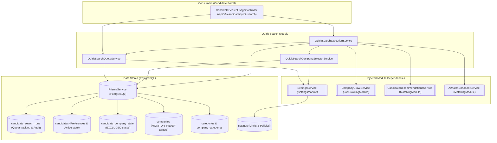
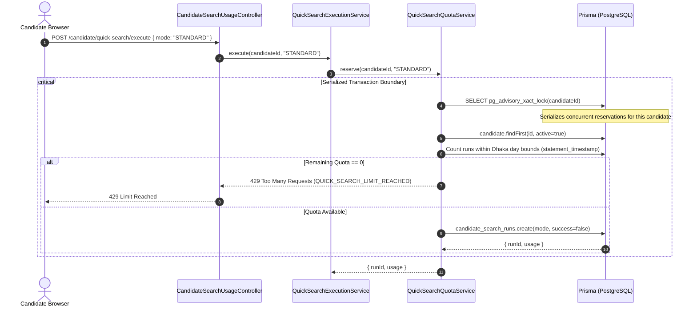
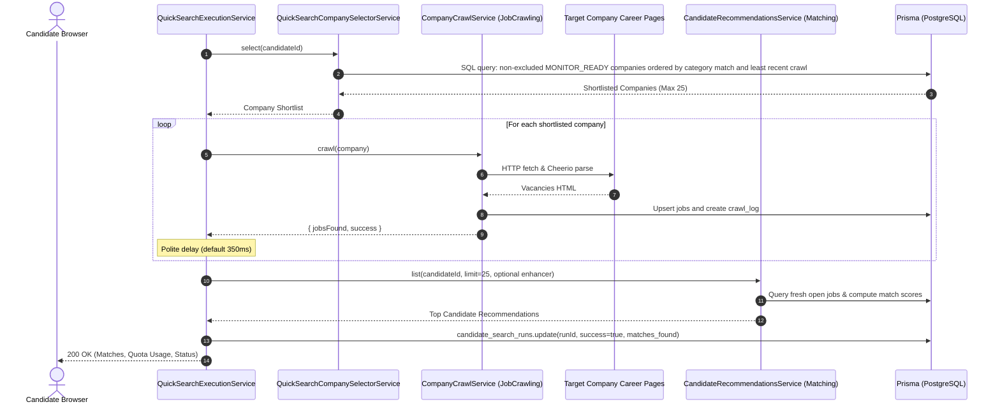
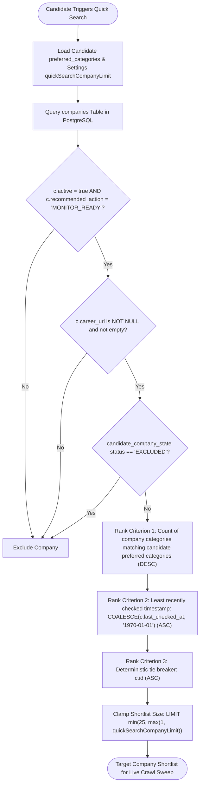

# Quick Search Feature

## Purpose
Owns candidate on-demand search quota reservation and daily allowance accounting (aligned with `Asia/Dhaka`), targeted company shortlist selection prioritizing candidate preferences and least-recently-crawled targets, live sequential crawl sweep orchestration, and search run audit persistence.

---

## Component Architecture



---

## Responsibilities
- **Timezone-Aware Quota Accounting (`Asia/Dhaka`)**:
  - Enforcing candidate daily search limits (`quickSearchDailyLimit`, `quickSearchAiDailyLimit`, bounded to $[0, 20]$).
  - Calculating exact calendar day boundaries in PostgreSQL using `statement_timestamp()` and `date_trunc('day', now AT TIME ZONE 'Asia/Dhaka')`.
  - Computing used runs, remaining balance, and exact ISO `resetsAt` midnight timestamp.
- **Transactional Quota Reservation**:
  - Serializing concurrent candidate requests using PostgreSQL transaction-level advisory locks (`pg_advisory_xact_lock(candidateId)`).
  - Enforcing zero-race-condition quota consumption; rejections return HTTP 429 `QUICK_SEARCH_LIMIT_REACHED`.
  - Creating initial audit records in `candidate_search_runs` with `success: false` before initiating network activity, guaranteeing quota consumption even if external crawls fail.
- **Intelligent Company Shortlist Selection**:
  - Filtering active `MONITOR_READY` companies with non-empty `career_url`.
  - Strictly suppressing companies bookmarked by the candidate with `status = 'EXCLUDED'`.
  - Scoring and ranking companies in pure SQL: prioritizing matches with the candidate's `preferred_categories`, tie-broken by least-recently-checked timestamp (`COALESCE(c.last_checked_at, '1970-01-01') ASC`), bounded by `quickSearchCompanyLimit` (clamped to $[1, 25]$).
- **On-Demand Crawl Execution Orchestration**:
  - Iterating over shortlisted companies sequentially with polite delay pacing (`QUICK_SEARCH_DELAY_MS`, default 350ms).
  - Invoking `CompanyCrawlService.crawl(company)` to fetch HTML, parse vacancies, and update jobs.
  - Tracking `companiesChecked`, `jobsFound`, and `crawlFailures`.
- **Match Generation & Run Finalization**:
  - Invoking `CandidateRecommendationsService.list(candidateId, 25, enhancer)` with optional AI semantic enhancement.
  - Finalizing `candidate_search_runs` with final metrics (`companies_checked`, `jobs_found`, `matches_found`, `success: true`).
  - Handling exceptions by recording sanitized error messages in the run record.

---

## Does Not Own
- **HTTP Routing & API Guarding**: Handled by `CandidatePortalModule` (`CandidateSearchUsageController` at `/api/v1/candidate/quick-search/*`).
- **Web Crawling & HTML Parsing**: HTTP transport, SSRF filtering, Cheerio parsing, and job upserting are owned by `JobCrawlingModule` (`CompanyCrawlService`, `CareerPageFetcherService`).
- **Match Scoring Engine**: Algorithmic scoring and LLM completions are owned by `MatchingModule` (`CandidateRecommendationsService`, `AiMatchEnhancerService`).
- **Operational Settings Management**: System-wide daily limit thresholds and company limit configuration are owned by `SettingsModule`.
- **Candidate Account State**: Candidate profile attributes and company blacklists are owned by `CandidatePortalModule`.

---

## Dependencies
- **Core / Platform**:
  - `PrismaService` (`@app/database`): PostgreSQL persistence and raw SQL query execution.
  - `node:timers/promises`: Polite crawl delay (`delay`).
- **Internal Modules**:
  - `SettingsModule`: Provides `SettingsService` for reading dynamic quota limits.
  - `CrawlExecutionModule` (`JobCrawlingModule`): Provides `CompanyCrawlService`.
  - `MatchingModule`: Provides `CandidateRecommendationsService` and `AiMatchEnhancerService`.

---

## Database Ownership

### Writes / Mutates
- `candidate_search_runs`: Creates an unfinalized search run upon quota reservation (`success: false`); updates the record upon completion (`companies_checked`, `jobs_found`, `matches_found`, `success: true`) or failure (`error`, `success: false`).

### Reads / References
- `candidate_search_runs`: Aggregates usage counts for the candidate within Dhaka day boundaries.
- `candidates`: Reads active candidate account status and `preferred_categories`.
- `candidate_company_state`: Excludes companies bookmarked as `EXCLUDED` by the candidate.
- `companies`: Queries `MONITOR_READY` targets with `career_url` and `last_checked_at`.
- `company_categories` & `categories`: Used in SQL ordering subquery to count matching preferred categories.
- `settings`: Reads dynamic quota limits.

---

## Important Invariants

1. **Advisory Transaction Lock Serialization**:
   Quota reservations must acquire `pg_advisory_xact_lock(candidateId)` inside a `READ COMMITTED` transaction. Parallel requests for the same candidate block and serialize, preventing race conditions and quota overdrafts.
2. **Dhaka Midnight Reset Alignment**:
   All daily quotas reset at `00:00:00 Asia/Dhaka` regardless of the host system or database server timezone (`statement_timestamp() AT TIME ZONE 'Asia/Dhaka'`).
3. **Reservation Precedes Network Activity**:
   The `candidate_search_runs` row must be created inside the quota transaction before any external network requests or crawls occur. Network timeouts, target site failures, or candidate browser disconnections still consume daily quota.
4. **Hard Blacklist Enforcement in Shortlist Query**:
   Companies with `status = 'EXCLUDED'` for the candidate are strictly excluded from the crawl shortlist via SQL `NOT EXISTS`.
5. **Shortlist Bounds & Prioritization**:
   The company shortlist size is strictly bounded by `quickSearchCompanyLimit` (capped at 25). Selection strictly prioritizes companies matching candidate preferred categories, then companies not checked for the longest time.
6. **Polite Pacing Rate Delay**:
   Sequential company crawling enforces a minimum delay (`delayMs >= 0`, default 350ms) between outbound requests to avoid tripping anti-bot triggers.
7. **Graceful Partial Crawl Tolerance**:
   If individual target companies fail to crawl or time out, `QuickSearchExecutionService` logs a warning, increments `crawlFailures`, and continues crawling remaining companies. Subsequent recommendation matching still proceeds with successfully updated jobs.

---

## Public API & Entry Points

### Exported Module Services

| Service | Method | Consumers | Purpose |
| :--- | :--- | :--- | :--- |
| `QuickSearchQuotaService` | `usage(candidateId)` | `CandidateSearchUsageController` | Reads candidate usage and remaining daily search allowance |
| `QuickSearchQuotaService` | `reserve(candidateId, mode)` | `QuickSearchExecutionService` | Atomically locks, checks quota, and reserves search run |
| `QuickSearchCompanySelectorService` | `select(candidateId)` | `QuickSearchExecutionService` | Generates prioritized company shortlist using parameterized SQL |
| `QuickSearchExecutionService` | `execute(candidateId, mode)` | `CandidateSearchUsageController` | Full orchestrator: reserves, crawls shortlist, matches, and updates run |

### Upstream HTTP Entry Points (`CandidatePortalModule`)
- `GET /api/v1/candidate/quick-search/usage`: Exposes quota usage and AI availability (`Cache-Control: private, no-store`).
- `POST /api/v1/candidate/quick-search/execute`: Triggers on-demand search sweep (`@RateLimit: 20 req/60s`).

---

## Important Flows

### 1. Quota Reservation & Advisory Lock Serialization



### 2. End-to-End On-Demand Quick Search Execution Flow



### 3. Shortlist Selection Decision & Ranking Logic



---

## Brutally Honest Vulnerability & Architectural Risk Assessment

> [!WARNING]
> This section details critical architectural bottlenecks, zero-day threat exposures, and operational risks identified in the `quick-search` module.

### 1. Synchronous HTTP Request Loop (Cloudflare 524/504 Gateway Timeout)
- **Vulnerability**: In `QuickSearchExecutionService.execute()`:
  Calling `POST /api/v1/candidate/quick-search/execute` initiates a synchronous `for (const company of companies)` loop that performs live network requests to external company websites with rate delays (`delayMs`):
  ```ts
  for (const company of companies) {
    await this.crawler.crawl(company);
    await delay(delayMs);
  }
  ```
- **Threat Vector**:
  - If a candidate shortlists 10 companies and any target websites are slow or tarpitting requests, the HTTP connection remains open for **25–45+ seconds**.
  - Edge reverse proxies (Cloudflare, Nginx, AWS ALB) enforce strict gateway timeouts (typically 30–60 seconds). Cloudflare will abort the connection with `524 A timeout occurred` or `504 Gateway Timeout`.
  - Because quota reservation happens *before* crawling, the candidate loses their daily search quota, but their browser displays a network error screen with zero job matches.
- **Remediation**:
  Decouple Quick Search execution from the HTTP request cycle using an asynchronous job queue (BullMQ / Redis):
  1. `POST /candidate/quick-search/execute` reserves quota, enqueues the job, and immediately returns HTTP 202 Accepted with a `jobId`.
  2. The browser polls or listens via Server-Sent Events (SSE) / WebSockets for progress updates.

### 2. PostgreSQL Advisory Lock Global Namespace Collisions
- **Vulnerability**: `QuickSearchQuotaService` acquires an advisory transaction lock using the raw candidate ID:
  ```ts
  await transaction.$executeRaw`SELECT pg_advisory_xact_lock(${candidateId})`;
  ```
- **Architectural Risk**:
  - PostgreSQL advisory locks share a single flat 64-bit integer namespace across the entire database.
  - If any other service (e.g. crawler run locks, batch jobs, background tasks) locks an integer ID that matches a candidate's ID (e.g. `124631` or small integers `1`, `2`, `3`), an unrelated candidate transaction will block waiting on that lock, causing unpredictable lock contention and transaction timeouts (`maxWait: 5000ms`).
- **Remediation**:
  Use two-key advisory locks with a 32-bit namespace discriminator:
  ```sql
  SELECT pg_advisory_xact_lock(hashtext('quick_search_quota'), ${Number(candidateId)});
  ```

### 3. Repeated Unindexed Aggregation Over Audit Table
- **Vulnerability**: In `QuickSearchQuotaService.count()`:
  Every usage check and quota reservation executes an aggregate query over `candidate_search_runs`:
  ```sql
  SELECT count(r.id) AS used, count(r.id) FILTER (WHERE r.mode = 'AI') AS "aiUsed", ...
  FROM candidate_search_runs r
  WHERE r.candidate_id = ${candidateId} AND r.requested_at >= start_at AND r.requested_at < end_at
  ```
- **Threat Vector**:
  As the `candidate_search_runs` table grows with thousands of historical runs, scanning and filtering by timestamp CTEs on every candidate dashboard navigation creates unnecessary connection pool churn on Neon serverless databases.
- **Remediation**:
  Maintain daily quota counters in Redis (`INCR quick_search:<date>:<candidateId>`) with a 24-hour TTL, using PostgreSQL strictly for audit persistence.

### 4. Denormalized String Parsing in Shortlist Query
- **Vulnerability**: In `QuickSearchCompanySelectorService.select()`:
  Candidate `preferred_categories` is loaded as a comma-separated string, split in JavaScript, and passed into PostgreSQL as `ARRAY[${Prisma.join(categories)}]::text[]`.
  Inside PostgreSQL:
  ```sql
  ORDER BY (
    SELECT count(*) FROM company_categories cc JOIN categories cat ON cat.id = cc.category_id
    WHERE cc.company_id = c.id AND cat.name = ANY(${preferred})
  ) DESC
  ```
- **Threat Vector**:
  This correlated subquery evaluates for every active `MONITOR_READY` company in the platform. As the directory scales to 5,000+ companies, executing unindexed nested category joins inside the `ORDER BY` clause will cause noticeable query latency and database CPU spikes.
- **Remediation**:
  Store candidate preferences in a relational join table (`candidate_preferred_categories`) or use PostgreSQL GIN indexed arrays (`TEXT[]`) with array overlap operators (`&&`).

### 5. Absence of Client Disconnect Cancellation (Zombie Runs)
- **Vulnerability**: If a candidate closes their browser tab or disconnects midway through a Quick Search, the backend does not check `request.signal.aborted`.
- **Threat Vector**:
  The Node.js server blindly continues crawling all remaining companies, parsing HTML, and firing external LLM API calls, wasting server compute, outbound bandwidth, and external AI credits for results that will never be viewed.
- **Remediation**:
  Pass an `AbortSignal` through `QuickSearchExecutionService.execute()` and check `signal.aborted` before each company crawl.
