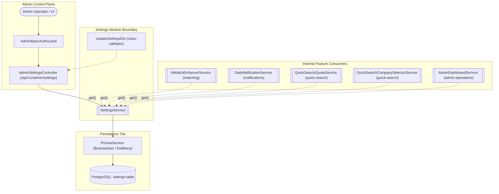
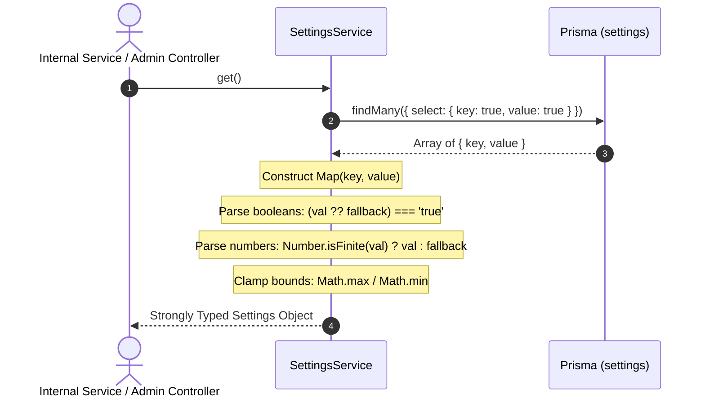
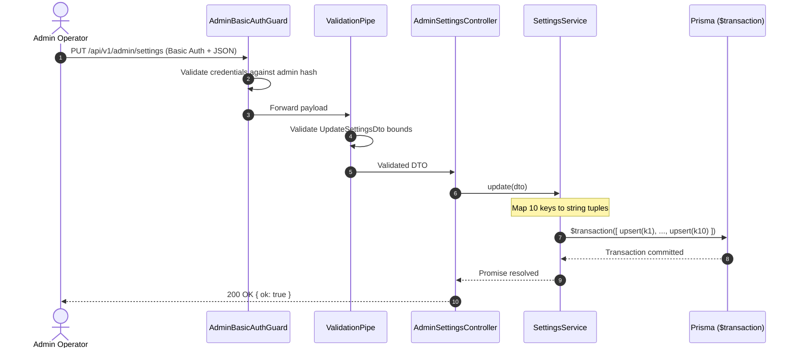
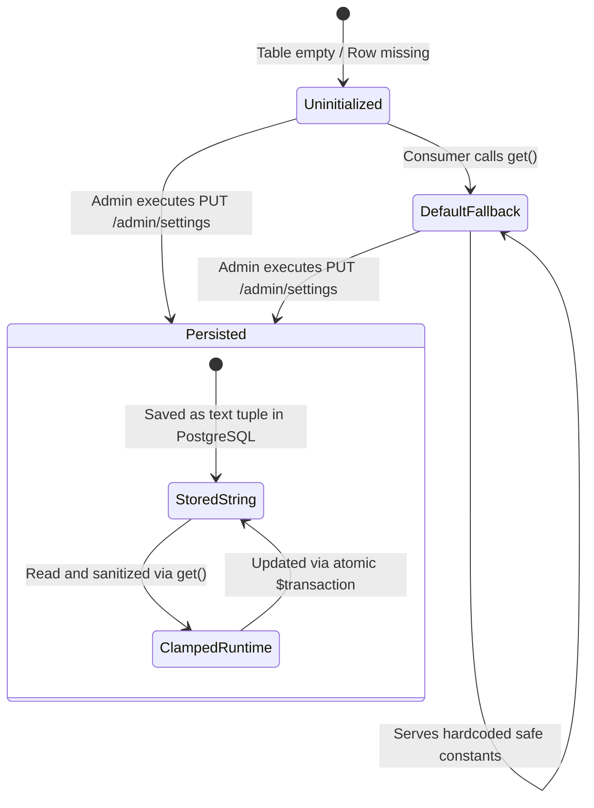

# Settings

## Purpose
The **Settings** module manages platform-wide operational configurations, feature flags, quota boundaries, and algorithm thresholds at runtime. It provides strongly-typed runtime parsing, bounded validation, safe fallback defaults, and transactional atomic batch updates for persistent operational settings stored in the database.

---

## Component Architecture

---

## Responsibilities

- **Typed Runtime Schema Projection**: Converts flat string key-value tuples from the `settings` database table into a strictly typed, camelCase runtime configuration object with booleans, integers, and trimmed strings.
- **Resilient Fallback Defaults**: Provides safe, immutable default values for all configuration parameters if the database is unseeded, empty, or missing specific rows, ensuring the application boots and operates without crashing.
- **Defensive Boundary Clamping**: Sanitizes and enforces mathematical constraints (such as `Math.max(0, Math.min(100, threshold))` and `Math.max(1, companyLimit)`) during reads to prevent malformed or out-of-range database values from corrupting business logic.
- **Atomic Transactional Setting Persistence**: Atomically upserts all ten managed operational parameters within a single database transaction (`prisma.$transaction`), guaranteeing an all-or-nothing mutation contract.
- **Central Operational Configuration Provider**: Serves as the single source of truth for runtime toggles across AI matching, notification mailers, crawler quota governors, and candidate portals.

---

## Does Not Own

- **Admin Authentication & Credential Verification**: Does not parse, verify, or hash admin passwords; relies entirely on `AdminBasicAuthGuard` from `AuthenticationModule`.
- **Static Environment Configurations**: Does not handle immutable infrastructure variables (such as database credentials, Redis URLs, or session secrets); these belong to NestJS `ConfigModule` and `.env`.
- **Per-Candidate or Per-Company Preferences**: Does not manage user-specific filters, excluded companies, or candidate categories; these are owned by `CandidatePortalModule` and `CompanyIntelligenceModule`.
- **Runtime Quota Counters & Consumption State**: Does not track how many searches a candidate has consumed today; quota counters and daily transaction ledgers are owned by `QuickSearchModule` and database quota tables.

---

## Dependencies

- **Core / Platform**:
  - `PrismaService` (`@app/database`): Executes atomic upserts and queries against the PostgreSQL `settings` table.
- **Internal Modules**:
  - `AuthenticationModule`: Provides `AdminBasicAuthGuard` for protecting administrative configuration endpoints.
- **External Libraries**:
  - `class-validator`: Enforces runtime type checks and numerical bounds on incoming configuration payloads (`@IsBoolean`, `@IsInt`, `@IsString`, `@Min`, `@Max`, `@MaxLength`).

---

## Database Ownership

### Writes / Mutates
- **`settings`**: Sole write owner. Executes atomic multi-key upserts (`prisma.setting.upsert` inside `prisma.$transaction`) on the ten managed keys:
  - `ai_enabled` (boolean string: `"true"` / `"false"`)
  - `ai_provider` (trimmed string, max 120 chars)
  - `ai_daily_limit` (non-negative integer string)
  - `ai_matching_enabled` (boolean string: `"true"` / `"false"`)
  - `ai_skill_extraction_enabled` (boolean string: `"true"` / `"false"`)
  - `default_match_threshold` (integer string bounded between 0 and 100)
  - `email_enabled` (boolean string: `"true"` / `"false"`)
  - `quick_search_daily_limit` (integer string bounded between 0 and 20)
  - `quick_search_ai_daily_limit` (integer string bounded between 0 and 20)
  - `quick_search_company_limit` (integer string bounded between 1 and 25)

### Reads / References
- **`settings`**: Reads all key-value rows using `findMany({ select: { key: true, value: true } })`.

---

## Important Invariants

- **Atomic All-or-Nothing Mutation**: Updating runtime configuration must upsert all ten managed keys inside a single Prisma `$transaction`. Partial configuration states are strictly impossible.
- **Zero-Crash Fallback Contract**: If the `settings` table is empty or missing keys, `SettingsService.get()` must never throw an error or return `NaN` / `undefined`. It must resolve to safe built-in fallback values:
  - `aiEnabled`: `false`
  - `aiProvider`: `""`
  - `aiDailyLimit`: `0`
  - `aiMatchingEnabled`: `false`
  - `aiSkillExtractionEnabled`: `false`
  - `defaultMatchThreshold`: `70`
  - `emailEnabled`: `false`
  - `quickSearchDailyLimit`: `3`
  - `quickSearchAiDailyLimit`: `1`
  - `quickSearchCompanyLimit`: `8`
- **Defensive Boundary Clamping on Read**: Read operations must defensively clamp values regardless of database contents (`defaultMatchThreshold` clamped to `[0, 100]`, `quickSearchCompanyLimit` clamped to `>= 1`).
- **Isolation of Unmanaged Keys**: The update transaction explicitly updates only the ten registered settings keys by name. It never executes truncations, wildcards, or deletions, allowing legacy or unmanaged database keys to persist unharmed.
- **Admin-Only Mutability**: The settings modification endpoint is strictly guarded by `AdminBasicAuthGuard`. Anonymous visitors and candidates have zero access to read or update platform settings.

---

## Public API & Entry Points

### HTTP Endpoints
- `GET /api/v1/admin/settings` - Returns the effective platform runtime configuration with applied fallbacks. Guarded by `AdminBasicAuthGuard`.
- `PUT /api/v1/admin/settings` - Validates and atomically updates the complete set of ten managed operational settings. Guarded by `AdminBasicAuthGuard`.

### Exported Services
- `SettingsService.get()`:
  - **Purpose**: Returns the strongly typed, validated runtime settings object.
  - **Consumers**: `DailyNotificationService`, `AiMatchEnhancerService`, `AdminDashboardService`, `QuickSearchQuotaService`, `QuickSearchCompanySelectorService`.
- `SettingsService.update(input: UpdateSettingsDto)`:
  - **Purpose**: Serializes and persists all ten settings in an atomic transaction.
  - **Consumers**: `AdminSettingsController`.

---

## Important Flows

### 1. Settings Read and Fallback Resolution Flow

### 2. Settings Atomic Update Flow

### 3. Setting State Lifecycle

---

## Brutally Honest Vulnerability & Architectural Risk Assessment

### 1. Database Thrashing via Uncached Per-Request Queries
- **Vulnerability**: `SettingsService.get()` executes a database query (`findMany`) every single time it is called. High-frequency consumers—including quick search queries, candidate matching iterations, and notification sweeps—hit the PostgreSQL `settings` table repeatedly for static configuration that rarely changes.
- **Exploitation / Failure Scenario**: During morning peak hours, when multiple candidates perform concurrent quick searches while the background crawler and notification jobs run, hundreds of identical queries flood the database connection pool, increasing query latency across the entire application.
- **Remediation**: Introduce a cached read layer (such as an in-memory TTL cache of 30–60 seconds, or a Redis-backed cache invalidated upon `SettingsService.update()`).

### 2. Blind Overwrite Race Condition (Lack of Optimistic Locking)
- **Vulnerability**: The `PUT /api/v1/admin/settings` endpoint requires the full configuration payload and blindly upserts all ten keys without checking an entity version, revision tag, or `updated_at` timestamp.
- **Exploitation / Failure Scenario**: Admin A loads the settings page to toggle `emailEnabled`. Concurrently, Admin B loads the settings page to adjust `quickSearchDailyLimit`. Admin A submits their change. Seconds later, Admin B submits their change, which was formulated from the stale state, unintentionally overwriting Admin A's `emailEnabled` toggle back to its previous state.
- **Remediation**: Implement optimistic locking using an incrementing `version` field or HTTP `ETag` / `If-Match` headers, rejecting updates if the configuration has changed since the admin fetched it.

### 3. Split-Brain Configuration in Multi-Instance Deployments
- **Vulnerability**: If local memory caching is added without a distributed invalidation mechanism, running multiple backend replicas behind a load balancer will result in inconsistent configuration states across processes.
- **Exploitation / Failure Scenario**: If an admin disables `ai_enabled` via a request routed to Node Instance 1, Node Instance 2 (handling candidate search requests) may continue to execute AI requests until its local process restarts or cache expires.
- **Remediation**: Utilize Redis Pub/Sub (`PUBLISH settings_channel "invalidated"`) to broadcast cache invalidation events across all running backend instances simultaneously upon every mutation.

### 4. Plaintext Secret Exposure Risk in Flat Key-Value Store
- **Vulnerability**: The `settings` table stores all values as unencrypted plain text (`value String`). Currently, `ai_provider` is stored here. If future requirements add AI API keys, SMTP credentials, or third-party tokens to runtime settings, storing them in plaintext exposes secrets in database backups, replication streams, and debug queries.
- **Exploitation / Failure Scenario**: A database backup leak or read-only database compromise immediately exposes sensitive credentials stored alongside benign operational flags.
- **Remediation**: Enforce strict architectural separation between operational parameters and sensitive secrets. If secrets must be stored in the database, encrypt them at rest using AES-256-GCM with keys managed in environment variables or an external KMS.

### 5. Weak HTTP Basic Authentication on High-Privilege Configuration
- **Vulnerability**: The administrative endpoint relies entirely on HTTP Basic Auth (`AdminBasicAuthGuard`). Basic Auth credentials are sent with every single request as a base64-encoded header, lacking session expiration, token revocation, or multi-factor authentication (MFA).
- **Exploitation / Failure Scenario**: Without dedicated IP rate limiting or progressive delays on the `/api/v1/admin/settings` path, an attacker can launch brute-force password guessing attacks against the administrative credentials.
- **Remediation**: Protect admin routes with strict IP rate limiting (e.g., via NestJS Throttler), enforce strong password complexity, and migrate administrative access to short-lived signed session tokens or OAuth 2.0 with MFA.
