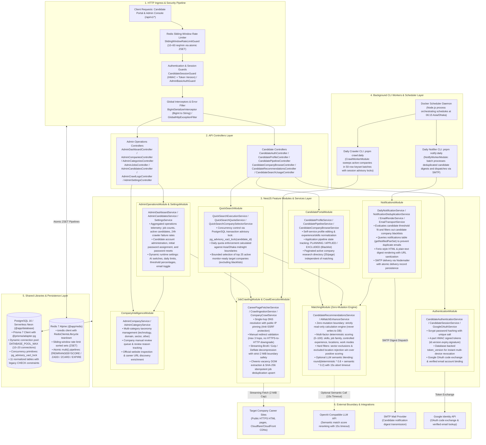

# Backend Architecture (Vertical / PDF Optimized)

This document provides a **vertical, Y-axis-oriented backend architecture specification** of the Job Intelligence platform. 

It is specifically structured for **portrait documents, PDF exports, and print rendering**, avoiding horizontal (X-axis) sprawl while detailing the entire backend subsystem: HTTP ingress pipeline, controllers, NestJS feature modules, domain services, background CLI workers, shared libraries, persistence layer, and external integrations.

---

## 🏗️ Vertical Backend Architecture Diagram

---

## 📋 Architectural Layers Breakdown

### 1. Ingress & Security Pipeline Layer
- **Unified Route Prefix:** Every backend resource is scoped under `/api/v1/*`.
- **`SlidingWindowRateLimitGuard` (`@app/common`):** Enforces route-level sliding-window rate limits backed by Redis atomic Sorted Sets. Configured presets protect authentication (10 req/min), quick search execution (20 req/min), and admin mutations (60 req/min). Returns RFC-compliant `X-RateLimit-*` and `Retry-After` headers.
- **Session Security & Revocation:** Candidate authentication uses 4-part HMAC signed session tokens (`id.version.expiry.signature`). The `token_version` column in PostgreSQL enables instant invalidation of active sessions across all devices upon password reset or explicit logout.
- **Global Data Serialization & Error Envelope:**
  - `BigIntSerializerInterceptor`: Automatically serializes native PostgreSQL BigInt IDs to strings before JSON output, preventing runtime Node.js serialization exceptions.
  - `GlobalHttpExceptionFilter`: Intercepts unhandled exceptions and formats consistent `{ code, message, timestamp, path }` error envelopes, ensuring database stack traces and query structures are never leaked.

### 2. API Controllers Layer
- **Separation of Concerns:** Clear segregation between Candidate Portal endpoints (`/api/v1/candidate/*`, `/api/v1/candidate-auth/*`) and Admin Operations endpoints (`/api/v1/admin/*`).
- **Authorization Guarding:** Admin endpoints are guarded by timing-safe HTTP Basic Authentication; candidate routes require active session cookies and mandatory initial password change completion.

### 3. NestJS Feature Modules & Services Layer
- **`AuthenticationModule`:** Manages salted Scrypt password hashing, Google OAuth code-to-token exchange, session token issuance/validation, and multi-session revocation.
- **`CandidatePortalModule`:** Powers candidate profile preferences, category exclusions, research company directory browsing, and candidate application pipeline status (`PLANNING`, `APPLIED`, `EXCLUDED`).
- **`QuickSearchModule`:** Coordinates on-demand candidate job checks. Acquires a PostgreSQL transaction-scoped advisory lock (`pg_advisory_xact_lock(candidate_id)`) to enforce daily search limits atomically, selects up to 25 target companies, triggers paced crawler checks, and computes fresh match scores.
- **`MatchingModule` (Zero-Mutation Engine):** A strictly read-only calculation engine with zero database write paths. Evaluates multi-factor deterministic scoring (0–100) combining skills, job families, controlled experience levels, numeric years, and locations while strictly applying hard exclusions. Provides an optional LLM semantic blending path (`80% deterministic + 20% semantic`) with a 15-second abort timeout budget.
- **`JobCrawlingModule` & `CrawlExecutionModule`:** Network-safe web crawling pipeline featuring single-hop DNS resolution with public IP pinning (Anti-SSRF), manual redirect tracing (maximum 3 hops), streaming Brotli/Gzip decompression with a strict 2 MiB memory boundary, Cheerio vacancy extraction, SHA-256 stable job hashing, and atomic database upserts.
- **`CompanyIntelligenceModule`:** Manages curated companies, multi-category taxonomy (technology, domain, sector, other), manual review queues, and career page URL discovery enrichment.
- **`NotificationsModule`:** Orchestrates daily candidate email broadcasts. Evaluates candidate thresholds, filters blacklists, deduplicates delivery records via the `notifications` table, renders Ferio-style responsive HTML/text digests, and dispatches via SMTP.
- **`AdminOperationsModule` & `SettingsModule`:** Aggregates operational telemetry, provides candidate management and password reset operations, and manages persisted runtime system settings.

### 4. Background CLI Workers & Scheduler Layer
- **`Docker Scheduler Daemon`:** Minimal Node.js daemon running inside the container, executing daily jobs on cron schedules (default: 06:15 Asia/Dhaka).
- **`Daily Crawler CLI` (`pnpm crawl:daily`):** Standalone worker sweeping active monitor-ready companies in 50-row keyset batches, using direct PostgreSQL session advisory locks to prevent overlapping crawl executions.
- **`Daily Notifier CLI` (`pnpm notify:daily`):** Standalone worker evaluating candidate match recommendations and transmitting deduplicated daily digests via SMTP.

### 5. Shared Libraries & Persistence Infrastructure
- **`@app/database` (`PrismaService`):** PostgreSQL 16 / Neon connection management using `@prisma/adapter-pg` with dynamic pool configuration (`DATABASE_POOL_MAX`, `DATABASE_IDLE_TIMEOUT_MS`, `DATABASE_CONN_TIMEOUT_MS`) and clean connection pool draining via NestJS shutdown hooks.
- **`@app/redis` (`RedisProvider` & `RedisClientsLifecycle`):** Dedicated Redis 7 client handling atomic sliding-window rate limit pipelines and automated client teardown on application shutdown.

### 6. External Boundary & Integrations
- **Company Career Sites:** Public HTTPS career pages fetched with strict streaming size caps (2 MiB).
- **OpenAI-Compatible LLM:** External semantic evaluation API called with strict 15-second timeouts and automatic fallback to deterministic scoring.
- **SMTP Server:** Secure email delivery provider for candidate job digests.
- **Google Identity API:** OpenID Connect endpoints for candidate Google login verification.
