# Backend Modular Architecture

This document provides a **backend-oriented architectural specification** of the NestJS application, illustrating the modular boundaries, inter-module dependency graph, request lifecycle pipeline, service layer contracts, and shared infrastructure libraries.

---

## 🏗️ Backend Module Dependency & Service Flow Diagram

```mermaid
flowchart TB
    %% 1. HTTP Ingress & Middleware Pipeline
    subgraph INGRESS ["HTTP Ingress & Global Pipeline"]
        direction TB
        REQ["Incoming Client Request (/api/v1/*)"]
        RL_GUARD["SlidingWindowRateLimitGuard<br/>(@app/common & Redis)"]
        AUTH_GUARDS["Auth Guards<br/>CandidateSessionGuard / AdminBasicAuthGuard"]
        INTERCEPT["BigIntSerializerInterceptor<br/>(Converts PostgreSQL BigInt to String)"]
        FILTER["GlobalHttpExceptionFilter<br/>(Sanitized Standardized Error Envelope)"]
        
        REQ --> RL_GUARD
        RL_GUARD --> AUTH_GUARDS
        AUTH_GUARDS --> INTERCEPT
        INTERCEPT --> FILTER
    end

    %% 2. API Controllers
    subgraph CONTROLLERS ["API Controllers Layer"]
        direction LR
        subgraph CAND_CTRLS ["Candidate Portal Controllers"]
            direction TB
            C_AUTH_CTRL["CandidateAuthController"]
            C_PROF_CTRL["CandidateProfileController"]
            C_PIPE_CTRL["CandidatePipelineController"]
            C_BROWSE_CTRL["CandidateCompanyBrowseController"]
            C_RECS_CTRL["CandidateRecommendationsController"]
            C_SEARCH_CTRL["CandidateSearchUsageController"]
        end

        subgraph ADMIN_CTRLS ["Admin Operations Controllers"]
            direction TB
            A_DASH_CTRL["AdminDashboardController"]
            A_COMP_CTRL["AdminCompaniesController"]
            A_CAT_CTRL["AdminCategoriesController"]
            A_JOB_CTRL["AdminJobsController"]
            A_CAND_CTRL["AdminCandidatesController"]
            A_LOG_CTRL["AdminCrawlLogsController"]
            A_SET_CTRL["AdminSettingsController"]
        end
    end

    FILTER --> CAND_CTRLS
    FILTER --> ADMIN_CTRLS

    %% 3. Core Feature Modules
    subgraph MODULES ["NestJS Feature Modules Layer"]
        direction TB
        
        subgraph AUTH_MOD ["AuthenticationModule"]
            AUTH_SVC["CandidateAuthenticationService"]
            SESS_SVC["CandidateSessionService"]
            OAUTH_SVC["GoogleOAuthService"]
        end

        subgraph CAND_MOD ["CandidatePortalModule"]
            CAND_PROF_SVC["CandidateProfileService"]
            CAND_PIPE_SVC["CandidatePipelineService"]
            CAND_BROWSE_SVC["CandidateCompanyBrowseService"]
        end

        subgraph SEARCH_MOD ["QuickSearchModule"]
            QS_EXEC_SVC["QuickSearchExecutionService"]
            QS_QUOTA_SVC["QuickSearchQuotaService<br/>(pg_advisory_xact_lock)"]
            QS_SELECT_SVC["QuickSearchCompanySelectorService"]
        end

        subgraph MATCH_MOD ["MatchingModule (Zero-Mutation Engine)"]
            RECS_SVC["CandidateRecommendationsService"]
            AI_MATCH_SVC["AiMatchEnhancerService"]
            DET_MATCHER["deterministicMatch (Pure Domain Math)"]
        end

        subgraph CRAWL_MOD ["JobCrawlingModule & CrawlExecutionModule"]
            FETCHER_SVC["CareerPageFetcherService<br/>(DNS Pinning / Decompression)"]
            INGEST_SVC["CrawlIngestionService<br/>(Atomic Transaction Upsert)"]
            CO_CRAWL_SVC["CompanyCrawlService"]
            PARSER["CareerPageParser (Cheerio DOM)"]
        end

        subgraph COMP_MOD ["CompanyIntelligenceModule"]
            COMP_SVC["AdminCompanyService"]
            CAT_SVC["AdminCategoryService"]
        end

        subgraph NOTIF_MOD ["NotificationsModule"]
            DAILY_NOTIF_SVC["DailyNotificationService"]
            DEDUP_SVC["NotificationDeduplicationService"]
            EMAIL_RENDER_SVC["EmailRenderService"]
            EMAIL_TRANS_SVC["EmailTransportService"]
        end

        subgraph ADMIN_MOD ["AdminOperationsModule & SettingsModule"]
            ADMIN_DASH_SVC["AdminDashboardService"]
            ADMIN_CAND_SVC["AdminCandidatesService"]
            SETTINGS_SVC["SettingsService"]
        end
    end

    %% Controller to Service Mappings
    C_AUTH_CTRL --> AUTH_SVC
    C_AUTH_CTRL --> SESS_SVC
    C_PROF_CTRL --> CAND_PROF_SVC
    C_PIPE_CTRL --> CAND_PIPE_SVC
    C_BROWSE_CTRL --> CAND_BROWSE_SVC
    C_RECS_CTRL --> RECS_SVC
    C_SEARCH_CTRL --> QS_EXEC_SVC

    A_DASH_CTRL --> ADMIN_DASH_SVC
    A_COMP_CTRL --> COMP_SVC
    A_CAT_CTRL --> CAT_SVC
    A_JOB_CTRL --> INGEST_SVC
    A_CAND_CTRL --> ADMIN_CAND_SVC
    A_LOG_CTRL --> INGEST_SVC
    A_SET_CTRL --> SETTINGS_SVC

    %% Inter-Module Dependencies
    CAND_MOD --> AUTH_MOD
    CAND_MOD --> MATCH_MOD
    CAND_MOD --> SEARCH_MOD

    SEARCH_MOD --> CRAWL_MOD
    SEARCH_MOD --> MATCH_MOD
    SEARCH_MOD --> ADMIN_MOD

    NOTIF_MOD --> MATCH_MOD
    NOTIF_MOD --> ADMIN_MOD

    ADMIN_MOD --> COMP_MOD
    ADMIN_MOD --> CRAWL_MOD
    ADMIN_MOD --> AUTH_MOD

    RECS_SVC --> DET_MATCHER
    RECS_SVC --> AI_MATCH_SVC
    QS_EXEC_SVC --> QS_QUOTA_SVC
    QS_EXEC_SVC --> QS_SELECT_SVC
    QS_EXEC_SVC --> CO_CRAWL_SVC
    CO_CRAWL_SVC --> FETCHER_SVC
    CO_CRAWL_SVC --> PARSER
    CO_CRAWL_SVC --> INGEST_SVC

    %% 4. Independent CLI Worker Layer
    subgraph WORKERS ["Standalone CLI Workers"]
        direction LR
        CRAWL_CLI["pnpm crawl:daily<br/>(CrawlWorkerModule)"]
        NOTIF_CLI["pnpm notify:daily<br/>(NotifyWorkerModule)"]

        CRAWL_CLI --> CO_CRAWL_SVC
        NOTIF_CLI --> DAILY_NOTIF_SVC
    end

    %% 5. Infrastructure & Shared Libraries
    subgraph LIBS ["Shared Libraries & Infrastructure Layer"]
        direction LR
        LIB_DB["@app/database<br/>PrismaService (Pool: 10-20)<br/>PostgreSQL 16 / Neon"]
        LIB_REDIS["@app/redis<br/>RedisProvider / RedisLifecycle<br/>Redis 7 Alpine"]
        LIB_COMMON["@app/common<br/>Guards, Polyfills, Interceptors"]
    end

    %% 6. External Boundary
    subgraph EXTERNAL ["External Boundary"]
        direction LR
        EXT_PG[("PostgreSQL 16 Database")]
        EXT_REDIS[("Redis 7 Cache")]
        EXT_WEB["Company Career Pages"]
        EXT_AI["OpenAI LLM API"]
        EXT_SMTP["SMTP Mail Server"]
    end

    %% Wiring to Infrastructure
    MODULES --> LIB_DB
    INGRESS --> LIB_REDIS
    INGRESS --> LIB_COMMON
    
    LIB_DB <-->|"Connection Pool Queries"| EXT_PG
    LIB_REDIS <-->|"Atomic ZSET Commands"| EXT_REDIS
    FETCHER_SVC -->|"HTTP GET (2MB Cap)"| EXT_WEB
    AI_MATCH_SVC -.->|"15s Abort Budget"| EXT_AI
    EMAIL_TRANS_SVC -->|"SMTP Digest"| EXT_SMTP
```

---

## 🧩 Architectural Breakdown of Backend Modules

### 1. Ingress & Cross-Cutting Layer (`@app/common`)
- **`SlidingWindowRateLimitGuard`**: Global guard backed by Redis atomic Sorted Sets (`multi()`, `zremrangebyscore`, `zadd`, `zcard`, `expire`). Emits standard `X-RateLimit-*` and `Retry-After` headers.
- **`BigIntSerializerInterceptor`**: Global interceptor that recursively serializes PostgreSQL BigInt identifiers into strings, preventing native JSON serialization crashes.
- **`GlobalHttpExceptionFilter`**: Traps unhandled database or application errors, normalizing them into structured `{ code, message, timestamp, path }` envelopes while sanitizing database details.

### 2. Candidate Portal & Authentication Bounded Context
- **`AuthenticationModule`**: Handles Scrypt password hashing with salt, signed HMAC session tokens with 4-part structure (`id.version.expiry.signature`), database-backed token versioning for instant multi-device revocation, and Google OAuth account binding.
- **`CandidatePortalModule`**: Provides self-service candidate profile management, candidate-specific application pipeline tracking (`PLANNING`, `APPLIED`, `EXCLUDED`), research company browsing, and job recommendation retrieval.
- **`QuickSearchModule`**: Orchestrates candidate-initiated on-demand crawling. Uses PostgreSQL `pg_advisory_xact_lock(candidate_id)` to enforce daily search quotas atomically, selects up to 25 relevant target companies, triggers paced sequential crawls, and finalizes search records.

### 3. Core Matching Engine (`MatchingModule`)
- **Zero-Mutation Boundary**: `MatchingModule` does not expose HTTP controllers and never creates, updates, or deletes database records.
- **Deterministic Math (`deterministicMatch`)**: Computes scores (0–100) across job family compatibility, skill aliases, controlled experience levels, numeric experience years, work modes, and location preferences, while applying hard sector/location exclusions.
- **Semantic Enhancement (`AiMatchEnhancerService`)**: Optional semantic score blending (`round(deterministic * 0.8 + semantic * 0.2)`). Operates with a 15-second timeout and 15-call budget, cleanly falling back to pure deterministic scoring upon failure or timeout.

### 4. Job Crawling & Ingestion Context (`JobCrawlingModule`)
- **`CareerPageFetcherService`**: Public HTTP(S) client featuring single-hop DNS resolution with IP pinning (anti-SSRF), manual redirect tracing (maximum 3 hops), streaming Gzip/Deflate/Brotli decompression, and a hard 2 MiB memory boundary.
- **`CareerPageParser`**: Network-free Cheerio DOM extractor that extracts vacancies, normalizes application deadlines, and generates stable SHA-256 job hashes.
- **`CrawlIngestionService`**: Single-transaction database writer that upserts open jobs, refreshes `last_seen_at`, marks expired deadlines as `CLOSED`, and records structured audit logs with duration diagnostics.

### 5. Notifications & Digest Dispatch (`NotificationsModule`)
- **`DailyNotificationService`**: Evaluates match thresholds, filters candidate blacklists, verifies delivery status, and executes daily candidate broadcasts.
- **`NotificationDeduplicationService`**: Queries PostgreSQL `notifications` table (`getNotifiedPairSet`) and records successful transmissions atomically with `skipDuplicates: true` to prevent duplicate emails.
- **`EmailRenderService` & `EmailTransportService`**: Pure rendering engine producing responsive HTML/text digests with sanitization, transmitted via Nodemailer SMTP.

### 6. Administration & Operations (`AdminOperationsModule` & `SettingsModule`)
- **`AdminOperationsModule`**: Aggregates operational telemetry (active jobs, candidate counts, crawler failure rates), manages candidate lifecycle and password resets, and provides filterable job/log views.
- **`CompanyIntelligenceModule`**: Manages company directories, category taxonomy (technology, domain, sector), manual review queues, and official website career page auto-enrichment.
- **`SettingsModule`**: Manages dynamic system configurations (AI enablement, match thresholds, daily limits, email switches) stored in PostgreSQL.

### 7. Background CLI Workers
- **`pnpm crawl:daily` (`CrawlWorkerModule`)**: Keyset-paginated batch crawler sweeping active monitor-ready companies with pacing and PostgreSQL session advisory locks.
- **`pnpm notify:daily` (`NotifyWorkerModule`)**: Scheduled notification worker coordinating daily batch digests via SMTP.
