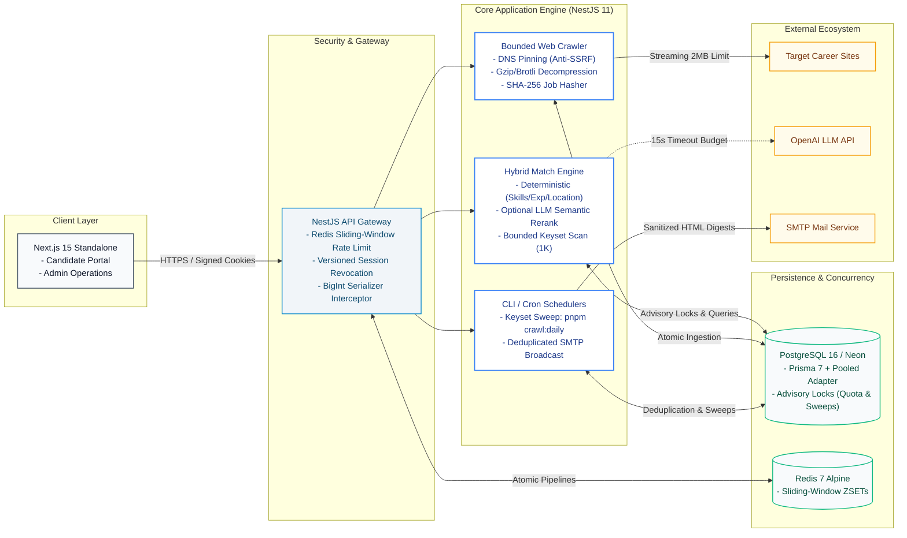

# Compact System Architecture

This document provides a streamlined, horizontal high-level architectural view of the Job Intelligence platform, highlighting core components, gateway security, and persistence topologies.

---

## 📄 Compact Architecture Diagram

---

## 📝 Core Architectural Highlights

- **Full-Stack Modular Architecture:** Engineered a high-throughput job crawling and candidate matching platform using **NestJS 11**, **Next.js 15 Standalone**, **PostgreSQL 16 (Neon)**, and **Redis 7**, fully verified across a **5-layer automated testing pyramid (198 tests: Unit, Integration, DB, E2E, Playwright)** with a 100% pass rate.
- **High-Throughput Concurrency & Rate Limiting:** Implemented sliding-window rate limiting in Redis via atomic Sorted Set pipelines (`multi()`, `zremrangebyscore`) and eliminated race conditions on candidate quotas using PostgreSQL transaction-level advisory locks (`pg_advisory_xact_lock`).
- **Resilient Bounded Web Crawler:** Built a memory-safe HTTP crawler featuring single-hop DNS pinning (anti-SSRF), manual redirect tracing, streaming Brotli/Gzip decompression with strict 2 MiB memory boundaries, and SHA-256 idempotent vacancy deduplication.
- **Fault-Tolerant Hybrid Matcher:** Designed a multi-factor deterministic matching engine (experience years, skills, locations, work modes) blended with optional LLM semantic scoring (80/20 ratio), featuring automated fallback to pure deterministic scoring upon external API timeouts (<15s).
- **Zero-Downtime Session & Database Hardening:** Designed token-versioned candidate authentication with instant session revocation, eliminated native BigInt serialization crashes via a global NestJS interceptor, and dynamically tuned database connection pools for serverless Neon.
