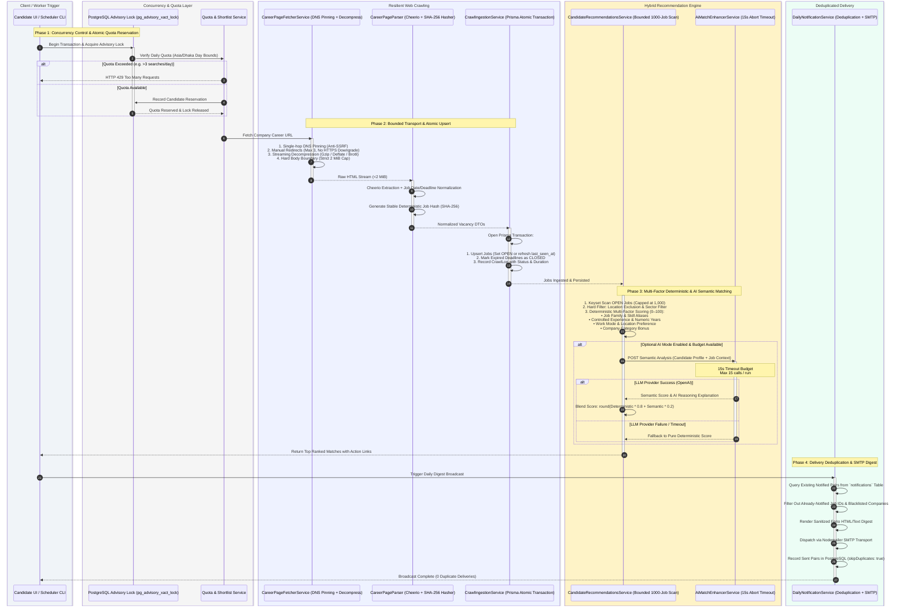

# Pipeline, Concurrency & Dataflow Architecture

This document details the **Dataflow Pipeline, Concurrency Guarantees, and Hybrid Matching Engine** of the Job Intelligence platform, covering concurrency controls, memory safety, streaming decompression, and deterministic scoring.

---

## ⚡ Mermaid Pipeline & Concurrency Diagram

---

## 🎯 Critical Failure Modes & Engineering Solutions

### 1. The Race Condition on Quotas & Daily Sweeps
* **Problem:** If a user opens multiple tabs and triggers Quick Search simultaneously, an uncoordinated count query reads 0 searches in all concurrent threads, allowing them to exceed their daily allowance.
* **Solution:** Used PostgreSQL `pg_advisory_xact_lock(candidate_id)`. The lock is automatically acquired and released within the transaction, guaranteeing strictly serialized quota increments without table-level locking bottlenecks.

### 2. Decompression Bombs & Network Anti-Bot Traps
* **Problem:** Many modern corporate sites enforce Gzip/Brotli compression, or they could return infinite HTTP streams / oversized files designed to exhaust scraper resources.
* **Solution:** 
  - Integrated `node:zlib` streaming decompression (`createUnzip`, `createBrotliDecompress`).
  - Implemented strict 2 MiB byte-counting stream transforms: if an uncompressed payload exceeds 2 MiB, the stream is aborted immediately with a sanitized `RESPONSE_TOO_LARGE` error.
  - DNS resolution is pinned to avoid DNS rebinding and internal subnet access (anti-SSRF).

### 3. Preventing Event-Loop Starvation in Matching
* **Problem:** Running in-memory regex matchers over tens of thousands of raw database vacancies will block Node.js's single-threaded event loop and exhaust memory.
* **Solution:** Configured a bounded keyset pagination with `MAX_MATCH_SCAN_JOBS = 1000`. Jobs older than 30 days unverified on the target career site are ignored, and expired deadlines are filtered at query time.

### 4. Zero-Flake AI Degradation
* **Problem:** External LLM APIs suffer from latency spikes, rate limits, and outages. Relying solely on AI for job matching breaks the core product whenever external providers are slow or down.
* **Solution:** AI is an optional 20% semantic blend on top of an 80% deterministic baseline. If the LLM provider times out (>15s) or returns invalid JSON, the system cleanly degrades to 100% deterministic ranking with zero user-facing errors.
