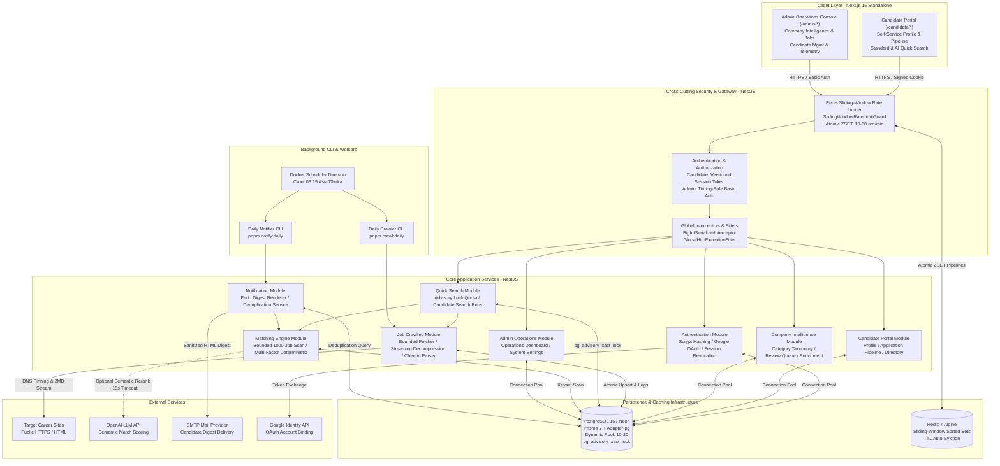

# System Architecture Specification

This document details the **System Architecture (C4 Container & Component View)** for the Job Intelligence platform, covering separation of concerns, cross-cutting security, background workers, and distributed data stores.

---

## 🏗️ Architecture Diagram

---

## 💡 Key Architectural Design Decisions

1. **Enterprise Boundary Decoupling:**
   - Next.js 15 standalone frontend communicating strictly over typed REST APIs (`/api/v1/*`) to NestJS.
   - Dual-portal isolation: Candidates use signed, expiring, versioned HTTP-only cookie sessions; Administrators use timing-safe HTTP Basic Auth.
2. **Industrial Cross-Cutting Defenses:**
   - **Redis Sliding-Window Rate Limiting:** Built using atomic Redis Sorted Set pipelines (`multi()`, `zremrangebyscore`, `zadd`, `zcard`, `expire`) with standard RFC headers (`X-RateLimit-*`, `Retry-After`).
   - **Global BigInt Serializer Interceptor:** Eliminates native Node.js BigInt serialization crashes across all PostgreSQL bigint IDs.
   - **Sanitized Global Error Envelope:** Unhandled database exceptions or internal stack traces are cleanly caught and normalized, never leaking schema internals.
3. **Concurrency & Locking Control:**
   - Concurrency-safe quota reservation using PostgreSQL transaction-level advisory locks (`pg_advisory_xact_lock`) ensuring candidates cannot bypass search limits via parallel requests.
   - Dedicated session advisory lock prevents overlapping daily crawler instances.
4. **Resilient Crawler Transport:**
   - Anti-SSRF protection: single-hop DNS resolution with pinned public IPs and manual redirect validation (no HTTPS-to-HTTP downgrade).
   - Streaming Brotli/Gzip/Deflate decompression with strict 2 MiB boundary safety to prevent compression bomb attacks.
5. **Hybrid Matcher Architecture:**
   - 100% operational with AI disabled: multi-factor deterministic scoring (skills, expertise, experience years, locations, work modes, and hard sector/location exclusions).
   - Optional LLM integration: blends deterministic score (80%) with semantic score (20%) with a strict 15-second abort controller and automatic deterministic fallback.
