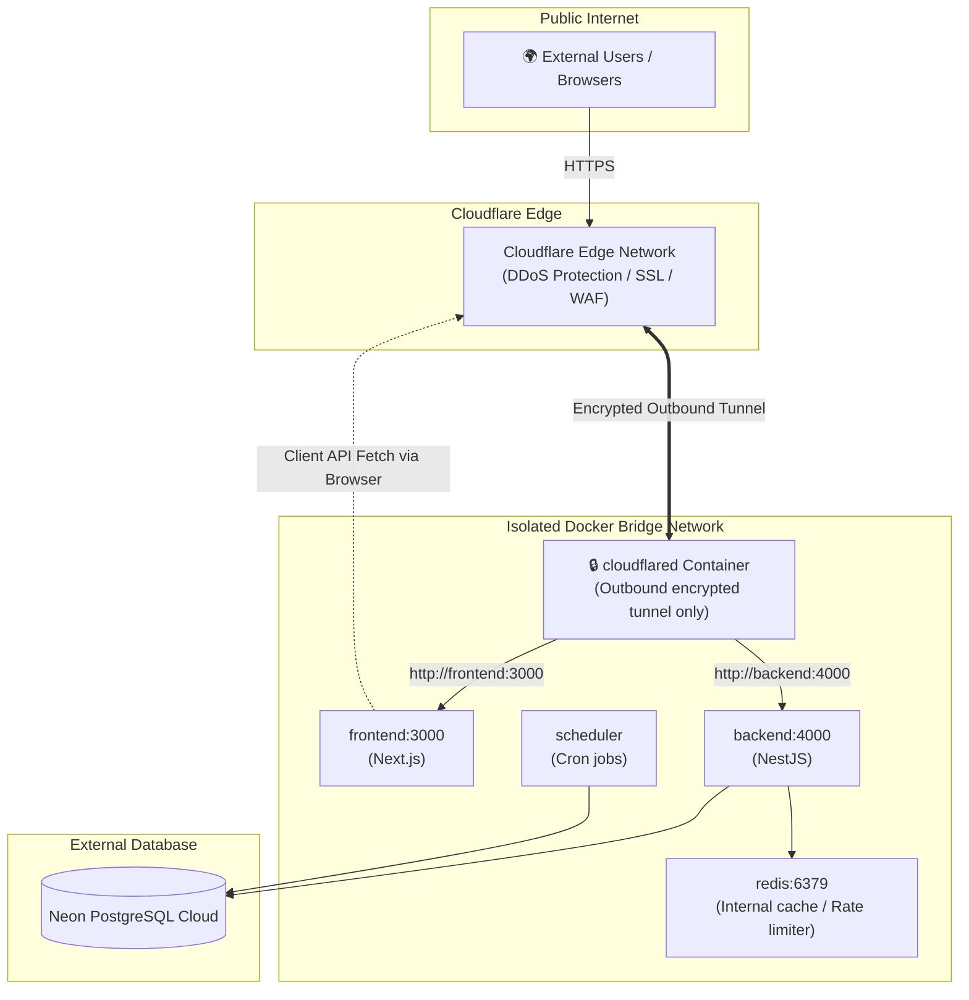

Viewed .env.example:1-53
Searched for "compose.neon.yaml"
Viewed prd-audit.ts:50-80

আপনার সিনিয়র **একদম সঠিক এবং স্ট্যান্ডার্ড সিকিউরিটি আর্কিটেকচার** সাজেস্ট করেছেন। 

আগে আপনার হোস্ট পিসিতে সরাসরি `cloudflared` চালানো এবং ডকারের পোর্ট `0.0.0.0:3000`, `0.0.0.0:4000`, `0.0.0.0:6379`-এ ওপেন রাখা বেশ ঝুঁকিপূর্ণ ছিল। ডকারের ভিতরে `cloudflared` নিয়ে আসলে আপনার সম্পূর্ণ নেটওয়ার্ক আইসোলেশন নিশ্চিত হয়।

---

### ১. আপনার সিনিয়ার কেন এটি করতে বলেছেন? (Security Reality)

| পুরানো সেটআপ (Host Cloudflared) | নতুন সেটআপ (Docker Containerized Cloudflared) |
|---|---|
| ১. `cloudflared` হোস্ট পিসির প্রোসেস হিসেবে চলত, ফলে হোস্টের সব লোকাল পোর্ট ও ফাইলের এক্সেস পেত। | ১. `cloudflared` ডকারের একটি কন্টেইনারে সম্পূর্ণ আইসোলেটেড থাকবে। সে হোস্টের কোনো সার্ভিস বা ফাইল দেখতে পাবে না। |
| ২. `compose.neon.yaml`-এ `3000:3000`, `4000:4000`, `6379:6379` হোস্টের `0.0.0.0`-এ পাবলিশ করা ছিল। আপনার ওয়াইফাই/ল্যানের যে কেউ আপনার পিসির আইপিতে সরাসরি রিকোয়েস্ট পাঠিয়ে ব্যাকএন্ড বা **Redis**-এ ঢুকতে পারত। | ২. কোনো হোস্ট পোর্ট `0.0.0.0`-এ পাবলিশ করার প্রয়োজন নেই। শুধুমাত্র ডকারের ইন্টারনাল ভার্চুয়াল নেটওয়ার্কে কন্টেইনারগুলো একে অপরের সাথে কথা বলবে। |
| ৩. আক্রমণকারী সরাসরি হোস্ট পোর্টের মাধ্যমে ক্লাউডফ্লেয়ারের সিকিউরিটি ও WAF বাইপাস করতে পারত। | ৩. বাইরের ট্রাফিক **বাধ্যতামূলকভাবে** Cloudflare WAF ও Zero Trust হয়ে টানেল দিয়ে কন্টেইনারে ঢুকবে। হোস্ট মেশিন ইন্টারনেটে অদৃশ্য থাকবে। |

> [!NOTE]
> **হোস্ট লেভেল সিকিউরিটি:** ডকার পোর্ট বন্ধ করলে ডকার কন্টেইনারগুলো নিরাপদ থাকবে। তবে আপনার পিসিতে যদি আলাদাভাবে SSH (Port 22), FTP বা অন্য সার্ভিস হোস্ট লেভেলে চালু থাকে, সেগুলো আপনার হোস্টের ফায়ারওয়াল (যেমন Linux `ufw`) দিয়ে প্রোটেক্ট করতে হবে।

---

### ২. আর্কিটেকচার ডায়াগ্রাম (How it works)



---

### ৩. Cloudflare Dashboard কনফিগারেশন

Cloudflare Zero Trust Dashboard-এ গিয়ে আপনার টানেলের **Public Hostnames** (Ingress rules) এভাবে সেট করতে পারেন:

#### অপশন A: দুটি সাবডোমেন (সবচেয়ে সহজ এবং প্রচলিত)
1. **Frontend App**:
   - Public Hostname: `jobs.yourdomain.com`
   - Service Type: `HTTP`
   - URL: `frontend:3000` *(এখানে localhost:3000 হবে না, ডকার সার্ভিস নাম `frontend:3000` হবে)*
2. **Backend API**:
   - Public Hostname: `api.jobs.yourdomain.com`
   - Service Type: `HTTP`
   - URL: `backend:4000`

---

#### অপশন B: সিঙ্গেল ডোমেন + পাথ রাউটিং (কোনো CORS ঝামেলা থাকবে না)
`jobs.yourdomain.com`-এর অধীনে দুটি ইনগ্রেস রুল:
1. Path: `/api/*` ➡️ Type: `HTTP`, URL: `backend:4000`
2. Path: `/*` (বা খালি) ➡️ Type: `HTTP`, URL: `frontend:3000`

---

### ৪. `.env` ফাইলে প্রয়োজনীয় ভেরিয়েবল

আপনার `.env` ফাইলে নিচের মানগুলো আপডেট করুন:

```bash
# ১. Cloudflare Tunnel টোকেন (ড্যাশবোর্ড থেকে পাওয়া টোকেন)
CLOUDFLARE_TUNNEL_TOKEN=eyJh...আপনার_টোকেন...

# ২. ডোমেন ও সিকিউরিটি কনফিগারেশন (HTTPS-এর জন্য)
FRONTEND_ORIGIN=https://jobs.yourdomain.com
COOKIE_SECURE=true

# ৩. ক্লায়েন্ট ব্রাউজারের API URL:
# যদি অপশন A (সাবডোমেন) ব্যবহার করেন:
NEXT_PUBLIC_API_URL=https://api.jobs.yourdomain.com/api/v1

# যদি অপশন B (সিঙ্গেল ডোমেন) ব্যবহার করেন:
# NEXT_PUBLIC_API_URL=https://jobs.yourdomain.com/api/v1
```

---

### ৫. `compose.neon.yaml` আপডেট

এখানে দুটি বিষয় লক্ষ্য করুন:
1. **Redis**: এর কোনো হোস্ট পোর্ট প্রয়োজন নেই। ব্যাকএন্ড ইন্টারনালি `redis://redis:6379` ব্যবহার করে।
2. **Host Ports**:
   - **পুরোপুরি সিকিউর (No Host Ports):** আপনি যদি চান হোস্ট পিসির কোনো পোর্ট খোলা না থাকুক, তাহলে `ports:` সেকশন সম্পূর্ণ বাদ দিতে পারেন।
   - **হাইব্রিড মোড (লোকাল ডেভেলপমেন্টের জন্য `127.0.0.1` বাইন্ডিং):** আপনি যদি আপনার পিসির ব্রাউজার থেকেও `http://localhost:3000` এক্সেস করতে চান, তবে `127.0.0.1:3000:3000` দিয়ে বাইন্ড করতে পারেন। এতে **বাইরের ওয়াইফাই/ল্যান থেকে কেউ ঢুকতে পারবে না**, কেবল আপনার নিজের পিসি থেকেই লোকালহোস্ট চলবে।
3. **`cloudflared` সার্ভিস:** টানেল সার্ভিসটি অ্যাড করা হয়েছে যা ডকারের ইন্টারনাল নেটওয়ার্ক থেকে `frontend:3000` এবং `backend:4000` সার্ভিস নাম দিয়ে রুট করবে।

আপনার [`compose.neon.yaml`](file:///home/chillpc/MohammadSheakh/projects/26/job-intelligence-prd-db-switch-ready/job-intelligence-prd-db-switch/compose.neon.yaml)-এর প্রস্তাবিত রূপ:

```yaml
name: job-intelligence

services:
  redis:
    image: redis:7-alpine
    restart: unless-stopped
    # কোনো হোস্ট পোর্ট এক্সপোজ করার দরকার নেই, ব্যাকএন্ড ইন্টারনালি redis:6379 এক্সেস করবে
    healthcheck:
      test: ['CMD', 'redis-cli', 'ping']
      interval: 5s
      timeout: 3s
      retries: 5
    volumes:
      - job_intelligence_redisdata:/data

  backend:
    build:
      context: .
      dockerfile: backend/Dockerfile
    restart: unless-stopped
    env_file:
      - .env
    environment:
      DATABASE_URL: ${DATABASE_URL:?Set DATABASE_URL in .env before using compose.neon.yaml}
      DATABASE_MODE: neon
      REDIS_URL: redis://redis:6379
      PORT: 4000
      ADMIN_USERNAME: ${ADMIN_USERNAME:-admin}
      ADMIN_PASSWORD: ${ADMIN_PASSWORD:-asdfasdf}
      DEFAULT_CANDIDATE_PASSWORD: ${DEFAULT_CANDIDATE_PASSWORD:-asdfasdf}
      CANDIDATE_SESSION_SECRET: ${CANDIDATE_SESSION_SECRET:-local-development-session-secret-2026-change-before-production}
      FRONTEND_ORIGIN: ${FRONTEND_ORIGIN:-http://localhost:3000}
      COOKIE_SECURE: ${COOKIE_SECURE:-false}
      TZ: Asia/Dhaka
    depends_on:
      redis:
        condition: service_healthy
    # শুধুমাত্র লোকালহোস্ট লুপব্যাকে বাইন্ড করুন (ল্যান বা ইন্টারনেটে এক্সপোজ হবে না)
    ports:
      - '127.0.0.1:${BACKEND_PORT:-4000}:4000'
    healthcheck:
      test:
        [
          'CMD',
          'node',
          '-e',
          "fetch('http://127.0.0.1:4000/api/v1/admin/settings').then(r=>process.exit(r.status===401||r.ok?0:1)).catch(()=>process.exit(1))",
        ]
      interval: 15s
      timeout: 5s
      start_period: 30s
      retries: 5

  frontend:
    build:
      context: .
      dockerfile: frontend/Dockerfile
    restart: unless-stopped
    env_file:
      - .env
    environment:
      HOSTNAME: 0.0.0.0
      NEXT_PUBLIC_API_URL: ${NEXT_PUBLIC_API_URL:-http://localhost:4000/api/v1}
      PORT: 3000
      NODE_ENV: production
    depends_on:
      backend:
        condition: service_healthy
    # শুধুমাত্র লোকালহোস্ট লুপব্যাকে বাইন্ড করুন (ল্যান বা ইন্টারনেটে এক্সপোজ হবে না)
    ports:
      - '127.0.0.1:${FRONTEND_PORT:-3000}:3000'
    healthcheck:
      test:
        [
          'CMD',
          'node',
          '-e',
          "fetch('http://127.0.0.1:3000/').then(r=>process.exit(r.ok?0:1)).catch(()=>process.exit(1))",
        ]
      interval: 15s
      timeout: 5s
      start_period: 30s
      retries: 5

  scheduler:
    build:
      context: .
      dockerfile: backend/Dockerfile
    restart: unless-stopped
    env_file:
      - .env
    environment:
      DATABASE_URL: ${DATABASE_URL:?Set DATABASE_URL in .env before using compose.neon.yaml}
      DATABASE_MODE: neon
      SKIP_DB_MIGRATIONS: 'true'
      AUTO_SEED_IF_EMPTY: 'false'
      TZ: Asia/Dhaka
      DAILY_CRAWL_HOUR: ${DAILY_CRAWL_HOUR:-6}
      DAILY_CRAWL_MINUTE: ${DAILY_CRAWL_MINUTE:-15}
      RUN_DAILY_ON_START: ${RUN_DAILY_ON_START:-false}
    depends_on:
      backend:
        condition: service_healthy
    command: ['node', 'scripts/docker-scheduler.mjs']

  cloudflared:
    image: cloudflare/cloudflared:latest
    restart: unless-stopped
    command: tunnel --no-autoupdate run --token ${CLOUDFLARE_TUNNEL_TOKEN}
    env_file:
      - .env
    depends_on:
      frontend:
        condition: service_healthy
      backend:
        condition: service_healthy

volumes:
  job_intelligence_redisdata:
```

---

### ৬. চালুর কমান্ড

আপনার `.env`-এ `CLOUDFLARE_TUNNEL_TOKEN` দিয়ে রান করুন:

```bash
docker compose -f compose.neon.yaml up --build -d
```

লগ দেখতে চাইলে:
```bash
docker compose -f compose.neon.yaml logs -f cloudflared
```
টানেল কানেক্ট হলে ক্লাউডফ্লেয়ার ড্যাশবোর্ডে স্ট্যাটাস `HEALTHY` দেখাবে এবং আপনার ডোমেইন থেকে সাইট ও ব্যাকএন্ড সরাসরি ওপেন হবে।

আপনি কি চান আমি এখনই `compose.neon.yaml` ফাইলটিতে এই পরিবর্তনগুলো কনফিগার করে দিই?