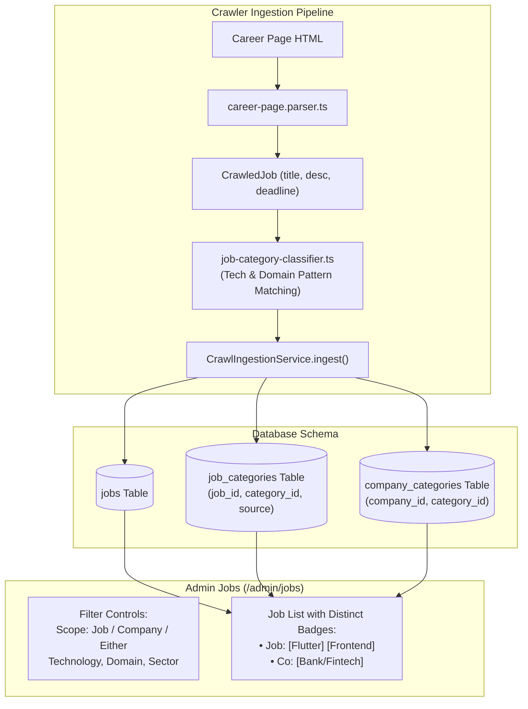

# Implementation Plan — Job-Level Category Classification & Dual Job/Company Filtering

Extract and store categories directly at the **Job level** during crawling, backfill all existing jobs, and provide dual **Job-level** and **Company-level** category filtering on `/admin/jobs`.

---

## Architecture Overview



---

## Proposed Changes

### 1. Database Schema & Migrations

#### [MODIFY] [backend/prisma/schema/job-crawling.module/job.prisma](file:///home/chillpc/MohammadSheakh/projects/26/job-intelligence-prd-db-switch-ready/job-intelligence-prd-db-switch/backend/prisma/schema/job-crawling.module/job.prisma)
- Add relation `categories JobCategory[]` to `Job` model.
- Define `model JobCategory`:
  ```prisma
  model JobCategory {
    jobId      BigInt   @map("job_id")
    categoryId BigInt   @map("category_id")
    source     String   @default("inferred")
    category   Category @relation(fields: [categoryId], references: [id], onDelete: Cascade, onUpdate: NoAction)
    job        Job      @relation(fields: [jobId], references: [id], onDelete: Cascade, onUpdate: NoAction)

    @@id([jobId, categoryId])
    @@index([categoryId])
    @@index([jobId])
    @@map("job_categories")
  }
  ```

#### [MODIFY] [backend/prisma/schema/company-intelligence.module/company.prisma](file:///home/chillpc/MohammadSheakh/projects/26/job-intelligence-prd-db-switch-ready/job-intelligence-prd-db-switch/backend/prisma/schema/company-intelligence.module/company.prisma)
- Add `jobs JobCategory[]` relation to `model Category`.

#### [MODIFY] [sql/008_runtime_schema.sql](file:///home/chillpc/MohammadSheakh/projects/26/job-intelligence-prd-db-switch-ready/job-intelligence-prd-db-switch/sql/008_runtime_schema.sql)
- Add DDL for `job_categories` table and indexes:
  ```sql
  CREATE TABLE IF NOT EXISTS job_categories (
    job_id bigint NOT NULL REFERENCES jobs(id) ON DELETE CASCADE,
    category_id bigint NOT NULL REFERENCES categories(id) ON DELETE CASCADE,
    source text NOT NULL DEFAULT 'inferred',
    PRIMARY KEY (job_id, category_id)
  );
  CREATE INDEX IF NOT EXISTS job_categories_job_id_idx ON job_categories(job_id);
  CREATE INDEX IF NOT EXISTS job_categories_category_id_idx ON job_categories(category_id);
  ```

#### [NEW] [backend/prisma/migrations/20260923153000_add_job_categories/migration.sql](file:///home/chillpc/MohammadSheakh/projects/26/job-intelligence-prd-db-switch-ready/job-intelligence-prd-db-switch/backend/prisma/migrations/20260923153000_add_job_categories/migration.sql)
- Prisma migration SQL applying `job_categories` to authoritative Neon PostgreSQL.

---

### 2. Job Category Classifier & Crawler Ingestion

#### [NEW] [backend/src/features/job-crawling/domain/job-category-classifier.ts](file:///home/chillpc/MohammadSheakh/projects/26/job-intelligence-prd-db-switch-ready/job-intelligence-prd-db-switch/backend/src/features/job-crawling/domain/job-category-classifier.ts)
- Implement `classifyJobCategories(title: string, description?: string | null): string[]`:
  - Tokenizes and tests job titles and descriptions against the standard system Category taxonomy.
  - Matches **Technologies**: `.NET`, `Django`, `Flutter`, `Java`, `Joomla`, `Laravel`, `NestJS`, `Next.js`, `Node.js`, `Odoo/ERP`, `PHP`, `Python`, `React`, `Vue.js`, `WordPress`.
  - Matches **Domains**: `AI`, `AR/VR`, `Backend`, `Cybersecurity`, `Data Analytics`, `Data Engineering`, `Data Science`, `DevOps/Cloud`, `Embedded/IoT`, `Frontend`, `Full Stack`, `Identity/Biometrics`, `Machine Learning`, `Networking`, `QA/SQA`, `UI/UX`.
  - Prioritizes job title tokens over description text to prevent false positives.

#### [MODIFY] [backend/src/features/job-crawling/services/crawl-ingestion.service.ts](file:///home/chillpc/MohammadSheakh/projects/26/job-intelligence-prd-db-switch-ready/job-intelligence-prd-db-switch/backend/src/features/job-crawling/services/crawl-ingestion.service.ts)
- During job ingestion, run `classifyJobCategories(job.title, job.description)`.
- Connect matching `Category` records to the newly created/updated `Job` in `job_categories`.
- Populate `job.skills` with the detected keywords for full-text search.

#### [NEW] [scripts/backfill-job-categories.ts](file:///home/chillpc/MohammadSheakh/projects/26/job-intelligence-prd-db-switch-ready/job-intelligence-prd-db-switch/scripts/backfill-job-categories.ts)
- Script to scan all existing jobs in the database, run the classifier, and populate `job_categories` so historical jobs are categorized immediately.

---

### 3. Backend API (`job-crawling` module)

#### [MODIFY] [backend/src/features/job-crawling/dto/job-list-query.dto.ts](file:///home/chillpc/MohammadSheakh/projects/26/job-intelligence-prd-db-switch-ready/job-intelligence-prd-db-switch/backend/src/features/job-crawling/dto/job-list-query.dto.ts)
- Add `@IsOptional() @IsIn(['all', 'job', 'company']) categoryScope?: 'all' | 'job' | 'company' = 'all'`
- Retain `technology`, `domain`, `sector`, `category`.

#### [MODIFY] [backend/src/features/job-crawling/services/admin-job-catalog.service.ts](file:///home/chillpc/MohammadSheakh/projects/26/job-intelligence-prd-db-switch-ready/job-intelligence-prd-db-switch/backend/src/features/job-crawling/services/admin-job-catalog.service.ts)
- Project both `categories` (job-level) and `company.categories` (company-level).
- Query based on `categoryScope`:
  - `job`: checks `job.categories.some({ category: { name, type } })`
  - `company`: checks `job.company.categories.some({ category: { name, type } })`
  - `all` (default): checks `OR: [job category match, company category match]`.
- Return in response:
  - `jobCategories`: string[] (e.g., `["Flutter", "Frontend"]`)
  - `companyCategories`: string[] (e.g., `["Node.js", "Bank/Fintech"]`)

---

### 4. Frontend UI (`frontend/app/admin/jobs/page.tsx`)

#### [MODIFY] [frontend/app/admin/jobs/page.tsx](file:///home/chillpc/MohammadSheakh/projects/26/job-intelligence-prd-db-switch-ready/job-intelligence-prd-db-switch/frontend/app/admin/jobs/page.tsx)
- Add **Match Scope Selector**:
  - `Match: Any (Job or Company)` (default)
  - `Match: Job Role Only`
  - `Match: Company Only`
- Dropdowns for:
  - `Technology`
  - `Domain`
  - `Sector` (Company)
  - `Status`
  - `Search`
- In Table Row:
  - Display distinct badges:
    - **Job Category**: Soft indigo pill `Job: Flutter`
    - **Company Category**: Soft neutral pill `Co: Bank/Fintech`
  - Clicking any tag sets that filter and scope immediately.

---

## Verification Plan

### Automated Tests
1. **Classifier Unit Tests**:
   - Create `backend/src/features/job-crawling/domain/job-category-classifier.spec.ts` testing extraction for various titles:
     - *"Senior Flutter Engineer"* -> `['Flutter', 'Frontend']`
     - *"NestJS & React Fullstack Developer"* -> `['NestJS', 'React', 'Full Stack', 'Backend', 'Frontend']`
     - *"DevOps / Cloud Specialist"* -> `['DevOps/Cloud']`
     - *"Python Data Scientist"* -> `['Python', 'Data Science', 'Machine Learning']`
2. **Backend Integration Tests**:
   - Update `job-crawling.integration-spec.ts` to test `JobCategory` creation during crawl ingestion and query filtering with `categoryScope: 'job' | 'company' | 'all'`.
   - Run `pnpm test:backend`.
3. **Database Migration & E2E**:
   - Run `pnpm test:browser` (which spins up PostgreSQL and applies migrations).
4. **Frontend Checks**:
   - `pnpm --dir frontend typecheck && pnpm --dir frontend lint && pnpm --dir frontend build`.

### Manual Verification
1. Open `http://localhost:3000/admin/jobs`.
2. Filter by Technology: "Flutter" with scope "Job Role Only" -> verify only jobs whose title/skills are Flutter appear.
3. Switch scope to "Company Only" -> verify jobs at Flutter companies appear.
4. Verify distinct "Job" vs "Co" category pill badges in the table.
