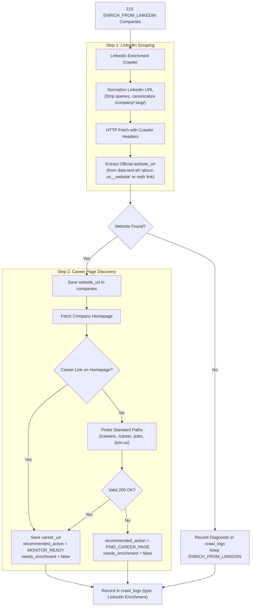

# Implementation Plan — LinkedIn Company Website & Career Page Enrichment Crawler

Implement an automated crawler that processes the **215 companies** currently in `recommended_action = 'ENRICH_FROM_LINKEDIN'`, crawls their LinkedIn profile pages (`/about/`), extracts the official company `website_url`, inspects that website for `career_url`, updates the database, and transitions their workflow status to `MONITOR_READY` or `FIND_CAREER_PAGE`.

---

## 1. Background & Architecture

### Current State
- There are **215 companies** in the database with `recommended_action = 'ENRICH_FROM_LINKEDIN'`.
- All 215 companies have a valid `linkedin_url` (e.g. `https://www.linkedin.com/company/adn-telecom-limited/`), but `website_url` is `NULL` and `career_url` is `NULL`.
- Currently, single company enrichment (`POST /api/v1/admin/companies/:id/enrich`) only inspects an existing `website_url` or manually supplied override; it does not autonomously scrape LinkedIn.

### Solution Overview

---

## 2. Proposed Changes

### Component 1: LinkedIn Crawler Domain & Service (`company-intelligence`)

#### [NEW] [backend/src/features/company-intelligence/domain/linkedin-parser.ts](file:///home/chillpc/MohammadSheakh/projects/26/job-intelligence-prd-db-switch-ready/job-intelligence-prd-db-switch/backend/src/features/company-intelligence/domain/linkedin-parser.ts)
- Pure domain parser for LinkedIn company HTML responses:
  - `extractWebsiteFromLinkedInHtml(html: string): string | null`:
    - Looks for `data-test-id="about-us__website"` block.
    - Decodes `redir/redirect?url=<encoded>` parameter.
    - Fallback: extracts link anchor text matching URL pattern.
    - Fallback: parses JSON-LD schema for `url` or `sameAs`.
    - Normalizes and validates URL (strips tracking, enforces `http`/`https`, excludes LinkedIn/social links).
  - `normalizeLinkedInCompanyUrl(rawUrl: string): string`:
    - Normalizes URLs like `https://www.linkedin.com/company/abc/?originalSubdomain=bd` to `https://www.linkedin.com/company/abc`.

#### [NEW] [backend/src/features/company-intelligence/domain/linkedin-parser.spec.ts](file:///home/chillpc/MohammadSheakh/projects/26/job-intelligence-prd-db-switch-ready/job-intelligence-prd-db-switch/backend/src/features/company-intelligence/domain/linkedin-parser.spec.ts)
- Comprehensive unit tests covering:
  - Extracting encoded redir query params: `https://www.linkedin.com/redir/redirect?url=https%3A%2F%2Fwww%2Eadnsl%2Enet%2F&urlhash=r3Xb` -> `https://www.adnsl.net/`.
  - Extracting plain anchor text when redir param is missing.
  - Rejecting non-website or internal links.
  - URL normalization across various LinkedIn subdomain formats.

#### [NEW] [backend/src/features/company-intelligence/services/linkedin-enrichment-crawler.service.ts](file:///home/chillpc/MohammadSheakh/projects/26/job-intelligence-prd-db-switch-ready/job-intelligence-prd-db-switch/backend/src/features/company-intelligence/services/linkedin-enrichment-crawler.service.ts)
- Service orchestrating the two-step enrichment:
  1. **LinkedIn Fetch**:
     - Fetches company page with crawler headers that LinkedIn responds to with full HTML.
     - Rate-limits requests with configurable interval (1000-1500ms) to avoid IP throttling.
     - Extracts `website_url`.
  2. **Career Page Discovery**:
     - Fetches discovered website homepage.
     - Reuses `extractCareerLink()` pattern matching.
     - Probes candidate paths (`/careers`, `/career`, `/jobs`, `/join-us`) if homepage doesn't contain direct link.
  3. **Database Mutation**:
     - Updates company record: `website_url`, `career_url`, `recommended_action`, `needs_enrichment`.
     - Logs operation in `crawl_logs` table (`crawler_type = 'LinkedIn Enrichment'`).
  4. **Batch Mode**:
     - `enrichPendingCompanies(options: { limit?: number; delayMs?: number })`:
       Iterates over pending companies, provides detailed progress, and returns summary stats.

---

### Component 2: Admin Controller & DTO

#### [MODIFY] [backend/src/features/company-intelligence/controllers/admin-companies.controller.ts](file:///home/chillpc/MohammadSheakh/projects/26/job-intelligence-prd-db-switch-ready/job-intelligence-prd-db-switch/backend/src/features/company-intelligence/controllers/admin-companies.controller.ts)
- Add endpoints:
  - `POST /api/v1/admin/companies/enrich-linkedin`: triggers batch LinkedIn enrichment with optional `{ limit?: number, delayMs?: number }`.
  - `GET /api/v1/admin/companies/enrich-linkedin/status`: returns count of companies pending LinkedIn enrichment.
- Update `POST /api/v1/admin/companies/:id/enrich`:
  - When called for a company without a `websiteUrl`, autonomously invokes `LinkedInEnrichmentCrawlerService` to fetch website from `linkedin_url` first!

#### [MODIFY] [backend/src/features/company-intelligence/company-intelligence.module.ts](file:///home/chillpc/MohammadSheakh/projects/26/job-intelligence-prd-db-switch-ready/job-intelligence-prd-db-switch/backend/src/features/company-intelligence/company-intelligence.module.ts)
- Register `LinkedInEnrichmentCrawlerService` as a provider and export it.

---

### Component 3: CLI & Scheduler Script

#### [NEW] [scripts/crawl-linkedin.ts](file:///home/chillpc/MohammadSheakh/projects/26/job-intelligence-prd-db-switch-ready/job-intelligence-prd-db-switch/scripts/crawl-linkedin.ts)
- Standalone CLI command:
  - Supports `--limit=N`, `--delay=MS`, `--apply`, `--company=ID`.
  - Can run standalone or as part of worker cron schedules.
- Add script to root [package.json](file:///home/chillpc/MohammadSheakh/projects/26/job-intelligence-prd-db-switch-ready/job-intelligence-prd-db-switch/package.json):
  `"crawl:linkedin": "tsx scripts/crawl-linkedin.ts"`

---

### Component 4: Frontend UI Updates

#### [MODIFY] [frontend/app/admin/companies/page.tsx](file:///home/chillpc/MohammadSheakh/projects/26/job-intelligence-prd-db-switch-ready/job-intelligence-prd-db-switch/frontend/app/admin/companies/page.tsx)
- Add an **"Enrich from LinkedIn"** action button in the header with a badge showing the pending count (`215`).
- When clicked, opens a dialog to run batch enrichment with live progress reporting (processed count, websites discovered, career pages discovered).
- In the Action filter dropdown, make selecting `ENRICH_FROM_LINKEDIN` easy with a badge indicator.

#### [MODIFY] [frontend/app/admin/companies/[id]/page.tsx](file:///home/chillpc/MohammadSheakh/projects/26/job-intelligence-prd-db-switch-ready/job-intelligence-prd-db-switch/frontend/app/admin/companies/%5Bid%5D/page.tsx)
- Update "Fetch from LinkedIn" button to invoke the full two-step scraper, displaying both discovered `website_url` and `career_url` in the result banner.

---

## 3. Verification Plan

### Automated Tests
1. **Unit Tests**:
   - `pnpm --dir backend test:unit -- linkedin-parser.spec.ts`: test HTML parsing, redir url extraction, regex fallbacks.
2. **Backend Integration Tests**:
   - `pnpm --dir backend test:integration -- company-intelligence.integration-spec.ts`: test LinkedIn crawler service and controller endpoints with mocked HTTP.
   - `pnpm test:backend` (all 17 test suites).
3. **Frontend Build & Linter**:
   - `pnpm --dir frontend typecheck && pnpm --dir frontend lint && pnpm --dir frontend build`.

### Manual & Pilot Verification
1. Run pilot crawl on 5 companies via `pnpm crawl:linkedin --limit=5`:
   - Inspect terminal output and verify websites and career pages are correctly identified.
   - Query Neon PostgreSQL to confirm `website_url`, `career_url`, and `recommended_action` updated accurately.
2. Verify batch enrichment in `/admin/companies` UI.
