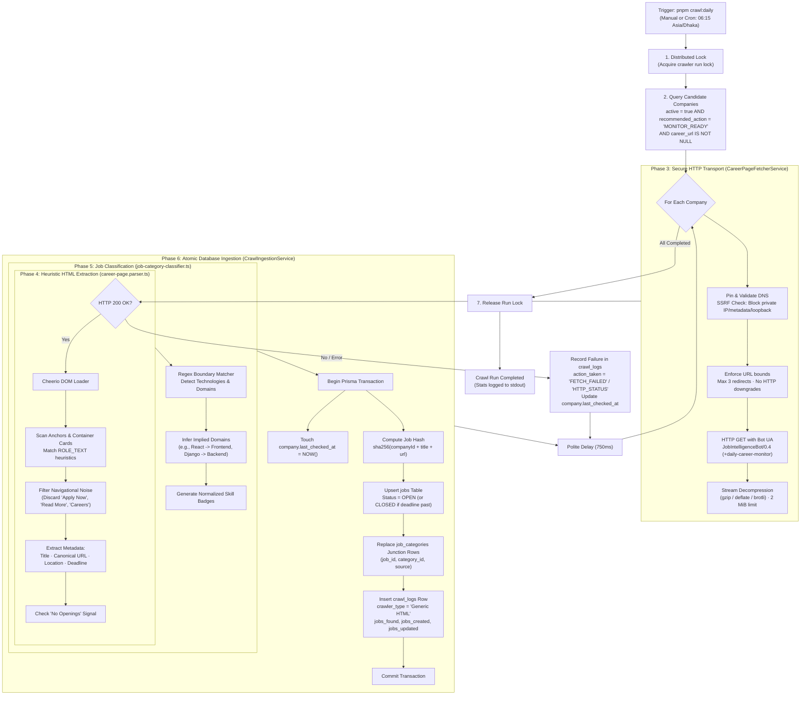
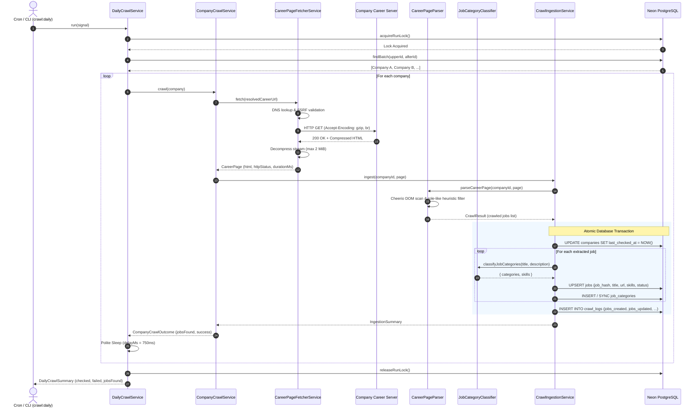

# Job Crawler Mechanism — Deep Dive & Execution Lifecycle

Comprehensive technical documentation of the automated daily job crawler in **Job Intelligence Platform**. Explains step-by-step what happens under the hood when executing `pnpm crawl:daily`, from scheduler triggering down to network transport, anti-SSRF protections, HTML heuristic parsing, role classification, atomic database transactions, and notification dispatch.

---

## 1. Executive Overview

The job crawler is an autonomous, rate-limited ingestion engine designed to monitor all active companies marked as `MONITOR_READY`, extract active job postings directly from their career portals, classify tech stacks and domain roles, and ingest them into PostgreSQL (`Neon`).

### Core Objectives
1. **Safety & Compliance**: Politeness delay (750–1200ms) between domains, strict 2 MiB response cap, and anti-SSRF DNS pinning.
2. **Deterministic Deduplication**: Unique SHA-256 job hashing ensuring zero duplicate listings even across URL renames or query string mutations.
3. **Dual Category Classification**: Automatic mapping of discovered jobs into technology and domain categories (e.g. *React* $\to$ *Frontend*, *NestJS* $\to$ *Backend*).
4. **Resilient Ingestion**: Isolated single-company failure boundary ensuring a broken career page never halts the batch sweep.

---

## 2. End-to-End Crawler Flowchart



---

## 3. Sequence Diagram — Single Company Lifecycle



---

## 4. Phase-by-Phase Technical Walkthrough

### Phase 1: Initiation, Scheduling & Concurrency Locks
When `pnpm crawl:daily` is triggered:
1. **Entrypoint Resolution**:
   - In production Docker containers: [`backend/src/commands/crawl-daily.ts`](file:///home/chillpc/MohammadSheakh/projects/26/job-intelligence-prd-db-switch-ready/job-intelligence-prd-db-switch/backend/src/commands/crawl-daily.ts) is launched by `docker-scheduler.mjs` at **06:15 Asia/Dhaka**.
   - Standalone CLI execution: [`scripts/crawl-daily.ts`](file:///home/chillpc/MohammadSheakh/projects/26/job-intelligence-prd-db-switch-ready/job-intelligence-prd-db-switch/scripts/crawl-daily.ts).
2. **Distributed Lock (`DailyCrawlRepository.acquireRunLock()`)**:
   - Checks that another crawl worker is not already running.
   - Prevents race conditions and multiple crawlers hitting target career portals simultaneously.

### Phase 2: Company Selection & Discovery
The crawler queries target companies:
```sql
SELECT id, name, career_url, website_url 
FROM companies 
WHERE active = true 
  AND recommended_action = 'MONITOR_READY' 
  AND career_url IS NOT NULL 
ORDER BY id ASC;
```
- **Status Gate**: Only companies verified with a working career URL (`MONITOR_READY`) are crawled. Companies waiting for LinkedIn enrichment or manual review are bypassed.
- **Source Overrides**: Evaluates [`source-overrides.ts`](file:///home/chillpc/MohammadSheakh/projects/26/job-intelligence-prd-db-switch-ready/job-intelligence-prd-db-switch/backend/src/features/job-crawling/domain/source-overrides.ts) to check if the company career portal requires URL resolution or pagination query params.

---

### Phase 3: Secure Transport (`CareerPageFetcherService`)
Career portals are external third-party servers. The fetcher enforces strict zero-trust security controls:
1. **SSRF Guard**:
   - Pre-resolves DNS using Node's `dns/promises`.
   - Inspects the returned IP address against [`ipaddr.js`](file:///home/chillpc/MohammadSheakh/projects/26/job-intelligence-prd-db-switch-ready/job-intelligence-prd-db-switch/backend/src/features/job-crawling/services/career-page-fetcher.service.ts#L127-L137).
   - Immediately aborts if the target IP is non-public (e.g. `127.0.0.1`, `10.x.x.x`, `192.168.x.x`, `169.254.169.254` AWS metadata, or loopbacks).
2. **Direct Socket Connection**:
   - Directly connects to the pre-verified public IP address, preventing DNS rebinding attacks.
   - Verifies TLS certificate identity against the hostname.
3. **Redirect Security**:
   - Caps redirects to maximum **3 hops**.
   - Enforces **no HTTPS downgrade** (aborts if HTTPS redirects to HTTP).
4. **Bandwidth & Memory Protection**:
   - Streams incoming bytes into a decompression pipeline (`createUnzip` for gzip/deflate, `createBrotliDecompress` for brotli).
   - If payload exceeds **2 MiB**, the stream is destroyed immediately with `BODY_LIMIT`.
5. **Timeout**:
   - Enforces a strict **20,000ms deadline** across DNS, handshake, redirects, and body download.

---

### Phase 4: Heuristic HTML Extraction (`career-page.parser.ts`)
Once raw HTML is obtained, it is analyzed with [Cheerio](file:///home/chillpc/MohammadSheakh/projects/26/job-intelligence-prd-db-switch-ready/job-intelligence-prd-db-switch/backend/src/features/job-crawling/domain/career-page.parser.ts):

1. **Role Identification Heuristics (`ROLE_TEXT`)**:
   Matches keywords such as:
   `engineer`, `developer`, `designer`, `manager`, `intern`, `analyst`, `specialist`, `architect`, `qa`, `devops`, `sales`, `marketing`, etc.
2. **Noise Rejection (`isActionOnly`)**:
   Prevents generic navigation buttons from becoming phantom job titles:
   - Rejected: `"Apply Now"`, `"Read More"`, `"View Details"`, `"Careers"`, `"Open Positions"`.
3. **Container Context Inspection**:
   When an anchor contains only an action verb like `"Apply"`, the parser walks up the DOM tree (up to 6 ancestor levels) to find the enclosing job card heading (`h1-h6`, `.job-title`, `.position-title`).
4. **Metadata Extraction**:
   - **Application URL**: Resolves relative paths against the final redirected URL. Excludes `mailto:`, `tel:`, `#`, and `javascript:`.
   - **Location**: Extracts nearby address tokens, remote tags, or city names (`[class*=location]`, `address`).
   - **Application Deadline**: Scans text for deadline patterns (`parseDeadlineFromText`):
     - Format: `Deadline: 2026-10-15` or `Apply by 15th October 2026`.
     - Sets timestamp to `23:59:59.999` on that day.
5. **Zero-Opening Detection (`NO_OPENINGS`)**:
   Matches explicit empty-state phrases like `"no current openings"`, `"currently no vacancies"`, or `"we are not hiring"`.

---

### Phase 5: Categorization & Skill Tagging (`job-category-classifier.ts`)
Extracted jobs are immediately classified using regular expression boundary matching:
- **Technologies** (15 categories):
  - *React*, *Next.js*, *Vue*, *Node.js*, *Python*, *Django*, *Go*, *Java*, *Spring Boot*, *Flutter*, *React Native*, *PostgreSQL*, *AWS*, *Docker*, *Kubernetes*.
- **Domains** (16 categories):
  - *Frontend*, *Backend*, *Full-stack*, *Mobile*, *DevOps*, *QA / Testing*, *Data Engineering*, *AI / ML*, *UI/UX Design*, *Cybersecurity*, etc.
- **Rule-Based Inference**:
  - `React` / `Vue` $\implies$ Automatically tags **Frontend**.
  - `NestJS` / `Django` / `Spring Boot` $\implies$ Automatically tags **Backend**.
  - `Flutter` / `React Native` $\implies$ Automatically tags **Mobile**.

---

### Phase 6: Atomic Database Ingestion (`CrawlIngestionService`)
All mutations for a single company are executed in an **atomic PostgreSQL transaction**:

1. **Company Heartbeat**:
   ```sql
   UPDATE companies SET last_checked_at = NOW() WHERE id = :companyId;
   ```
2. **Deduplication Hashing**:
   - Generates deterministic hash:
     ```ts
     jobHash = sha256(`${companyId}|${normalizedTitle}|${normalizedUrl}`)
     ```
3. **Job Upsert (`jobs` table)**:
   - **Insert (New Job)**:
     - `status = 'OPEN'` (or `'CLOSED'` if deadline already passed).
     - `first_seen_at = NOW()`, `last_seen_at = NOW()`.
     - Saves skills string (e.g. `"Flutter, Dart, Mobile, REST API"`).
   - **Update (Existing Job)**:
     - Updates `last_seen_at = NOW()`.
     - Preserves previously extracted descriptions and deadlines if missing on current crawl.
4. **Job Categories Sync (`job_categories` junction table)**:
   - Connects the job ID to category IDs with source tag (`'title'`, `'description'`, `'skills'`).
5. **Crawl Diagnostics Log (`crawl_logs` table)**:
   ```sql
   INSERT INTO crawl_logs (
     company_id, checked_at, success, jobs_found, http_status, 
     duration_ms, crawler_type, jobs_created, jobs_updated, action_taken
   ) VALUES (
     :companyId, NOW(), true, :jobsCount, :status, 
     :durationMs, 'Generic HTML', :created, :updated, 'MONITOR_READY'
   );
   ```

---

## 5. Summary State Transition Matrix

| Previous State | Crawl Outcome | New Company Status | New Job Status | Action Recorded |
| :--- | :--- | :--- | :--- | :--- |
| `MONITOR_READY` | Found active jobs | `MONITOR_READY` | `OPEN` | `MONITOR_READY` (logged with count) |
| `MONITOR_READY` | 0 jobs (clean crawl) | `MONITOR_READY` | Unchanged (no blind mass closing) | `MONITOR_READY` (`jobs_found: 0`) |
| `MONITOR_READY` | Job deadline expired | `MONITOR_READY` | `CLOSED` | Ingested as expired |
| `MONITOR_READY` | HTTP 404 / 500 / Timeout | `MONITOR_READY` | Unchanged | `FETCH_FAILED` in `crawl_logs` |
| `ENRICH_FROM_LINKEDIN` | N/A (skipped in daily) | `ENRICH_FROM_LINKEDIN` | N/A | Targeted by `pnpm crawl:linkedin` |

---

## 6. How to Run & Verify

### CLI Commands
```bash
# 1. Run full daily crawl sweep
pnpm crawl:daily

# 2. Run daily crawl with custom limit (e.g. pilot 10 companies)
CRAWL_LIMIT=10 pnpm crawl:daily

# 3. Adjust rate-limiting delay between requests (default: 750ms)
CRAWL_DELAY_MS=1500 pnpm crawl:daily
```

### Admin Portal Inspection
- **Crawler Runs & Metrics**: [`http://localhost:3000/admin/crawl-logs`](http://localhost:3000/admin/crawl-logs) displays real-time execution duration, HTTP statuses, jobs created, and failure reasons.
- **Discovered Jobs Catalog**: [`http://localhost:3000/admin/jobs`](http://localhost:3000/admin/jobs) displays open jobs with clickable company links, deadlines, and dual job/company category badges.
- **Admin Dashboard**: [`http://localhost:3000/admin`](http://localhost:3000/admin) displays KPI counters for tracked companies, active monitors, and total open jobs.
